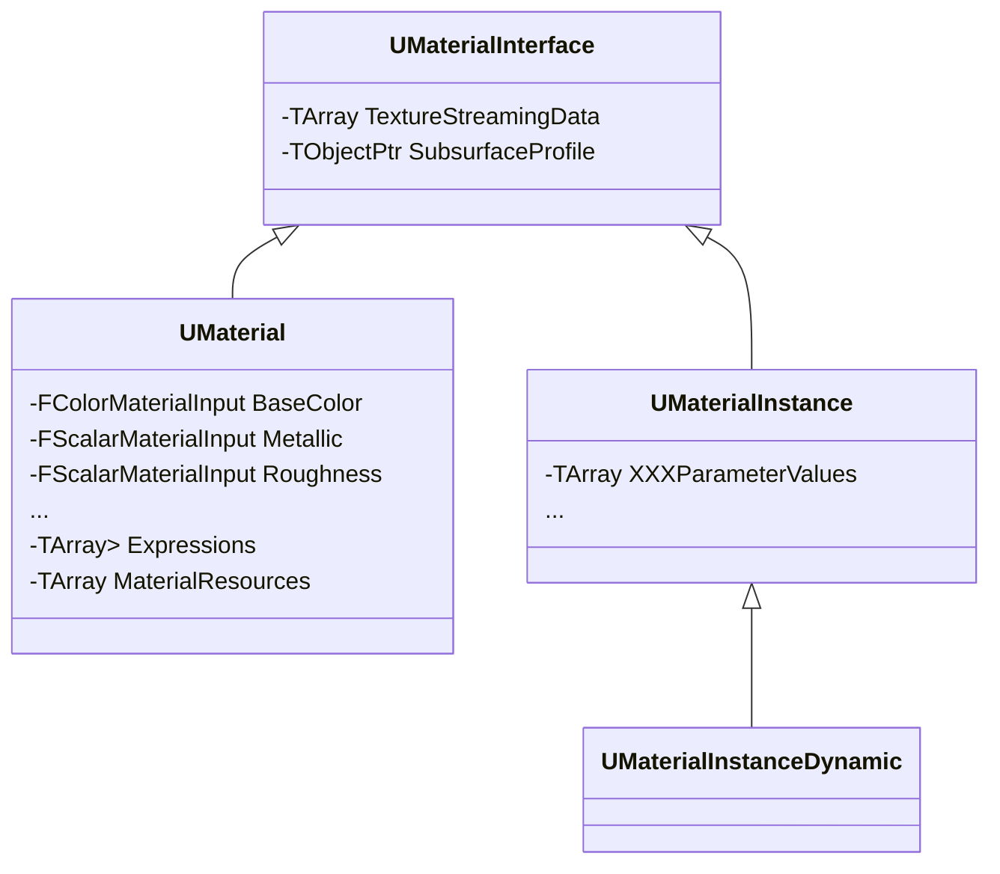

## Summary

## 材质顶层设计

下面是材质系统的三个主要类的类图：

从使用上看：`UMaterial` 相当于一个材质模板(以下统一称作材质模板)，用户可以在引擎的材质蓝图系统中基于此模板创建 `UMaterialInstance`(以下称作材质实例)。`UMaterialInstance` 与 `UMaterial` 都直接继承于
 `UMaterialInterface` ，是因为用户既可以通过材质模板创建材质实例，又可以通过一个材质实例来创建另一个材质实例。

### 1. 材质模板与材质实例

材质模板中定义的是引擎渲染管线所需要的参数，可能包含配置参数、输入到 shader 的参数等。这些参数都是引擎渲染管线爆露出给用户操作，实现效果。对于配置参数，包括一些效果(render pass)的开启、环境配置等等。对于 shader 的输入参数，如 PBR 参数中的 BaseColor、Metallic、Roughness 等，这些参数可以是常量也可以是变量。对于变量的情况，需要在材质模板中爆露出对应参数，由此材质模板创建的材质实例即可自定义这些爆露出的参数。这样做的目的是什么？

- 材质模板的编辑即在材质蓝图系统进行操作，添加节点，改变环境参数配置等。这些操作可能导致对应 shader 代码的变化而产生 shader 变体，以及管线状态参数配置的变化。对于管线状态配置(shader 或者管线参数配置)不相同的材质无法被同一个 draw call 使用。
- 对于一个材质，会对应一个 shader map、及一些参数配置。而从属于同一材质模板的材质实例共用一套 shader map，这样对这些材质实例应用 draw call 的组织策略。

### 2. 材质蓝图系统中的操作

新建材质模板，以下即默认的材质模板

可以看到左图有很多输入参数，这些参数都是输入到 shader 的。目前没有暴露任何参数，因此中图 Parameters 为空，右图 Details 是一些参数配置。基于此模板创建一个材质实例：

上图中材质实例的 Details 为引擎默认可调整参数，并没有额外的参数。Layers Parameters 是多层材质相关(本文不涉及)。下面对材质模板进行简单修改

图中 Add 属于 math 类别的节点； tex 与 scalar 属于 params 类别的节点，是材质模板暴露出来的参数，此时显示在其参数面板中。这时再来看其材质实例，可以看到 parameters group 出现了相应的参数：

上述编辑材质模板添加的节点即保存在 `UMaterial` 中的 Expressions 字段。
