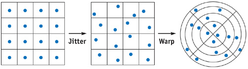
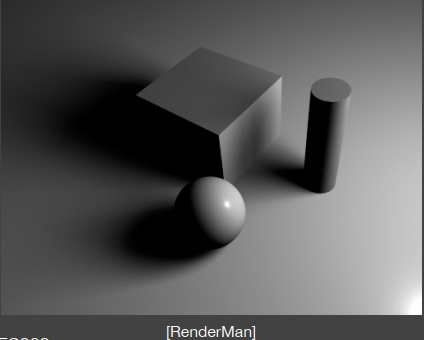

## Summary

Basic Shadow Mapping [[1]](#[1]) 中实现的是硬阴影，不仅与现实中的软阴影相比不够真实，而且有锯齿的问题。本文将描述解决 shadow mapping 的锯齿问题的 PCF(Percentage Closer Filtering) 算法，以及基于 PCF 来实现软阴影效果的 PCSS(Percentage Closer Soft Shadows) 算法。

## PCF (Percentage Closer Filtering)

图像空间的算法总会由于采样不足导致 aliasing，如 shadow mapping 的阴影锯齿，如下图所示


Aliasing 无法完全消除，但可以以人类可接受的角度减弱。解决 aliasing 的方法就是 filter，即以区域采样取代点采样，进行平滑处理，PCF 就是基于此思想。但 PCF 不是平滑 shadow map 中的深度值，而是 camera pass 与 shadow map 中深度的比较结果。由 shadow mapping 得到的一个采样点的 (0/1) 二值的比较结果 visibility，平滑为一个区域的比较结果的平均值，作为 PCF 的 visibility。

### 1. 算法描述

- ① 确定 filter size (一般以像素为单位)，filter size 即以当前采样点为中心的 shadow map 的采样区域大小。
- ② 在采样区域内进行随机采样，得到一批随机采样点，假定为 N 个随机采样点。
- ③ 对这 N 个采样点中的每一个都进行 shadow mapping 算法中的深度比较，最终得到 N 个 (0/1) 二值的比较结果。
- ④ 最终当前像素的 visibility = (N 个 比较结果之和)/N。

在 camera pass 中，对 shadow map 进行采样时，PCF 通过采样以当前采样点为中心的 filter 区域，得到多个该区域内的随机采样点。将这些采样点的信息（visibility）以一种方式合并为当前采样点的信息（平滑后的visibility），使得当前采样点同时包含了附近采样点的信息，可以适当弥补采样率不足的问题。

首先定义 filter 区域，采用以当前采样点为中心的圆盘区域。其次要考虑如何在该圆盘内生成随机采样点，即以何种随机分布生成。

#### 1.1 如何生成随机采样点？[[2]](#[2])

通常我们希望随机采样点较均匀且随机分布在采样区域内，均匀能够充分吸收到采样区域的信息，随机使得每个采样区域的采样点分布都不完全一样，避免出现一种很有规律性的模式（pattern），出现肉眼可见的纹路，即低差异性分布 [[3]](#[3])。本例中使用的是泊松盘采样。

直接在圆盘区域内生成均匀分布的采样点比较困难，[[2]](#[2]) 使用了一种比较 tricky 的方式。先生成与采样数量相同的正方形组成的网格，对每个格子的中心点加上一个格子区域内的随机扰动，最后再将这些扰动后的点变形到圆盘区域内。如下图所示：



假设扰动后的点坐标为 $(u,v)$，那么变形到圆盘区域的坐标为：

$$
x=\sqrt{v}\cross cos(2\pi u)\\ y=\sqrt{v}\cross sin(2\pi u)
$$

> 上述转换公式是基于极坐标的，$u$ 用来定位采样点位于那个扇区，$v$ 用来定位采样点位于扇区的半径。圆盘由中心的扇区到外部的环区，每个面积都相等，因此每个小区域对应的半径随着向外延伸增长越缓慢，其中的开根号是这个原理。
>
> - 数学方式证明如下：
>
> 假设圆盘中心第一个圈围成的圆为 $\gamma_1$，第二个圈围成的圆为 $\gamma_2$，依次类推。由设定可知，$\gamma_1$ 对应的扇形区域面积、$\gamma_2$ 与 $\gamma_1$ 之间的环区面积以及 $\gamma_n$ 与 $\gamma_{n-1}$ 对应的环区域面积都相等，假设为 $S$。$\gamma_i$ 对应的半径为 $r_i$，那么 $\large S=\frac{\alpha r_1^2}{2}$。因此： 
>
> $\gamma_2$ 对应的扇区面积为 $\large 2S=\frac{\alpha r_2^2}{2}=2\cdot \frac{\alpha r_1^2}{2}$，有 $ \large r_2 = \sqrt{2 r_1^2}$
>
> $\gamma_3$ 对应的扇区面积为 $\large 3S=\frac{\alpha r_3^2}{2}=3\cdot \frac{\alpha r_1^2}{2}$，有 $\large r_3 = \sqrt{3r_1^2}$
>
> $\gamma_n$ 对应的扇区面积为 $\large nS=\frac{\alpha r_n^2}{2}=n\cdot \frac{\alpha r_1^2}{2}$，有 $\large r_n = \sqrt{nr_1^2}$
>
> 由此有 $\large r_1=\sqrt{r_1^2}$ ，$\large r_2=\sqrt{2r_1^2}$ ，$\large r_3=\sqrt{3r_1^2}$ ，... ，$\large r_n=\sqrt{nr_1^2}$ 。将根号下看作采样点所在格子的 $v$ 坐标，那么就得到了每个格子在圆盘上对应的环区。

#### 1.2 计算 visibility

通过上述方式得到 $N$ 个采样点，计算来的采样点坐标 $(x,y)$ 是标准化到 $[-1,1]$ 的范围。设定 filter size 为 $\omega$，即以 $\omega$ 个像素为半径的圆盘。那么 $(x,y)\cdot \omega$ 得到相对于当前 shadow map 采样点的偏移量，将偏移量与 shadow mapping 采样点坐标相加即得到 filter 区域中的随机采样点。假设 shadow map 当前采样点为 $(u,v)$，那么 visibility 的计算方式如下：

$$
visibility = \frac{1}{N}\sum\limits_{i=0}^N V\Big(sample(u+x_i\cdot \omega,v+y_i\cdot\omega)\Big)
$$
其中 $sample(u,v)$ 为采样 shadow map 的坐标 $(u,v)$ 的值， $V$ 是 shadow mapping 算法中计算当前像素 visibility 的二值函数。

#### 1.3 PCF 的数学原理 [[4]](#[4])

渲染方程：

$$
L_o(p,\omega_o)=\int_{\Omega^+}f_r(p,\omega_i,\omega_o)cos\theta_i \cdot V(p,\omega_i)d\omega_i
$$
上式中 $V$ 是计算当前着色点 visibility 的函数，注意光线追踪的渲染方程里没有这一项，因为光线追踪是通过求交进行着色，不需要先计算 visibility。

数学中的积分不等式：
$$
\left[\int^b_af(x)\cdot g(x)dx\right]^2\leq\int_a^bf^2(x)dx\cdot\int_a^bg^2(x)dx \\
\left\{\int^b_a \left[f(x)+g(x)\right]^2 dx\right\}^\frac{1}{2} \leq\left\{\int_a^bf^2(x)dx\right\}^\frac{1}{2}+\left\{\int_a^bg^2(x)dx\right\}^\frac{1}{2}
$$
在实时渲染中经常将不等式作为约等式近似处理，即有
$$
\int_{\Omega}f(x)g(x)dx \approx \frac{\int_{\Omega}f(x)dx}{\int_{\Omega}dx}\cdot \int_{\Omega}g(x)dx
$$
这个近似当 $g(x)$ 积分域较小或者 $g(x)$ 比较光滑 (即在积分区域内变化较小，min/max 相差不大) 时较为精确。

按照以上近似改写渲染方程有：
$$
L_o(p,\omega_o)\approx \frac{\int_{\Omega^+}V(p,\omega_i)d_{\omega_i}}{\int_{\Omega^+}d_{\omega_i}} \cdot \int_{\Omega^+}f_r(p,\omega_i,\omega_o)cos\theta_i d\omega_i
$$
$\large \frac{\int_{\Omega^+}V(p,\omega_i)d_{\omega_i}}{\int_{\Omega^+}d_{\omega_i}}$ 项，很自然得看作 visibility 函数在积分区域的均值。同样渲染方程的上述近似满足以下两种条件之一时较为精确：

- 积分区域较小：(point/directional lighting) 硬阴影
- 被积函数光滑：(diffuse bsdf/constant radiance area lighting)，这些光照变化范围都较小。

### 2 Implementaion

PCF 基于 shadow mapping 算法，同样是 2-pass 算法，包括 light pass 和 camera pass，关于这个两个 pass 的描述请看 [[1]](#[1])，pass 的配置基本相同，这里着重讲不同的地方。

#### 2.1 随机采样点生成

如果在 fragment shader 中实时生成随机采样点，比较消耗，这里我们预先生成好随机采样点，存储在一张 3D texture 中，传递给 shader 直接采样使用。

- 3D jitter texture：分辨率(32x32x32)，格式 ```VK_FORMAT_R8G8B8A8_SINT``` ，其中每个 texel 存储两个采样点。jitter texure 的每个 $z$ 维度存储 64 个采样点，作为一组。生成 32x32 组采样点是为了使得相邻像素使用不同组，避免出现肉眼可察觉的纹路。具体选用那一组根据当前像素的屏幕坐标确定。注意 jitter texture 采样设置 minFilter/magFilter 为 ```VK_FILTER_NEAREST```，因为对随机采样点进行线性插值过滤是无意义且不正确的。使用 ```VK_FORMAT_R8G8B8A8_SINT``` 格式，表示每个维度的偏移量都精度都为 8 位，已经足够，如果使用浮点格式，性能开销会非常大。

- 随机采样点生成算法实现

  ```c++
  // 3d texture (sizeSqrt x sizeSqrt x (sampleCountSqrt*sampleCountSqrt/2))
  void SampleGenerator::CreateJitterDiscSamples2D(uint32_t sizeSqrt, uint32_t sampleCountSqrt, std::vector<int8_t>& outSamples)
  {
  	uint32_t sampleCount = sampleCountSqrt * sampleCountSqrt;
  	
  	outSamples.resize(sizeSqrt * sizeSqrt * sampleCount * 2);
  	for (uint32_t x = 0; x < sizeSqrt; ++x) {
  		for (uint32_t y = 0; y < sizeSqrt; ++y) {
  			// depth dimision
  			for (uint32_t z = 0; z < sampleCount / 2; ++z) {
  				// Generate jittered samples of two grirds one time, a pair of 2D samples is packed into one four-component texel
  				Vector4u grids2;
  				grids2.x = (2 * z) % sampleCountSqrt;
  				grids2.y = (sampleCount - 2 * z - 1) / sampleCountSqrt;
  				grids2.z = (2 * z + 1) % sampleCountSqrt;
  				grids2.w = grids2.y;
  
  				// the center position of grid (sampleCountSqrt x sampleCountSqrt)
  				Vector4f grids2Center;
  				grids2Center.x = (float)(0.5f + grids2.x) / sampleCountSqrt;
  				grids2Center.y = (float)(0.5f + grids2.y) / sampleCountSqrt;
  				grids2Center.z = (float)(0.5f + grids2.z) / sampleCountSqrt;
  				grids2Center.w = (float)(0.5f + grids2.w) / sampleCountSqrt;
  
  				// jitter position
  				grids2Center.x += (std::rand() * 2.0f / RAND_MAX - 1.0f) * (0.5f / sampleCountSqrt);	// random number in [-1, 1]*(0.5f/sampleCountSqrt)
  				grids2Center.y += (std::rand() * 2.0f / RAND_MAX - 1.0f) * (0.5f / sampleCountSqrt);
  				grids2Center.z += (std::rand() * 2.0f / RAND_MAX - 1.0f) * (0.5f / sampleCountSqrt);
  				grids2Center.w += (std::rand() * 2.0f / RAND_MAX - 1.0f) * (0.5f / sampleCountSqrt);
  
  				// warp into disk
  				Vector4f disc;
  				disc.x = sqrtf(grids2Center.y) * cosf(2.0f * UM_PI * grids2Center.x);
  				disc.y = sqrtf(grids2Center.y) * sinf(2.0f * UM_PI * grids2Center.x);
  				disc.z = sqrtf(grids2Center.w) * cosf(2.0f * UM_PI * grids2Center.z);
  				disc.w = sqrtf(grids2Center.w) * sinf(2.0f * UM_PI * grids2Center.z);
  				
                  // conver to signed int8 [-127, 127]
  				outSamples[(z * sizeSqrt * sizeSqrt + y * sizeSqrt + x) * 4 + 0] = (int8_t)(disc.x * 127);
  				outSamples[(z * sizeSqrt * sizeSqrt + y * sizeSqrt + x) * 4 + 1] = (int8_t)(disc.y * 127);
  				outSamples[(z * sizeSqrt * sizeSqrt + y * sizeSqrt + x) * 4 + 2] = (int8_t)(disc.z * 127);
  				outSamples[(z * sizeSqrt * sizeSqrt + y * sizeSqrt + x) * 4 + 3] = (int8_t)(disc.w * 127);
  			}
  		}
  	}
  }
  ```

#### 2.2 PCF 的 visibility 计算

PCF 的 filter 操作使得 basic shadow mapping 中对 shadow map 的一次采样变成 64(本例使用 64 个随机采样点)次。但通常大多数像素处于硬阴影或者无阴影区域，只有少数处于半影区域。因此在执行 64 次采样之前，我们可以先进行少量的采样预测一下当前像素是否在半影区域内，如果不在，则不需要再进行更多采样。

对于用于预测的采样点，我们只需要判断圆盘区域最外围的采样点是否都在阴影中或者是否都不在阴影中，即可确定当前像素是否不在半影中。测试点如下图中的绿色点：


如果测试点不全在阴影中或者不全在无阴影区域，则无法说明该像素是否在半影区域，继续完整的 64 次采样。从上述随机采样点生成算法可以知道，最外围的采样点放置在最前面，因此从 0 坐标开始采样。

Camera Pass 的 fragment shader 实现：

```glsl
#version 450

#define SAMPLE_COUNT 64
#define SAMPLE_COUNT_2 32
#define JITTER_SIZE 32
layout(push_constant) uniform uPushConstant {
    vec4 uLightPos;
    vec4 uCameraPos;
};

// material parameters
layout(binding = 2) uniform uMaterial {
    vec4 uKd;
    vec4 uKs;
    float uLightIntensity;
};

layout(binding = 3) uniform sampler2D uDiffuseTexSampler;	// mesh texture
layout(binding = 4) uniform sampler2D uShadowMapTexSampler;	// shadow map generated by light pass
layout(binding = 5) uniform isampler3D uJitterTexSampler;	// 3D jitter texture

layout(location = 0) in vec2 vTextureCoord;
layout(location = 1) in vec3 vFragPos;
layout(location = 2) in vec3 vNormal;
layout(location = 3) in vec4 vPositionFromLight;

layout(location = 0) out vec4 outColor;

const float invSampleCount = 1.0/SAMPLE_COUNT;
const float invSampleCount2 = 1.0/SAMPLE_COUNT_2;
const float pixelSize = 1.0/2048;	// shadow map resolution is 2048x2048
const float jitterScale = 1.0/127;	// normalize offset of sample point into [-1, 1]
const float depthBias = 0.000000;
vec3 BlinnPhong()
{
    vec3 diffuseColor = vec3(1.0);
    diffuseColor = texture(uDiffuseTexSampler, vTextureCoord).rgb;
    
    vec3 ambient = 0.05 * diffuseColor;
    
    vec3 lightVec = uLightPos.xyz-vFragPos;
    vec3 lightDir = normalize(lightVec);
    vec3 normal = normalize(vNormal);
    float lightAttenCoff = uLightIntensity/dot(lightVec, lightVec);

    vec3 diffuse = max(dot(lightDir, normal), 0.0) * lightAttenCoff * diffuseColor;
    
    vec3 viewDir = normalize(uCameraPos.xyz-vFragPos);
    vec3 halfVec = normalize(lightDir+viewDir);
    float spec = pow(max(dot(viewDir, halfVec), 0.0), 35.0);
    vec3 specular = uKs.xyz * lightAttenCoff * spec;
    return ambient + diffuse + specular; 
}

float FilterVisibility(vec2 smUV, float depth, vec3 jitterCoord, float pbSize)
{
    float biasDepth = depth - depthBias;
    float shadow = 0.0;
    float fsize = jitterScale * pbSize * pixelSize;

    int testCount = 4;  // take 8 samples as test sample, one texel of jitter texture contains two sample points.
    int inShadowCount = 0;
    vec2 smCoord = smUV;
    float weightTest = testCount*2.0*invSampleCount;
    float invTestCount = 1.0/(testCount*2.0);
    // take cheap "test" sample first
    for(int i = 0; i < testCount; ++i){
        vec4 offset = texture(uJitterTexSampler, jitterCoord);
        smCoord = smUV+offset.xy*fsize;
        float depthInSm = texture(uShadowMapTexSampler, smCoord).r;
        if(depthInSm < biasDepth){
            shadow += invTestCount;
            inShadowCount += 1;
        }

        smCoord = smUV+offset.zw*fsize;
        depthInSm = texture(uShadowMapTexSampler, smCoord).r;
        if(depthInSm < biasDepth){
            shadow += invTestCount;
            inShadowCount += 1;
        }

        jitterCoord.z += invSampleCount2;
    }

    if((inShadowCount-testCount*2)*inShadowCount != 0){
        shadow *= weightTest;
        for(int i = 0; i < SAMPLE_COUNT_2-testCount; ++i) {
            vec4 offset = texture(uJitterTexSampler, jitterCoord);
            smCoord = smUV+offset.xy*fsize;
            float depthInSm = texture(uShadowMapTexSampler, smCoord).r;
            if(depthInSm < biasDepth){
                shadow += invSampleCount;
            }

            smCoord = smUV+offset.zw*fsize;
            depthInSm = texture(uShadowMapTexSampler, smCoord).r;
            if(depthInSm < biasDepth){
                shadow += invSampleCount;
            }

            jitterCoord.z += invSampleCount2;
        }
    }
    float visibility = 1-shadow;
    
    return visibility;
}

void main()
{
    // vPositionFromLight is the position 
    // which can be seen by camera (pass the depth-test) and is transformed into light space
    vec4 shadowCoord = vPositionFromLight / vPositionFromLight.w;
    float depthInLightSpace = shadowCoord.z;
    float visibility = 0.0;
    vec2 jxyscale = vec2(1.0/JITTER_SIZE, 1.0/JITTER_SIZE);
    vec3 jitterCoord = vec3(gl_FragCoord.xy*jxyscale, 0.0);
    visibility = FilterVisibility(shadowCoord.xy, depthInLightSpace, jitterCoord, 4.0);	// filter size is 4 pixels
    outColor = vec4(visibility * BlinnPhong(), 1.0);
}
```

- 渲染结果


可以看出，阴影边缘被平滑处理，将锯齿平滑为模糊的边缘。注意模型上的锯齿与阴影锯齿原因不同，模型锯齿是几何锯齿(光栅化面片为像素阶段产生)，而阴影是着色锯齿(采样贴图产生)。

## PCSS (Percentage Closer Soft Shadows) [[4]](#[4])

PCSS 算法用于模拟现实世界中的软阴影效果，该算法基于 PCF 的思想。PCF 的阴影渲染图与 basic shadow mapping 相比，PCF 的阴影边缘位置更加平滑，且有阴影逐渐变淡的渐变效果。而 PCSS 则进一步通过调节不同像素的 filter size 来控制这个渐变效果，例如离遮挡物越进的阴影渐变就越不明显，阴影边缘就越硬；离遮挡物比较远的阴影渐变就越明显，阴影边缘就越软，如下图所示：



### 1. 软阴影产生的原因

软阴影的产生主要是由于光源具有面积，以太阳、月球与地球为例：


图中 Umbra 即为硬阴影区域，penumbra 即为软阴影区域。

### 2. 算法描述

PCSS 算法的第一步即求 penumbra 的大小，根据 penumbra 的大小来调整 PCF 中的 filter size。Filter size 越大，则带来越软的阴影，越小则带来越硬的阴影。

#### 2.1 计算 penumbra 大小

光源 Light、遮挡物 Blocker 与阴影接收物 Receiver 的关系如下图所示：


 由相似三角形有：
$$
\frac{d_{Receiver}-d_{Blokcer}}{d_{Blocker}}=\frac{P}{L}=\frac{W_{Penumbra}}{W_{Light}}
$$
可以得到半影大小  $\large W_{Penumbra}=(d_{Receiver}-d_{Blocker})\cdot W_{Light}/d_{Blocker}=(\frac{d_{Receiver}}{d_{Blocker}}-1)\cdot W_{Light}$

其中 $W_{Light}$ 为光源大小；$d_{Blocker}$ 为光源到遮挡物的距离，即 shadow map 中记录的深度，$d_{Blocker}$ 是通过对 shadow map 当前采样点的附近区域内进行多次随机采样得到的平均 blocker 深度。得到半影大小后，乘上一个自定义的缩放因子就可以作为 filter size。

#### 2.2 计算 blocker 深度

对 shadow map 当前采样点的给定大小的附近区域内进行多次随机采样，这一步骤与 PCF 的区域多次随机采样相同。如果随机采样点的深度值小于当前像素到光源的深度值，则说明该随机采样点为一个 blocker。$d_{Blocker}$ 就是所有随机采样点中所有 blocker 的深度的平均。假设共得到 $N$ 个随机采样点，其中有 $M$ 个 blocker，那么 $d_{Blocker} = (M 个 blocker 深度之和)/M$。

将得到的 $d_{Blocker}$ 代入计算，得到 $W_{Penumbra}$，再乘上一个缩放因子作为 PCF 的 filter size，下面就执行 PCF 算法。

但计算 $d_{Blocker}$ 也需要在区域内进行随机采样，那么这个区域大小如何确定？如下图所示：


计算 $d_{Blocker}$ 所需的区域大小与上图中shadow map 的红色面积成正比。红色面积为：从光源连向当前着色像素，在 shadow map(light pass 的近平面)所映射的面积。至此，我们只需要将 Light 的大小作为参数即可得到计算 $d_{Blocker}$ 的采样区域大小，从而得到 $W_{Penumbra}$，再乘上一个微调的缩放因子即可得到 PCF 的 filter size。

### 3. Implementation

PCSS 相比于 PCF 的改动集中在 camera pass 的 fragment shader 中

```glsl
#version 450

//
// omitted codes, which are same as PCF
//
const float lightSize = 8.0;
const float nearPlaneDepth = 0.1;
vec3 BlinnPhong()
{
    //
	// omitted codes, which are same as PCF
	//
}

float BlockerAvgDepth(vec2 smUV, float zReceiver, vec3 jitterCoord, float blockSize)
{
    float fsize = jitterScale * blockSize * pixelSize;
    vec2 smCoord = smUV;
    float biasDepth = zReceiver - depthBias;
    int blockerCount = 0;
    float blockerDepth = 0.0;
    for(int i = 0; i < SAMPLE_COUNT_2; ++i){
        vec4 offset = texture(uJitterTexSampler, jitterCoord);
        smCoord = smUV+offset.xy*fsize;
        float depthInSm = texture(uShadowMapTexSampler, smCoord).r;
        if(depthInSm < biasDepth){
            ++blockerCount;
            blockerDepth += depthInSm;
        }

        smCoord = smUV+offset.zw*fsize;
        depthInSm = texture(uShadowMapTexSampler, smCoord).r;
        if(depthInSm < biasDepth){
            ++blockerCount;
            blockerDepth += depthInSm;
        }

        jitterCoord.z += invSampleCount2;
    }
    if(blockerCount == 0){
        return 0.0;
    }
    return blockerDepth/blockerCount;
}

float FilterVisibility(vec2 smUV, float depth, vec3 jitterCoord, float pbSize)
{
    //
	// omitted codes, which are same as PCF
	//
}

float PCSS(vec2 smUV, float depth, vec3 jitterCoord)
{
    float smLightSize = lightSize * (depth-nearPlaneDepth)/depth;	// calculate blockSize according to lightSize
    float blockSize = smLightSize;
    float avgBlockDepth = BlockerAvgDepth(smUV, depth, jitterCoord, blockSize);
    if(avgBlockDepth < 1e-8){
        return 1.0;
    }
    if(avgBlockDepth > 1.0){
        return 0.0;
    }

    float penumbraSize = (depth-avgBlockDepth)/avgBlockDepth;	// calculate penumbra size
    return FilterVisibility(smUV, depth, jitterCoord, penumbraSize*10000);	// scale penumbra size as filter size of PCF
}


void main()
{
    // vPositionFromLight is the position 
    // which can be seen by camera (pass the depth-test) and is transformed into light space
    vec4 shadowCoord = vPositionFromLight / vPositionFromLight.w;
    float depthInLightSpace = shadowCoord.z;
    float visibility = 0.0;
    vec2 jxyscale = vec2(1.0/JITTER_SIZE, 1.0/JITTER_SIZE);
    vec3 jitterCoord = vec3(gl_FragCoord.xy*jxyscale, 0.0);
    visibility = PCSS(shadowCoord.xy, depthInLightSpace, jitterCoord);
    outColor = vec4(visibility*BlinnPhong(), 1.0);
}
```

渲染结果：


可以看到头部的阴影明显比脚部阴影软。

阴影看起来还是有点不自然，主要是因为没有全局光照，导致硬阴影区域完全黑。这里稍作修改，visibility 项只应用于 diffuse 和 specular，不影响 ambient 项，从来模拟全局光照效果。下面是 shader 修改部分

```glsl
//
// omitted codes, which are not changed
//

vec3 BlinnPhong(float visibility)
{
    //
    // omitted codes, which are not changed
    //
    
    return ambient + diffuse*visibility + specular*visibility; 
}

//
// omitted codes, which are not changed
//


void main()
{
    //
    // omitted codes, which are not changed
    //
    outColor = vec4(BlinnPhong(visibility), 1.0);
}
```

渲染结果：


看上去自然了许多。


## Reference

<a name="[1]">[1]</a> [Basic Shadow Mapping.md](1. Basic Shadow Mapping.md)

<a name="[2]"> [2]</a> https://developer.nvidia.com/gpugems/gpugems2/part-ii-shading-lighting-and-shadows/chapter-17-efficient-soft-edged-shadows-using

<a name="[3]">[3]</a> https://zhuanlan.zhihu.com/p/20197323

<a name="[4]">[4]</a> https://www.bilibili.com/video/BV1YK4y1T7yY?p=3

