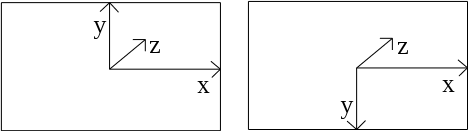

## Summary

本文档记录一些 Vulkan 基础细节

### 1. Vulkan Coordinates

Vulkan 是右手系坐标系，这与 OpenGL 不同，OpenGL 是左手系坐标系。如下图所示



<center>左为 OpenGL 坐标系，右为 Vulkan 坐标系</center>

右手系是指：右手四指指向 $+x$，然后绕向 $+y$ 方向，大拇指的指向即为 $+z$ 方向。

  ### 2. 平面的正面与反面

首先判断顶点顺序是顺时针还是逆时针。顺时针方向为：右手拇指指向 $+z$ 方向，四指环绕方向即为顺时针方向。[```VkPipelineRasterizationStateCreateInfo```](https://www.khronos.org/registry/vulkan/specs/1.2-extensions/man/html/VkPipelineRasterizationStateCreateInfo.html) 中的 ```frontFace``` 用以定义正面为顺时针 (```VK_FRONT_FACE_COUNTER_CLOCKWISE ```) 还是逆时针 (```VK_FRONT_FACE_CLOCKWISE ```)，另一成员 ```cullMode``` 指定剔除背面还是正面。

 这里的正反面是通过手势判断的，算法上是使用有符号面积实现，如 [VkFrontFace ](https://www.khronos.org/registry/vulkan/specs/1.2-extensions/man/html/VkFrontFace.html)。

