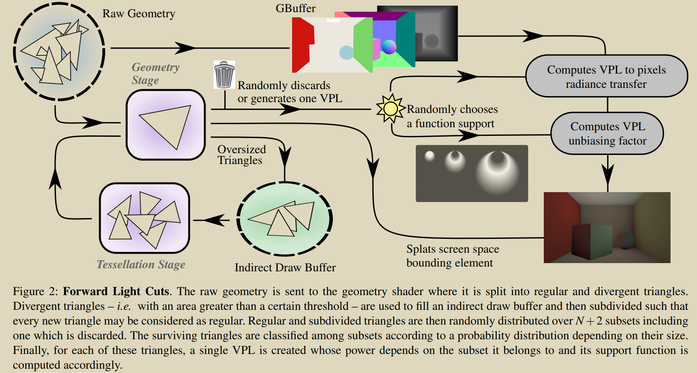

## Summary

`Forward Light Cuts: A Scalable Approach to Real-Time Global Illumination  `  

这篇论文假设了次级光源为 diffuse 材质的场景，提出了一种能够很好结合 tesellation 和 geometry 阶段的并行特性的高效实时全局光照近似计算算法。该算法基于 many-light 框架，首先通过将场景中三角形以一种概率分布划分为 multi-scale radiance 子集，每个子集中的每个三角形生成一个扰动的 VPL，这样就组成了多尺度的 VPL 集合。之后求解该 VPL 集合形成的 many-light 问题来近似全局光照。该算法既模拟了传统层级的光源数量的随尺度增加的几何级下降，又具有可高度并行的线性设计，在场景完全动态并且涉及大量物体时，相比于之前算法，画面无明显缺陷并且具有较大的性能提升。

## Motivation

实时全局光照有很多基于 radiance caching 的方法，之前这些方法构建出场景中几何的层级结构（多为树形结构），使用这种层级结构来构建 multi-scale radiance function，之后通过查询该层级结构对像素进行照亮。

对于这种策略的方法，在场景完全动态并且涉及大量物体情况下，至少有两种局限，

- 层级缓存结构每一帧都要重复计算，这个缺点带来的开销在现代图形学的并行结构下更为明显
- 对于实时渲染，初始 VPL 集合过大，带来的开销难以分摊

## Algorithm

### 1. VPLs Generation

##### (1) 区分 Divergent 和 Regular 三角形

设置阈值 $S_0$ ，面积大于 $S_0$ 的三角形为 Divergent 三角形，这类三角形需要经过一次 tessellation 特殊处理，之后描述。

​							$$\large S_0=4\pi \frac{D^2_{near}}{N_{avg}}$$ ， 

这个公式表达的是启发式地照亮一个像素，该像素至少周围有 $N_{avg}$ 个距离为 $D_{near}$ 的 VPLs 。参数配置：假设 $R_{scene}$ 为场景的半径长度，设置 $\large D_{near}=0.2\times R_{scene}$，$N_{avg}$ 在区间 $[64,1024]$ 内进行 quality-speed tradeoff。

> `个人理解见`：附录 1. 阈值 $S_0$​ 的启发式的理解

##### (2) 三角形提取过程

提取过程目的是丢弃小三角形，因为这类三角形引入的 diffuse indirect lighting 对最终的渲染贡献很小，丢弃会加快速度，但如果全部无差别丢弃，则会丢失那些多个小三角形一起作用而带来的明显间接光照效果，因此提取操作中引入一种随机过程，即**随机提取过程**：

对于每一个三角形计算一个 $[0,1]$ 区间均匀分布的随机数 $u_{t_i}$，如果三角形面积 $\large\mathcal{A}(t_i)>u_{t_i}S_0$，则保留该三角形，否则丢弃。三角形是否保留的概率分布为

​								$$\large \forall\space t_i\in \mathcal{L}, \quad P(t_i\in \mathcal{L^*})=\frac{\mathcal{A}(t_i)}{S_0}$$ ,

其中 $\mathcal{L}$ 是全体 regular 三角形的集合，$\mathcal{L^*}$ 是保留的三角形集合。由此可以看出，**三角形面积越小，被丢弃的概率越大。**对于整个场景的面能够保留下来的数量的期望为 $\large \mathbb{E}(N_{sample})=\frac{\mathcal{A}_{scene}}{S_0}$。

**基于随机提取过程的三角形多尺度划分**

将场景中三角形划分为 $(\mathcal{L}^0,...,\mathcal{L}^N)$ 共个 $N+1$ 子集，子集索引由 $0$ 到 $N$ 递增，影响距离递减（即尺度递减），子集包含的三角形数量递增。为了实现这样的划分，引入 $N+1$ 长度的递增序列 $\{S_0<...<S_N\}$。扩展随机提取过程到多尺度划分过程，三角形 $\large t_i$ 划分为子集 $\large \mathcal{L}^k$ 的概率为

​								$$\large \forall k\in [0...N],\quad P(t_i\in \mathcal{L}^k)=\frac{\mathcal{A}(t_i)}{S_k}\tag{1}$$

在多尺度划分过程中，divergent 三角形的定义更改为**面积大于 $S_N$ 的三角形**。

实际划分算法又有进一步的改动，引入 $\large\forall k\in [0...N],\quad \tilde{S}_k=\frac{1}{\sum^k_{j=0}}$ ， 算法伪代码如下

> 可知 $\tilde{S}_k$ 单调递减，与原 $S_k$ 单调递增相反，但算法中是只有三角形没有被分在 $k-1$ 子集中，才有可能判断是否可分到 $k$ 子集，这是条件概率。粗略地看，子集索引越大，三角形分到该子集的概率越低，因为需要在前面没有分到所有子集的条件，才进行后续子集的划分。

至此，我们已经对场景三角形进行随机划分为多个不同尺度的子集，之后其中的每个三角形都会随机生成一个 VPL，形成 VPL 集。接下来基于生成的 VPL 求解 many-light 问题，即如何使用这些 VPL 照亮像素。

### 2. VPLs 光照下的着色

##### (1) many-light 下的 VPLs lighting 问题描述

在 many-lights 框架中，对于 normal 为 $\large \vec{n_x}$ 的着色点 $x$ 的 indirect outgoing radiance，计算方法由连续积分近似为来自一个 VPLs 集合的 radiance 离散求和。

$$\large L^{ML}(x,\vec{n_x})=\sum_{t_i\in \mathcal{L}}H(t_i,x,\vec{n_x})\mathcal{A}(t_i) \tag{2}$$

$\large \mathcal{L}$ 表示场景中所有三角形集合，$\large  H(t_i,x,\vec{n_x})$ 表示 normal 为 $\large \vec{n_x}$ 的点 $\large x$ 接收到由 $\large t_i$(VPL) 出发的 radiance。对于 albedo 为 $\large  \rho_x$ 的 diffuse receiver， $\large H$ 的形式如下：

​										$$\large H(t_i,x,\vec{n_x})=L(t_i,\bar{y_ix})\frac{\rho_x}{\pi}\frac{<\vec{n_x},\bar{xy_i}>^+<\vec{n_i},\bar{y_ix}>^+}{d_i^2}$$

其中 $\large \bar{u}$ 表示 normalized 向量，$\large <\vec{u},\vec{v}>^+=max(0,<\vec{u},\vec{v}>)$，$\large L(t_i,\bar{y_ix})$ 是离开 VPL 中心 $\large y_i\in t_i$ 朝向 $\large \bar{y_ix}$ 的 radiance， $\large d_i=max(\epsilon,||\vec{xy_i}||)$ 是进行过 clamp 的 $\large y_i$ 与 $\large x$ 之间的距离，避免奇异点。

> `对近似的个人理解见`：附录 2. 着色方程积分近似为求和的理解

VPL diffuse 反射直接光照表示为下面的 VPL 出射 radiance：

​										$$\large L(t_i,\bar{y_ix})=\rho_iE(t_i)\frac{3}{2\pi}<\vec{n_i},\bar{y_ix}>^+$$

其中 $\large E_i$ 是直接到达三角形 $\large t_i$ 的直接 irradiance，由于 $\large <\vec{n_i},\bar{y_ix}>^+$ 可知上式并非 perfectly lambertian (一种简单的漫反射：光线被均匀的反射到表面上方的半球)，而只会在几何法线方向发生完美反射。$\large \frac{3}{2\pi}$ *用来保证能量守恒*。

>  将 $\large L(t_i,\bar{y_ix})$ 代入 $\large H(t_i,x,\vec{n_x})$ 中有
>
> $$\large\begin{align}H(t_i,x,\vec{n_x})&=\rho_iE(t_i)\frac{3}{2\pi}<\vec{n_i},\bar{y_ix}>^+\frac{\rho_x}{\pi}\frac{<\vec{n_x},\bar{xy_i}>^+<\vec{n_i},\bar{y_ix}>^+}{d_i^2}\\ &= \frac{3}{2\pi^2}\rho_i\rho_xE(t_i)\frac{<\vec{n_x},\bar{xy_i}>(<\vec{n_i},\bar{y_ix}>)^2}{d_i^2}\tag{3}\end{align} $$

##### (2) 多尺度划分下的 VPLs lighting 的近似

上述进行的对三角形的多尺度随机划分引入了随机过程，因此 $\large L^{ML}(x,\vec{n_x})$  也变成了**随机量**，接下来就需要对该随机量进行估计。我们定义 $\large K(x,\vec{n_x})$ 为 $\large L^{ML}(x,\vec{n_x})$  **估计量(Estimator)**：

​										$$\large K(x,\vec{n_x})=\sum\limits^N_{k=0}\sum\limits_{t_i\in\mathcal{L}^k}H(t_i,x,\vec{n_x})F^k(t_i,k)$$

其中 $\large F^k(t_i,k)$ 是一个未知函数，参数 $\large x$ 为着色点，$\large t_i$ 为 VPL 所在三角形，$k$ 为子集索引。

下面就要确定 $\large F^k(t_i,k)$ 的形式：

​										$$\large \begin{align} \mathbb{E}\left[K(x,\vec{n_x})\right] &= \mathbb{E}\left[\sum\limits^N_{k=0}\sum\limits_{t_i^k\in \mathcal{L}^k}H(t_i^k,x,\vec{n_x})F^k(t_i^k,x)\right] \\ &= \sum\limits_{t_i\in \mathcal{L}}H(t_i,x,\vec{n_x}) \mathbb{E}\left[\sum\limits^N_{k=0}F^k(t_i,x)\mathbb{I}_{t_i\in \mathcal{L}^k}\right] \\ &= \sum\limits_{t_i\in \mathcal{L}}H(t_i,x,\vec{n_x})\sum\limits^N_{k=0}F^k(t_i,x)P(t_i\in \mathcal{L}^k)\tag{4}\end{align}$$

其中 $\large \mathbb{I}_{t_i\in \mathcal{L}^k}$ 为指示函数，当 $\large t_i\in \mathcal{L}^k$ 时值为 $1$，否则为 0。

> `推导见`：附录 3. VPL lighting 推导

我们要选取 $F^k(t_i,x)$ 使得 $K(x,\vec{n_x})$ 为 $L^{ML}(x,\vec{n_x})$ 的无偏估计，即 $\mathbb{E}\left[K(x,\vec{n_x})\right]=L^{ML}(x,\vec{n_x})$，比较式 (2) 和 (4) 可有

​											$\large \forall x,\quad \sum\limits_k F^k(t_i,x)P(t_i\in \mathcal{L}^k)=\mathcal{A}(t_i)\tag{5}$

根据划分策略，将 $\large F^k$ 定义为 	$\large F^k(t_i,x)=S_kf^k(t_i,x)$

> `推导见`：附录 4. 转为整体划分问题推导

这样就将一个无偏估计问题转为了寻找对一个整体的划分问题。

**整体的划分选取**

$\large f^k(t_i,x)$ 划分函数的参数 $\large t_i,x$ 都为三维，论文采用一种方法将划分函数进行降维近似处理，此方法参考了论文  *Point-based approximate color bleeding* 中的 nested balls: $\large \mathcal{B}_h(t_i)$，其定义如下：

​								$$\large \forall h\in \mathbb{R}^*, \quad \mathcal{B}_h(t_i)=\{x\in\mathbb{R}^3\space s.t. \space \underset{\vec{n_x}}{max}\space H(t_i,x,\vec{n})\geq h\} \tag{6}$$

> $\large H$ 是 $\large x$ 接收到 $\large t_i$ VPL 的 radiance，这个 nested ball 的含义就是定义了一个对着色点 $\large x$ 的 radiance 贡献较为显著的区域，这个显著程度由 $\large h$ 决定。

此外，考虑 receiver 正对着 emitter 的情况，即 $\large \vec{n_x}=\bar{xy_i}$，此时 $\large H$ 达到最大值，有：

​								$$\large \mathcal{B}_h(t_i)=\{x\in\mathbb{R}^3\space s.t. \space \frac{||x-y_i||}{<\vec{n_i},\bar{xy_I}>^+}\leq D(h)\}\tag{7}$$，

其中  $\large D(h)=\frac{1}{\pi}\sqrt{\frac{3\rho_x\rho_iE(t_i)}{2h}}$

> `推导见`：附录 5. 整体划分选取推导

 $\large D(h)=\frac{1}{\pi}\sqrt{\frac{3\rho_x\rho_iE(t_i)}{2h}}$ 与 $\large x$ 着色点无关，因此 $\large \mathcal{B}_h(t_i)$ 是一个 nest ball，其边界上有点 $\large y_i$，其中心位于直线 $\large (y_i,\vec{n_i})$ 上。如下图所示

> 上图是 $\large f^k(t_i,x)$ 函数的二维可视化，其值从 0(黑) 到 1(白)。

作者做了一个假设：nest ball 边界上的三维划分 $\large f^k(t_i,x)$ 是不变的，通过如下 $\large \mathbb{R}^3$ 到 $\large \mathbb{R}$ 的映射：

​										$$\large \forall x\in \mathbb{R}^3, \quad d(t_i,x)=\frac{||x-y_i||}{<\vec{n_i},\bar{xy_I}>^+}$$

可以将三维划分将为一维划分：

​										$$\large \forall x\in \mathbb{R}^3, \quad f^k(t_i,x)=\tilde{f}^k(d(t_i,x))$$

 $\large f^k$ 将会在 rendering 中用作 splat function，因此尽可能使得 $f^k$ 易于计算且 smooth，论文定义为下面一组分段线性函数

​										$$\large \forall d\in\mathbb{R},\quad \tilde{f}^k(d)=\begin{cases}\begin{align}&1 &k=0\space and \space d\in[0,D_1] \\ &\frac{d-D_{k-1}}{D_k-D_{k-1}} &k>0\space and \space d\in[D_{k-1},D_k] \\ &\frac{D_{k+1}-d}{D_{k+1}-D_k} &k>0 \space and \space d\in [D_k,D_{k+1}]\\&0 &otherwise\end{align}\end{cases}$$

$\large \{D_k\}$ 定义了每一级 VPL 的影响距离。

 **参数配置**

作者为了模仿传统的层级表示，采用了子集大小几何级下降的参数配置。从前述划分策略来看，$\large S_k$ 影响到划分子集的结果，此外，可以将 $\large S_k$ 理解为子集 $\large \mathcal{L}^k$ 的平均面积，应几何级增加，因此定义如下参数配置：

​											$$\large S_k=S_0\mu^k$$

其中 $\large \mu >1$ 是用户定义的参数，论文建议 $[1.4,5]$。作者还建议定义影响距离参数，这样每个点都只会有一个可控数量的 VPL 到达，控制计算量，如：

​											$$\large\begin{cases}D_k=\sqrt{S_0\mu^k}\\ D_{N+1}=D_{N}\end{cases}$$

> `个人理解见：附录 6. 模拟传统层级的几何级下降的理解`

## 实现细节

##### (1) Pipeline 描述

本论文提出的技术共用到三个 geometry pass，其中两个主要 pass 用于生成 GBuffer 和生成并 Splat VPLs。第三个 pass 用于处理 Divergent triangle。如下图所示

##### (2) Divergent 三角形处理

在本论文提出的 indirect lighting pipeline 中包含了两个 geometry pass：第一个 pass 关闭 tessellation stage 处理整个场景的三角形，这个阶段检测出哪些是 Divergent 三角形，并存入单独的 buffer 中。剩下的 regualer 三角形送入 regular pipeline。

存储 Divergent 三角形的 buffer 直接作为后续第二个 geometry pass 的输入。tessellation stage 只在这个 pass 开启，用于细分 divergent 三角形，使得它们的面积小到能够被 regular pipeline 处理。

> Tessellation stage 相比于 geometry 是开销是非常大的，因此使用一个 geometry 阶段过滤 regular 三角形，提高了效率。

regular pipeline 即对 regular 三角形采样分级，再进行 VPL lighting 计算。

##### (3) Per-triangle random number generation

本论文涉及的随机过程都需要随机数来完成，对于算法 1 用到的随机数 $\large u_{t_i}$，作者使用伪随机数。mesh 中每个顶点添加一个额外的 uint32 属性，v_rand。该属性在加载 mesh 时为每个顶点生成一个 uniform 随机数。在 regular pipeline 中，每个三角形的随机数 $\large u_{t_i}$ 是使用其三个顶点间的 $\large xor$ 操作得到的。

对于 tessellation stage 细分生成的新三角形，作者通过采样一张预计算的噪声贴图得到新顶点的随机值，采样坐标为新顶点的重心坐标，最后对新三角形顶点的随机数使用同样的 $\large xor$ 操作。

想要以上随机数每帧更新，以上随机数最终再与一个 uniform 的全局变量 u_rand 进行 $\large xor$ 操作，这个 uniform 全局变量大概要一帧更新一次。算法如下

##### (4) Progressive rendering

可以按照上述使用 u_rand 的方法生成多个 independent rendering，之后累积作平均用以产生更好的渲染结果。如，从 u_rand 中为每个三角形生成两个独立的随机数，用以扰动 VPL 中心点 $\large y_i$。平均由多个 jittered VPLs 生成的多个 independent rendering，可以提供接近公式 (4) 真实解的结果。

## Remain Question

- [ ] 划分整体过程中的整体应该怎么理解？
- [ ] Splatting indirect illumination   技术不了解

## 附录

### 1. 阈值 $S_0$ 的启发式的理解

以像素为球心、半径为 $D_{near}$ 的球面面积为 $4\pi D^2_{near}$，假设在距离 $D_{near}$ 内的 VPL 光源才能到达该像素，并且 $N_{avg}$ 个 VPL 共同作用下才能照亮该像素。由于本文中次级光源都假设为 diffuse，因此可粗略地认为 VPL 发出的 radiance 与面积成正比。这样下来，VPL 的平均面积 $\large 4\pi \frac{D^2_{near}}{N_{avg}}$，高于此平均面积的三角形成为 divergent，剩下的三角形为  regular，regular 三角形生成的 VPL 具有可控的影响距离，divergent 三角形后续会进一步细分为小三角形。

### 2. 着色方程积分近似为求和的理解

首先来看精确的 rendering equation，

​									$$\large L(x,\omega_o)=\int_{\Omega^+}\space f_r(x,\omega_i\rightarrow\omega_o)L_i(x',\omega_i)cos\theta \space d\omega_i$$

上式为对立体角的积分，转为对光源面积的积分为

​									$$\large L(x,\omega_o)=\int_{A}\space f_r(x,\omega_i\rightarrow\omega_o)L_i(x',\omega_i)\frac{cos\theta cos\theta'}{||x'-x||^2} \space dA$$

$L^{ML}$ 的形式即从对光源面积的积分近似而来，diffuse 下 BRDF 是常量，即 $H$ 中的 $\large\frac{\rho_x}{\pi}$，$L_i$ 对应 $H$ 中的 $L$。因此，$L^{ML}(x,\vec{n_x})$ 与 $L(x,\omega_o)$ 唯一不同的是一个是对总体面积的连续积分，一个是将每个 VPL 的面积视为微元的离散求和。可知，在 VPL 面积较小时，这种近似较为接近正确。

### 3. VPL lighting 推导

将划分的三角形所有子集看作一个整体求和符号有：$\large \sum\limits^N_{k=0}\sum\limits_{t_i^k\in \mathcal{L}^k}=\sum\limits_{t_i\in \mathcal{L}}$

>  因为 $\large t_i^k$ 本就代表是子集 $\large \mathcal{L}^k$ 中的三角形，可知 $\large \mathbb{I}_{t_i^k\in \mathcal{L}^k}$ 恒为 $1$，因此有

$\large\mathbb{E}\left[\sum\limits^N_{k=0}\sum\limits_{t_i^k\in \mathcal{L}^k}H(t_i^k,x,\vec{n_x})F^k(t_i^k,x)\right]=\mathbb{E}\left[\sum\limits^N_{k=0}\sum\limits_{t_i^k\in \mathcal{L}^k}H(t_i^k,x,\vec{n_x})F^k(t_i^k,x)\mathbb{I}_{t_i^k\in \mathcal{L}^k}\right]$，

>  将和的期望转为期望的和

$\large=\sum\limits^N_{k=0}\sum\limits_{t_i^k\in \mathcal{L}^k}\mathbb{E}\left[H(t_i^k,x,\vec{n_x})F^k(t_i^k,x)\mathbb{I}_{t_i^k\in \mathcal{L}^k}\right]$，

> 此时由于指示函数的存在可将三角形子集看作一个整体求和，

$\large=\sum\limits_{t_i\in \mathcal{L}}\mathbb{E}\left[H(t_i,x,\vec{n_x})F^k(t_i,x)\mathbb{I}_{t_i\in \mathcal{L}^k}\right]$，

> $H(t_i,x,\vec{n_x})$ 与随机划分无关，对于期望而言是常量，可以提出期望计算外，即

$\large=\sum\limits_{t_i\in \mathcal{L}}H(t_i,x,\vec{n_x})\mathbb{E}\left[F^k(t_i,x)\mathbb{I}_{t_i\in \mathcal{L}^k}\right]$，

> 接下来进行一个恒等变换，$\large F^k(t_i,x)\mathbb{I}_{t_i\in \mathcal{L}^k}=\sum\limits^N_{k=0}F^k(t_i,x)\mathbb{I}_{t_i\in \mathcal{L}^k}$，因为对于每一个 $t_i$，只会有一个 $k$ 值使得 $\large \mathbb{I}_{t_i\in \mathcal{L}^k}=1$，其余都为 $0$。

$\large=\sum\limits_{t_i\in \mathcal{L}}H(t_i,x,\vec{n_x})\sum\limits^N_{k=0}\mathbb{E}\left[F^k(t_i,x)\mathbb{I}_{t_i\in \mathcal{L}^k}\right]$，

> 目前期望计算中只有指示函数与随机划分相关，且易知  $\large \mathbb{E}\left[\mathbb{I}_{t_i\in \mathcal{L}^k}\right]=P(t_i\in \mathcal{L^k})$ ，有

$\large\mathbb{E}\left[F^k(t_i,x)\mathbb{I}_{t_i\in \mathcal{L}^k}\right]=F^k(t_i,x)\mathbb{E}\left[\mathbb{I}_{t_i\in \mathcal{L}^k}\right]=F^k(t_i,x)P(t_i\in \mathcal{L^k})$

> 最终有

$\large \sum\limits_{t_i\in \mathcal{L}}H(t_i,x,\vec{n_x})\sum\limits^N_{k=0}F^k(t_i,x)P(t_i\in \mathcal{L}^k)$

### 4. 转为整体划分问题推导

由 (1) 式代入 (4) 中有

$$\large\forall x,\quad \sum\limits_k F^k(t_i,x)\frac{\mathcal{A}(t_i)}{S_k}=\mathcal{A}(t_i)$$

$$\large\forall x,\quad \sum\limits_k \frac{F^k(t_i,x)}{S_k}=1$$

假设未知函数 $\large f^k(t_i,x)$ 使得 $\large F^k(t_i,x)=S_kf^k(t_i,x)$，那么有

​				$\large \sum\limits_kf^k(t_i,x)=1$

### 5. 整体划分选取推导

> 当 receiver 正对着 emitter 时，将 $\large \vec{n_x}=\bar{xy_i}$ 代入 (3)，有

$\begin{align}\large \underset{\vec{n_x}}{max}\space H(t_i,x,\vec{n_x})&=\frac{3}{2\pi^2}\rho_i\rho_xE(t_i)\frac{(<\vec{n_i},\bar{y_ix}>)^2}{d_i^2}\\&=\frac{3}{2\pi^2}\rho_i\rho_xE(t_i)\left(\frac{<\vec{n_i},\bar{y_ix}>}{||x-y_i||}\right)^2\end{align}$

> 将 $\large H$ 代入公式 (6) 有

$$\large \frac{3}{2\pi^2}\rho_i\rho_xE(t_i)\left(\frac{<\vec{n_i},\bar{y_ix}>}{||x-y_i||}\right)^2 \geq h$$

$$\large \left(\frac{<\vec{n_i},\bar{y_ix}>}{||x-y_i||}\right)^2 \geq \frac{2h\pi^2}{3\rho_i\rho_xE(t_i)}$$

$$\large \frac{<\vec{n_i},\bar{y_ix}>}{||x-y_i||} \geq \pi \sqrt{\frac{2h}{3\rho_i\rho_xE(t_i)}}$$

$$\large \frac{||x-y_i||}{<\vec{n_i},\bar{y_ix}>} \leq \frac{1}{\pi} \sqrt{\frac{3\rho_i\rho_xE(t_i)}{2h}}$$

### 6. 模拟传统层级的几何级下降的理解

这里的模拟层级表示而引入几何级下降的参数配置：例如满二叉树的层级表示，根节点层(0层)节点数量为 $\large S_0=1$ 个，往下每层数量是前一层的 2 倍，即有 $\large S_k=S_0 2^k$ 个，为几何级增长。
