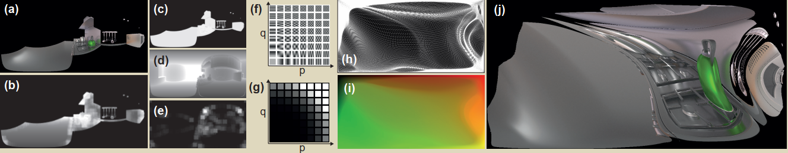

## Summary

```Glossy Probe Reprojection for Interactive Global Illumination  ``` [[8]](#[8])

这篇论文提出了一种基于 light probe 思想的实时全局光照算法，高效解决带有 glossy 路径的全局光照问题。light probe 思想在场景中放置多个 light probe，每个 light probe 包含了该位置的间接光照信息，这些信息通过预计算过程存入 light probe，并用于在实时渲染过程中计算着色点的全局光照。本论文提出自适应的 probe 参数化，通过评估不同角度、不同位置的几何信息，自适应不同情况所需要的 probe 分辨率，用以缓解 glossy 全局光照带来的高内存消耗问题。在实时渲染中提出基于 specular path perturbation 的间接光反射点估计方法，高效 reproject glossy path 信息到实时的 novel view space，进而收集到实时全局光照信息。同时论文改善了 occlusion boundaries 附近出现的硬边界问题，通过预计算过程中降低几何 roughness 来预计算 probe data，以收集到更大范围的全局光照信息，在实时渲染中设计 filter 重构原 roughness，达到硬边界的平滑过渡。

## Background

### 1. Light Probe

- [ ] light probe 算法思想

- [ ] 基于 3D-grid 的 light probe [[1]](#[1])

## Approach

### 1. Probe 预计算

Probe 中存储实时渲染过程中需要使用的全局光照信息，通过 path-tracer 计算得到。glossy BRDF 需要较多的采样才能得到平滑的着色，如果在整个场景中的每个 probe 的所有方向都收集同样多样本的信息，会使得 probe 数据存储消耗过大。因此作者提出 adaptive probe resolution，即根据不同位置、不同视角观察到的几何信息来评估该位置需要的 probe resolution，高分辨率对应高样本数，低分辨率对应低样本数。先介绍一下本论文使用的 probe data 存储的数据

#### 1.1 Per Probe Data

预计算过程中，为每个 Probe 生成数据，包含三张贴图，如下图所示：


- (a) 可见的三角形信息(三角形 ID、重心坐标)

- (b) probe 空间的环境贴图(只存储 glossy BRDF 计算的颜色值)

- (c) 将每个面视为镜面，记录完美反射过程中的几何信息(反射点、及其材质 ID)

这三张贴图都是 360 度贴图，将 probe 作为相机，贴图中每个 texel 存储的是不同角度看向场景得到的信息，即 probe view 下的渲染信息。

#### 1.2 Probe Parameterization

对于有限的内存消耗，probe 数量是有限的，这篇论文提出的 adaptive probe resolution 是为了将更多地 probe resolution 分配到需要高采样的区域(因为同样的 fov 下，probe 数据的分辨率越高，包含采样的样本越多)。作者设计了一种 probe 需求的评估策略，评估结果为一个方向看到的场景所需的 probe resolution 参数。根据评估得来的 probe resolution 不断调整 probe 对应 3D grid 的等划分网格，最终达到网格大小与 probe resolution 相匹配，即 probe resolution 越大，网格越大。对网格中像素对应的场景角度，使用 path tracer 计算 probe 离线数据。

**如何确定什么情况需要较高的 probe resolution 或较低的 probe resolution？**

- a) 因为光滑表面频率信息较高，因此越光滑的表面需要越高的分辨率，反之粗糙的材质频率较低，需要较少的样本
- b) 远距离表面或者 grazing 角度看到的表面需要较高的分辨率
- c) 高频几何(法线)信息在 reflected radiance 上表现出很大的变化，因此需要较高的分辨率。

根据上述要求，论文使用 lat-long (相当于球坐标) 对 probe 分辨率参数化。在 probe view space 中，计算每个角度对应的 probe resolution 参数，并存储到 adaptive resolution map 中。lat-long 参数化易于确定 adaptive resolution map 的每个像素对应的 ray direction，方便 probe data预计算过程的 ray-tracing。

##### 1.2.1 Adaptive Resolution Map 计算

一个 Adaptive resolution map 的元素表示 probe 每个方向对应的 probe resolution 参数。计算该 Map 前先使用以 probe 出发的 ray casting 构建 4 个 256x128 的 buffers，(i) 材质 smoothness $\large m_{mat}$，(ii) 深度值 $\large m_{depth}$，(iii) 法线 $\large m_{norm}$，(iv) facing angle $\large m_{face}$ (入射光方向与表面法线点乘)。

Adaptive resolution map 的元素计算：

$$
m=m_{mat}(m_{size}+m_{complexity})
$$
可以看出 

- $\large m_{mat}$​ 满足了 a)，越光滑 $\large m_{mat}$​ 越大，得到的分辨率参数 $m$​ 也越大；

- $\large m_{size}$​​​​ 考虑了 b) 中距离与角度的要求，其计算为 
                      $$
                      m_{size}=\frac{m^2_{depth}}{m_{face}}\cos(\theta_{long})
  $$

  >  depth 越大，表面面积相对越小，对应较大的 $m$​；$\large m_{face}$​​ 越小，表示入射光与 normal 夹角越大，越 grazing，对应较大的 $m$

  - [ ] 不明白：This term converts probe area to actual object size, compensating for perspective and angular foreshortening akin to a form factor. $\large \theta_{long}$ is the longitude angle, which compensates for size variations induced by the lat-long base parameterization.  
  
- 要求 c) 需要对局部几何复杂度分析，作者使用频率分析代替：
     $$
     m_{complexity}=\frac{1}{N^2}\sum\limits^{N-1}_{p=0}\sum\limits^{N-1}_{q=0}w_{p,q}||\mathbf{b}_{p,q}*m_{norm}||_1
     $$

     - [ ] 2D Discrete consine transform [[2]](#[2]): $\mathbf{b}$​ 是 basis function，basis function 与法线的卷积用来分析 local neighborhood 的频率信息
     
     $\large w_{p,q} =||[p,q]||^k$ 权重用来确保高频对几何复杂度贡献更高，论文中取 $N=16,k=5$。

$\large m_{size}$ 和 $\large m_{complexity}$ 使用均值经过归一化。

上述 Adaptive Resolution Map 只是计算了 probe 在不同方向上的分辨率参数，但这个参数只是相对分辨率，反应不同方向上分辨率的大小关系，而不是真正的分辨率。接下来需要根据这个相对分辨率参数，进行对 probe 真正分辨率的参数化。

##### 1.2.2 Adaptive Parameterization <a name="1.2.2"></a>

本小节，作者使用 tensorial quasi-harmonic maps [[3]](#[3])，将 adaptive resolution map 转为 adapted resolution。转换过程如下：

- [ ] 需要理解 [[3]](#[3]) 的数学原理，描述下面过程的细节

1. 将每个 proble 对应的 3D grid 进行离散等划分，得到均分的四边形网格 quad mesh (应该是 3D grid 的六面划分成四边形网格)，并且 adaptive resolution map 中每一个元素对应一个 quad mesh。
2. 根据 adaptive resolution map ，求解 quasi-harmonic equation ，得到 forward flow map。
3. forward flow map 指示如何调整 quad mesh 的顶点，不断对 quad mesh 变形，最终达到与 apaptive resolution map 相一致的参数化。probe 对应的 3D grid 最终变形为如图 [Fig. 1.2.2(h)](#Fig. 1.2.2) 所示。

至此，变形的 quad mesh 达到与 adaptive resolution map 描述一致的 adaptive resolution，即 adaptive resolution map 较大的元素对应较大的网格，较小的元素对应较小的网格。下面就需要计算不同分辨率的 probe data，即对网格的每个像素进行 path-tracing 计算 probe data。但由于变形，这里的像素位置已经不能确定 path-tracing 的光线方向，即像素的 view vector。作者将 forward flow map 进行求逆，得到 inverse flow map，这样就可以确定像素真正的 view vector。

<a name="Fig. 1.2.2"></a>



<center>Fig. 1.2.2</center>

全局光照包含两个组成成分 glossy 和 diffuse：glossy 成分存储在 probe 数据中，在计算 probe 时，path-tracer 计算 glossy BRDF；Diffuse 成分与 view 视角无关(view-independent)，因此存储在传统的 lightmap 中。

#### 1.3 Geometric Information

上一小节完成了 probe 中包含的全局光照信息的预计算，但 probe 贴图数据中包含的是 360° 视角的全局信息，在实时渲染中，需要确定当前着色点需要哪些 probe 数据的样本。对于此，作者使用 specular path perturbation 的方法，这个在之后章节阐述，但该方法需要几何面的导数信息。

因此本小节预计算场景几何信息，估计场景中每个顶点的主曲率，以此将 mesh 近似为具有解析表达式形式的抛物面，这样的抛物面可以高效计算出其高阶导，用于实时渲染中收集 probe 样本的 glossy light 信息。过程如下：

1. - [ ] 对于每个顶点，使用 [[4]](#[4]) 技术估计其主曲率与对应方向 [Fig 1.3(a)](#Fig 1.3)。该步骤在每个物体上分别进行，并且为了更好的结果，对较大表面，先进行细分 [Fig 1.3(b d)](#Fig 1.3)。
2. 计算来的主曲率可以以曲率方向为坐标轴将物体表面局部表示为具有解析表达式的抛物面 [Fig 1.3(c)](#Fig 1.3)，该解析表达式方便后续高效计算其高阶导。

<a name="Fig 1.3"></a>


<center>Fig 1.3</center>

至此，预计算部分已经结束，下面开始实时渲染。

### 2. Rendering Global Illumination

上述预计算的数据都是 probe view 下的光照信息，实时渲染中则需要将 probe view 重投影为 novel view 下所需要的全局光照信息。全局光照信息包含 diffuse 与 glossy 光照信息，对于 diffuse 全局光照，直接采样预计算的 lightmap。而 glossy 成分则需要对 light probe 重投影到 novel view。

glossy 光线路径的全局光照渲染概要：

1. 需要将预计算的 light probe 进行重投影(reprojection)。为此，先光栅化一个 G-buffer，其中包含 position、normal、表面曲率和材质(ID和roughness)。

2. 使用 ray-caster，发射光线到 specular pixels(应该指把像素看作 specular)，再经过完美镜面反射。ray data 中存储反射光的 hit position 和对应的材质 IDs。

3. 之后基于像素附近收集的 probes 信息来计算像素的 glossy 光照信息。

   - 选择距离着色点最近的 probe(最终方案为最近的 8 个)，确定 probe data 中与当前像素关联的 sample：计算 probe 经过镜面反射最终到达 ray data 中的 hit position 的反射点，probe data 中该反射点对应的 sample 即包含了着色像素的 glossy GI 信息。(因为 camera -> shading point -> hit position -> specular reflected position -> probe 正好形成了一条带有间接光照的光线路径，前三个是一个镜面反射路径(从 ray data 中获取)，后三个是一个镜面反射路径(由选定的 probe 位置计算得到))。 

     > 如图 [Fig 2(a)](#Fig 2) 所示，光线路径为 $\mathbf{p}\rightarrow \mathbf{x} \rightarrow \mathbf{q} \rightarrow \mathbf{x'} \rightarrow \mathbf{p'}$​，其中 $\mathbf{x}$ 为像素对应的着色点，$\mathbf{q}$ 为经过镜面反射的 hit position(存储在 ray data 中)，$\mathbf{p'}$ 为​挑选的 probe，$\mathbf{x'}$ 为由 $\mathbf{p'}$ 与 $\mathbf{q}$​ 作为镜面反射路径端点计算得到。 

   - 基于一种设计的评估策略，在反射点对应的 probe sample 附近搜索选择最优的 probe sample，即为最终用来计算着色点 GI 的 sample。

<a name="Fig 2"></a>


<center>Fig 2</center>

由上述可知，想要收集 probe samples 信息，必须先知道反射点 $\mathbf{x'}$ 的位置。虽然可以再次使用 ray-caster，但为了高效，作者引入 specular path perturbation 方法。

#### 2.1 On-the-fly Reflection Position Estimation

当相机由 $\mathbf{p}$​​​ 移动到 $\mathbf{p'}$​​​ 时，作者基于 specular path perturbation 理论来确定 $\mathbf{x}$​​​ 移动到的位置 $\mathbf{x'}$​​​。这样的移动描述的其实是镜面反射路径 $\mathcal{S}_1$​​​($p\rightarrow x\rightarrow q$​​​) 到 $\mathcal{S}_2$​​​($p'\rightarrow x'\rightarrow q$​​​​) 的 specular motion。其中反射路径 $\mathcal{S}_1$​​​​ 在 G-buffer 光栅化后已经确定，那么只有 $\mathbf{x'}$​​​ 是未知的。

- [ ] 基于 specular path perturbation [[5]](#[5]) 理论，此时问题转化为：已知 $\Delta p=p'-p$​​，近似 $\Delta x=x-x'$​​，从而得到 $x'=x+\Delta x$​​.
  							                        $$\large \Delta x=J\Delta p+[\Delta p]^TH[\Delta p]$$​​
  其中，$J(p,q,x,f)$​​ 是一个 3X3 Jacobian 矩阵，$H(p,q,x,f)$​​ 是一个 3x3x3 tensor，$[\Delta p]$​​ 是重复 $\Delta p$​​ 三次的  1x1x3 tensor。由于 specular path perturbation 需要使用到 $f$​​ 的一阶、二阶、三阶导数，这里就使用到了预计算中近似的抛物面。

至此，已经计算出 $p\rightarrow  x \rightarrow  q \rightarrow  x' \rightarrow  p'$ 光线路径中 $x'$ 的位置，作者对于得到的 $x'$ 做了额外的处理，只保留和 $x$ 具有相同材质的 $x'$ 点。下面可以使用 $x'$ 来收集 probe data 中的 probe samples，从而得到 probe data 中存储的 glossy GI 信息。

#### 2.2 Gathering View-dependent Color

结合 specular path perturbation 和预计算中表面曲率估计的方法，只是得到了 novel view 到 probe view 的 specular motion。为了得到更加鲁棒的结果，需要在 $x'$ 对应的 probe sample 的区域中搜索，选取最优的 probe sample。

> 在 $p\rightarrow  x \rightarrow  q \rightarrow  x' \rightarrow  p'$ 光线路径中，$p'\rightarrow x'\rightarrow q$ 为镜面反射的路径，但 probe data 中存储的是 glossy GI，glossy BRDF 是一个 lobe，光线路径对应的是一个区域，只要最终能到达 $q$ 即为所找 probe sample。因此，$x'$ 对应的样本附近区域也属于该镜面反射对应的 glossy 路径。因此可以在这个区域的 probe samples 中选取最优的 sample。注意：probe data 中的每个 sample 携带的都是其 probe 对应的 3D grid 区域的 glossy BRDF 的全局光照信息，若要使得像素的全局光照信息更加平滑，应收集不同区域 (即不同 probe) 的全局光照信息。

**probe sample 搜索算法**：使用 two-level 的 grid 搜索算法，coarse-level 在较大的区域内使用较大的 step-size 进行搜索，得到 coarse-level 的最优 sample。然后以这个最优 sample 为中心，使用较小的 step-size 进行 fine-level 搜索。

**评估 probe sample 的优劣**：接下来使用 [Fig 2(b)](#Fig 2) 中的符号，probe view 下的 reflector position $r_p$、normal $n_p$ 和 reflected position $R_p$；novel view 下对应的 $r_v$、$n_v$ 和 $R_v$​ 。设计 energy function 来评估 probe sample 优劣的四个标准：

- novel view sample($R_v$) 和 probe view samples($R_p$) 更倾向于位于同一表面。如果二者的材质 ID 不同，则惩罚总 energy，即乘上 $\large s_a=10$。因此只有在其他样本不可用时，才会选用材质不匹配的样本。

- $\large R_v$ 与 $\large R_p$ 距离近更好，对此引入 $\large s_b=||R_v-R_p||$.

- 相近的表面法线 $n_v$​ 和 $n_p$​ 可以确保一致的光照。对此引入 $\large s_c=1-(n_v\cdot n_p)$​

- 样本应该具有相近的 reflected ray，对此引入：
               $$
               s_d=1-\frac{(R_v-r_v)\cdot (R_p-r_p)}{||R_v-r_v||\cdot||R_p-r_p||}
               $$

结合以上标准，设计 energy function 为：

$$
\varepsilon=s_a\cdot \big(min(s_b,1)+min(s_c,1)+min(s_d,1)\big) \tag{1} \label{energy function}
$$
由于预计算 probe data 过程中应用了 apaptive parameterization，因此在搜索 sample 邻域中不能按常规使用固定大小的 grid(即搜索算法中的步长大小单位不应该固定)，因为这样会在压缩区域中丢失细节，或在放大区域中不充分搜索。对于此，作者对 step size 进行一次 scale，即步长(grid 数量)要乘以

$$
|\frac{\partial f^{-1}_h}{\partial x}|^{-1}
$$
其中 $\large f^{-1}_h$​​ 是预计算过程中生成的 [inverse flow field](#1.2.2)。在作者实验中，coarse-level 搜索区域大小为 7X7 samples，步长为 4 texels；fine-level 搜索区域大小为 3X3 samples，步长为 2 texels。(步长都是 scale 前的)。

至此已经完成在 probe data 中选取最优 probe sample 的方法。下面将 probe sample 中的 glossy GI 信息加入到像素的最终着色中。

如果简单的只收集一个 probe 的 probe sample 中的 glossy GI，相机移动过程中会出现 pop-up 不平滑现象。作者使用距离 novel view 最近（即距相机最近）的 8 个 probe，每个 probe 选取一个最优 probe sample，最终以以下方式整合：
$$
C=\frac{1}{Z}\sum\limits^8_{i=1} t_i\cdot exp(-\phi\varepsilon_i)\cdot c_i \tag{2} \label{the sum of neighboor probes}
$$
其中 $t_i$​ 是 trilinear weight；$\phi$ 是 falloff 因子，论文中设为 8；$Z$ 是归一化系数，确保加权和为一个 unity；$c_i$ 从 probe data 中得到，当 sample 没有 color-blend 时，在加载 $c_i$​​ 过程中使用 bilinear 插值。对于没有找到有效 sample 的像素，对上一帧的 probe 进行 reprojection。

### 3. Two-step Convolution For Accurate Warping of Glossy Probes

上述描述的都是完美镜面反射的着色点，即 $p\rightarrow x\rightarrow q$ 为镜面反射路径，但实际中着色点更多的还是 glossy 材质。对于 glossy 材质的着色点，其对应的 hit position $q$ 会变为一个区域，即 glossy lobe 对应的区域。任何可以到达该区域的光线都可以复用该区域内对应的 probe samples。

对于一种特殊情况，两个相邻着色点的 BRDF lobe 的所有 probe samples 正好分别落在了 occlusion 边界两侧，这样就形成了明显的硬边界。图 [Fig 3](#Fig 3) 形象描述了出现这种情况的原理，[Fig 3(e)](#Fig 3) 中两个像素对应的着色点的 BRDF lobe 包含了黄色和蓝色两个平面的信息，这是 ground truth [Fig 3(a)](#Fig 3) 对应的 BRDF lobe 积分情况；简单的 reprojection 收集的 probe samples 正好落在了遮挡的一侧 [Fig 3(f)](#Fig 3)，使得模糊的边缘变得 sharpen  [Fig 3(d)](#Fig 3)；如果仅进行一次简单的 post-process filter，会导致 overblur，使得表面视觉 roughness 增大 [Fig 3(g)](#Fig 3)，注意着色像素的颜色(roughness 增大，导致像素包含了更大区域的信息，最终颜色过于平滑)。

<a name="Fig 3"></a>


<center>Fig 3</center>

本章节设计新的 filter，减小 Naive post-process filter 造成的 overblur。作者使用 Gaussian 分布拟合 BRDF，利用 Gaussian 分布卷积中的可分离特性，将 BRDF 包含的卷积进行分离为两步。在预计算过程中，减小表面 roughness，设计实时 image filter 重构原 roughness

> 这种聚集 occlusion 边界一侧的现象可以理解为采样不足导致的，本章节提出在不提高采样数量的情况下，在 probe 预计算阶段降低几何表面的 roughness，这样会使得反射的光线更发散，probe sampe 更容易收集到周围着色点信息。在实时渲染过程中，再使用设计的 filter 重构原 roughness，得到原 roughness 下的周围着色点信息。

#### 3.1 Filter Footprint Estimation

为了使用 Gaussian 分布可分离特性，首先需要使用 Gaussian 分布拟合 BRDF，为此需要估计其 footprint（指不同参数变化下 BRDF 的变化足迹）。为了估计 BRDF footprint，作者使用了一个简单的设定，如 [Fig 3.1(a)](#Fig 3.1) 所示：相机通过看向各向同性均匀 roughness 的反射平面($\mathbf{x}$​​​​​​​​)来观察 reflected point，其中反射平面法向量与 view direction 平行，并且与相机和 reflected point 的共线并行。基于这种设定，以固定的 fov 评估每一个点的 GGX BRDF(微表面法线模型) [[6]](#[6])，如 [Fig 3.1(b)](#Fig 3.1) 所示，中间区域最亮应该是直射区域，越往外侧越暗，GGX BRDF 的 specular lobe 反射到相机的越来越少。

影响 BRDF footprint 的参数有评估点的 roughness $\rho$​ 、相机到反射平面的距离 $d_c$​、反射平面到反射点的距离 $d_r$​​，给定这些参数，可以拟合一个协方差矩阵为 $\sum_{\rho}$​ 的 Gaussian 分布 $\mathcal{G}_{\rho}(\mathbf{x}:\rho,d_c,d_r)$​ 。协方差矩阵 $\sum_{\rho}$​ 可以通过选定一组 $[\rho, d_c,d_r]$​ 参数，采样 BRDF footprint 来确定。​例如 [Fig 3.1(c)](#Fig 3.1) 展示的是一条扫描线(相机移动轨迹)下的 BRDF 随 $\mathbf{x}$​ 变化的曲线。作者通过预计算不同参数组合下的协方差表格，供实时渲染时查表。该制表包含 32x32x32 bins，roughness 由 $0$ 到 $0.5$ 、距离由 $0.01$ 到 $10m$。并且采样过程选取 power sampling，在 $d_r<0.5m$​ 降低协方差，防止这种情况下的拟合 overestimated 协方差。

<a name="Fig 3.1"></a>


<center>Fig 3.1</center>

上述简单设定是 view direction 与反射平面垂直的情况，当二者不垂直时，即反射平面为一个倾斜平面，会使得 BRDF footprint 会由于远小近大而沿着倾斜方向缩小。在渲染时，通过将协方差乘上 view direction 和 surface normal 的点乘来进行补偿。

> 使用 [Fig 3.1(a)](#Fig 3.1) 中的设置在预计算过程中拟合出 $[\rho, d_c,d_r]$ 参数不同组合下的 BRDF footprint 的 Gaussian 分布，然后在实时渲染中，根据当前着色点的 $[\rho, d_c,d_r]$ 查表获取该点的 BRDF footprint。但实时渲染中着色点、相机、反射平面多数不是 [Fig 3.1(a)](#Fig 3.1) 的简单设定，需要通过对协方差参数进行 scale 补偿，scale 系数为  view direction 和 surface normal 的点乘。

假设 $\mathcal{G}_{\rho}$ 是反射平面的 BRDF，在 glossy light probes 预计算中获取；$\mathcal{G}_I$ 是 runtime image filter。我们可以在预计算中降低反射平面的 roughness，得到具有对应新 roughness $\rho'$ 的协方差矩阵 $\sum_{\rho'}$ 的 $\mathcal{G}_{\rho'}$. 使用 Gaussian 分布的性质：

$$
\sum(\mathcal{G}_1*\mathcal{G}_2)=\sum(\mathcal{G}_1)+\sum(\mathcal{G}_2)
$$
其中 $\sum$ 是卷积的求和操作，其余为协方差矩阵。现在需要求得一个 image filter $\mathcal{G}_I$ 将降低过 roughness $\rho '$ 的 $\mathcal{G}_{\rho'}$ 重构为原 roughness 的 $\mathcal{G}_{\rho}$​. 利用上述性质，可以得到
$$
\sum_I=\sum_{\rho}-\sum_{\rho'}
$$
从而得到 $\mathcal{G}_I$ （因为这里所有的 Gaussian 分布都采用均值为 0）。在实现中，作者使用 $\rho '=\rho/2$​ 作为预计算中光线路径中的第一个 glossy 顶点的 roughness 参数。

至此，已经完成对 image-space filter footprint 的估计。下面是如何应用 image filter。

#### 3.2 Gloss Filtering

使用几何数据来估计公式 $\eqref{the sum of neighboor probes}$ 中的 $C$ ，
$$
\hat{C}(\mathbf{x})=\frac{1}{Z(\mathbf{x})}\sum\limits_{\mathbf{x}_i\in\mathcal{N}(\mathbf{x})}\mathcal{G}_I(\mathbf{x}_i-\mathbf{x})w_r(\mathbf{x,x}_i)\space\varepsilon^{-1}(\mathbf{x}_i)C(\mathbf{x}_i) \tag{3} \label{glossy filtering}
$$
其中，$\mathcal{N}(\mathbf{x})$​​​​ 表示 $\mathbf{x}$​​​​ 处的 filter footprint；$\large \varepsilon$​​​​ 是 energy function $\eqref{energy function}$​​​​，其逆函数作为置信度来限制向匹配良好的像素的传播；range weight：

$$
w_r(\mathbf{x,x}_i)=\mathbb{1}_{\mathbf{n(x)\cdot n}(\mathbf{x}_i)>\alpha_\mathbf{n}}\cdot \mathbb{1}_{|d(\mathbf{x})-d(\mathbf{x}_i)|<\alpha_d}\cdot \mathbb{1}_{m(\mathbf{x})=m(\mathbf{x}_i)}
$$
作为 cross-bilateral 项，防止不连续的 normal 和 depth 或者不同反射材质 IDs 之间的 filtering. 实现中，作者设置 $\alpha_{\mathbf{n}}=0.8$​ 和 $\alpha_d=0.2$​；$Z$​​ is the normalizing partition function, ensuring filter weights sum to unity。

> 求和的区域应该是 glossy BRDF lobe 对应的区域，对这个区域进行 filter

#### 3.3 Efficient Filter Approximation

- [ ] $\eqref{glossy filtering}$​​​ 式的计算开销太大，作者使用 two passes, effectively using four 1D separable filters 进行高效近似计算 [[7]](#[7])


## Remain Questions

- [ ] 不明白：This term converts probe area to actual object size, compensating for perspective and angular foreshortening akin to a form factor. $\large \theta_{long}$ is the longitude angle, which compensates for size variations induced by the lat-long base parameterization.  

- [ ] 2D Discrete consine transform [[2]](#[2]): $\mathbf{b}$​ 是 basis function，basis function 与 法线的卷积用来分析 local neighborhood 的频率信息
- [ ] 需要理解 [[3]](#[3]) 的数学原理，描述下面过程的细节
- [ ] 对于每个顶点，使用 [[4]](#[4]) 技术估计其主曲率与对应方向 [Fig 1.3(a)](#Fig 1.3)。该步骤在每个物体上分别进行，并且为了更好的结果，对较大表面，先进行细分 [Fig 1.3(b d)](#Fig 1.3)。
- [ ] 基于 specular path perturbation [[5]](#[5]) 理论，此时问题转化为：已知 $\Delta p=p'-p$，近似 $\Delta x=x-x'$，从而得到 $x'=x+\Delta x$.
  	                              $$\large \Delta x=J\Delta p+[\Delta p]^TH[\Delta p]$$
  其中，$J(p,q,x,f)$ 是一个 3X3 Jacobian 矩阵，$H(p,q,x,f)$ 是一个 3x3x3 tensor，$[\Delta p]$ 是重复 $\Delta p$ 三次的  1x1x3 tensor。由于 specular path perturbation 需要使用到 $f$​​ 的一阶、二阶、三阶导数，这里就使用到了预计算中近似的抛物面。
- [ ] cross-bilateral 是什么
- [ ] $\eqref{glossy filtering}$ 式的计算开销太大，作者使用 two passes, effectively using four 1D separable filters 进行高效近似计算 [[7]](#[7])

## Reference

<a name="[1]">[1]</a> Morgan McGuire, Mike Mara, Derek Nowrouzezahrai, and David Luebke. 2017b. Realtime global illumination using precomputed light field probes. In Proceedings of the Symposium on Interactive 3D Graphics and Games. ACM, 2  

<a name="[2]">[2]</a> Nasir Ahmed, T Raj Natarajan, and Kamisetty R Rao. 1974. Discrete cosine transform. IEEE Trans. Comput. 100, 1 (1974), 90–93.  

<a name="[3]">[3]</a> Rhaleb Zayer, Christian Rossl, and H-P Seidel. 2005. Discrete tensorial quasi-harmonic maps. In International Conference on Shape Modeling and Applications. IEEE, 276–285.  

<a name="[4]">[4]</a> Mark Meyer, Mathieu Desbrun, Peter Schröder, and Alan H Barr. 2003. Discrete differential-geometry operators for triangulated 2-manifolds. In Visualization and Mathematics III. Springer, 35–57.  

<a name="[5]">[5]</a> Perturbation methods for interactive specular reflections. IEEE Transactions on Visualization and Computer Graphics 6, 3 (2000), 253–264.  

<a name="[6]">[6]</a> Bruce Walter, Stephen R Marschner, Hongsong Li, and Kenneth E Torrance. 2007. Microfacet Models for Refraction through Rough Surfaces. Rendering Techniques 2007 2007, 18th.  

<a name="[7]">[7]</a> Eduardo SL Gastal and Manuel M Oliveira. 2011. Domain transform for edge-aware image and video processing. ACM Transactions on Graphics (TOG) (2011), 1–12.  

<a name="[8]">[8]</a> *Simon Rodriguez, Thomas Leimkühler, Siddhant Prakash, Chris Wyman, Peter Shirley, and George Drettakis. 2020. Glossy probe reprojection for interactive global illumination.* *ACM Trans. Graph.* *39, 6, Article 237 (December 2020), 16 pages. DOI:https://doi.org/10.1145/3414685.3417823*
