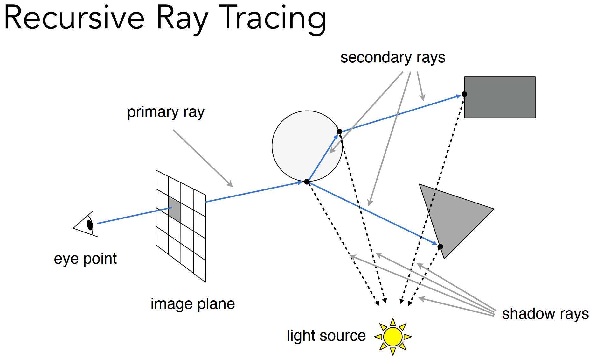
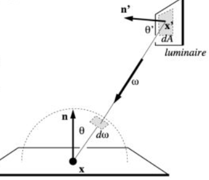
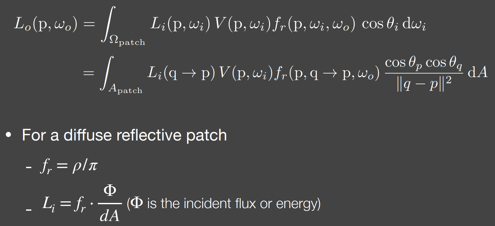
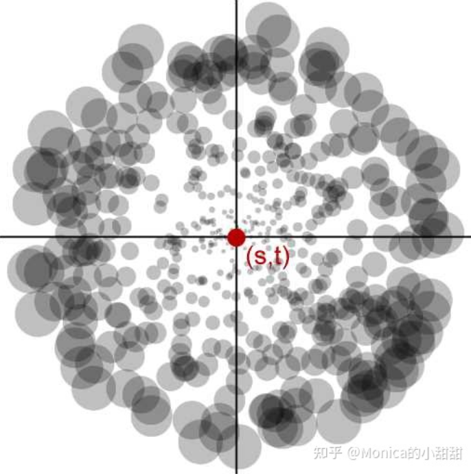

#### 1. 前置概念

##### 1.1 Depth Complexity vs. Overdraw

- Depth Complexity (深度复杂度)：表示一个像素被多少个面片包含。可以通过特殊配置的绘制方式可视化：关闭 深度测试，并使用 `glBlendFunc(GL ONE,GL ONE)`，像素着色器只输出 $(1/255,1/255,1/255)$。绘制完所有 mesh 的最终结果解释场景的深度复杂度，越白的像素表示其复杂度越高。
- Overdraw：表示在实际渲染中，一个像素的 pixel shader 被执行了多少次。例如场景中有两个物体，A、B，A 整体在 B 前。如果先画 A 后画 B，每个像素最多只会计算一次，因为 B 被 A 遮挡的部分，由于深度缓冲被丢弃掉，不会执行 pixel shader。但如果先画 B 后画 A，两者重叠部分的像素计算不止一次。消除 overdraw 的常见做法是，增加一个 z-prepass，只生成场景的 depth buffer。在后续的实际渲染中直接使用该 depth buffer，来避免像素的 overdraw。
- early-z 开启后将深度测试提前到 pixel shader 之前，光栅化过程中。z-prepass 是指先使用一个 depth only pass 得到场景的 depth buffer，然后使用 depth buffer 再执行第二个 pass。

#### 2. 抗锯齿

##### 2.1 几何锯齿 vs. 着色锯齿 [[1]](#[1])

- 几何锯齿：主要由于光栅化时的采样不足导致，体现在几何边缘的锯齿现象
- 着色锯齿：主要由于渲染（例如光照计算）的采样不足导致，体现在画面中的部分像素点的闪烁或者噪点


##### 2.2 超采样

超采样类抗锯齿只对几何锯齿有效。

- MSAA：为了减轻几何边缘由于采样不足带来的锯齿，NxMSAA 会为每个像素划分为 N 子采样点。在 MSAA 下，深度测试会为每个子采样点进行，因此 depth buffer 增大到 N 倍。对于着色而言，MSAA 下的像素虽然会有多个子采样点，但每个像素的着色最多只会执行一次。

  - 如果表面覆盖到像素中心，那么在像素中心位置计算着色，通过深度测试的子采样点则共享这一着色结果。
  - 如果表面没有覆盖到着色中心，则选择距离最近的子采样点计算着色。

  这样下来得到 NxMSAA 的 render target，还需要额外的 resolve 操作，得到最终的 render target。resolve 操作使用一个 box filter 将像素的所有子采样点的着色进行平均。此外，像素的子采样点的位置硬件层通常采用一个低差异序列。
  
- FXAA：针对边缘上的抗锯齿

##### 2.3 TAA

时序抗锯齿是找到当前帧像素在上一帧中对应的历史帧像素，将历史帧像素与当前帧像素结合起来作为最终着色，从而提高采样率。同时当前帧像素需要做一定的抖动，不然当前帧与历史帧对应像素完全一样，无法提高采样率。TAA 有以下步骤：

- 抖动操作：绘制当前帧像素时，通过修改变换矩阵，将原像素位置在像素范围内进行抖动，抖动的大小可以使用 halton 低差异序列。

- 重投影：计算当前帧像素当上一帧像素的运动矢量，即当前帧像素位置与历史帧像素位置的差值。MVP 变换已知，动画等变换也已知，则可以计算出每个像素的运动矢量 $v_{motion}$，像素 $p$ 对应的历史帧像素为 $\pi_{t-1}(p)=p-v_{motion}$

- 加权混合当前帧与历史帧：指数平滑混合，$\alpha$ 为混合权重通常取 $0.1$
  $$
  f_t(p)=\alpha \cdot s_t(p) + (1-\alpha)f_{t-1}\left(\pi_{t-1}(p)\right)
  $$

有一些情况会造成历史帧像素失效，不可用：

- 场景切换、光源切换、相机切换
- 去遮挡

#### 3. Shading 方式 [RTR4-chapter 20]

##### 3.1 Deferred Shading

在 forward shading 中，单个 pass 使用一个 mesh 和 shader渲染最终图像，在这个 pass 中需要执行渲染所需的所有操作，如从贴图或 buffer 中提取材质参数，对一系列光源进行光照计算等。而 deferred shading 则将光照计算部分解耦出来，先使用一个 geometry pass 将所有可见像素的材质属性、几何属性渲染到 G-Buffer 中，再使用一个 postprocess pass 对 G-Buffer 中存储的材质、几何数据应用光源。 使用 z-prepass 的 forward pass 也可以看作几何数据渲染与着色的轻度解耦。Deferred Shading 有如下方面的优缺点：

- shader 代码复杂性降低：forward shading 把几何数据和着色放在了一个 shader 中计算，其代码长且复杂，以及较多的 dynamic-branch。这样的 shader 需要的寄存器数量会很多，同时在 dynamic-branch 的作用下，会导致 GPU 占用率降低(同时执行的 shader invocation)。deferred shading 的解耦使得每个 pass 的 shader 代码更为简洁。
- G-Buffer：包含的数据依赖于用户的实现，一般包含材质属性（PBR中的贴图），法线贴图、位置信息（一般只存储深度，使用深度和贴图坐标即可恢复三维坐标）
- 多个光源的情况：对每个光源逐个执行一次 postprocess pass，但如果每次都是 full-screen quad shading，相当于每个像素都会进行 G-Buffer 数据提取、光照计算等，这种做法效率甚至低于 forward shading(由于额外的 G-Buffer)。对于多光源常见做法是使用 light volume，即每个光源影响的三维区域。将 light volume 投影到屏幕空间得到一个较小的 quad 来覆盖 light volume。light pass 只对 quad 范围内的像素计算，同时 light volume 投影的像素会有一个最小和最大深度区间，如果着色像素的深度不在这个区间内，则表示该像素不受光源影响，也可以跳过该像素的光照计算。
- deferred shading 对于多光源情况的优化：forward shading 复杂度 O(num_geometry_fragments * num_lights)，而 deferred shading 的复杂度 O(screen_resolution * num_lights)。forward shading 的几何体有遮挡，有可能对同一像素重复着色。
- MSAA 难以在 deferred shading 中应用：NxMSAA 需要 N 倍大小的 render target，因此 G-Buffer 的存储开销增大到 N 倍。
- 透明材质：透明材质的渲染与次序相关，靠前的透明物体与其后的不透明物体会发生融合。在 basic deferred shading 中无法处理透明材质，可以结合 deferred shading 与 forward shading，**deferred shading 渲染不透明物体，再使用一次 forward shading 处理透明材质**。

##### 3.2 Tiled Shading

Tiled shading 的核心思想是：将 render target 划分为以 tile 为单位的像素块，为每个 tile 记录其收到影响的光源列表，在单个 shader invocation 中执行所有光源的光照计算，而不是 basic deferred shading 中对每个光源执行一次 shader。每个 tile 的光源列表需要通过 light volume 与 tile 对应的 frustum 求交来确定：

- tile 的 frustum：tile 的最小/最大深度构成 frustum 的远近平面，并且与相机 frustum 的远近平面平行。
  
- light volume：可以使用一个球包含光源影响区域，使用这个球与 tile frustum 求交
- 求交：

Tiled Shading 可以与 deferred shading 或 forward shading 结合。

###### 3.2.1 Tiled deferred shading

在G-Buffer 构建方面 tiled/basic deferred shading 二者并无差别。但在 basic deferred shading 中，光源是逐个计算，并且每次计算只绘制光源覆盖的四边形区域。而 tiled deferred shading 中，每个 tile 记录与其相交的光源列表，在一次 full-screen quad shading 中计算所有光源，这种方式有以下好处：

- 每个像素最多只会访问一次 G-Buffer，而不是有多少个与其重叠的光源就访问多少次。
- render target 的每个像素也只会写一次，而不是累计每个光源的结果
- shader 代码可以更高效处理渲染方程中的公共项，而不需要为每个光源单独计算
- 在不透明物体渲染完成后，可以在 forward shading 中使用同样的光源列表渲染透明物体
- tile 中的每个像素计算同一个光源列表，这对于 GPU 执行更高效

###### 3.2.2 Tiled forward shading(forward+)

先使用一个 z-prepass 得到场景深度，然后使用 compute shader 来得到 tile 的光源列表。

###### 3.2.3 深度不连续

Tile 中不连续深度会降低 Tiled Shading 的性能，如近处的角色与远处的山之间的不连续深度占比很高。这会导致一个 tile 的光源列表很大，但实际要计算的很少，即 tiled shading 不能有效剔除多数无影响光源。一些降低不连续深度影响的解决方案有：

- HalfZ：除了 tile 的最大/最小深度之外，增加一个中间深度值，将 tile frustum 为远近两个部分。相交的光源有三种情况，覆盖近处、覆盖远处、全覆盖。根据 tile 中像素深度来应用不同分类的光源列表。
- 2.5D culling：将 tile 深度分为 32 个区间，每个光源使用一个 32 位标志，每位来表示光源是否覆盖了对应区间。像素的深度得到的 32 位标志与光源标志位进行与运算，不为零，则表示受到该光源的影响。

##### 3.3 Cluster Shading

Tiled shading 是屏幕空间的二维划分，而 cluster shading 则是对相机的整个 view frustum 的三维划分。

#### 4. 变换

##### 4.1 坐标系

如下所示的 OpenGL 的左手坐标系与 Vulkan 右手坐标系


- 左手坐标系使用左手法则判断叉乘方向：四指指向叉乘第一个向量，绕向第二个向量，大拇指指向即为叉乘结果向量的方向。
- 右手坐标系使用右手法则判断叉乘方向，过程与左手相同

$\vec{X}\times\vec{Y}$ 的方向服从左手法则即为左手坐标系，反之为右手坐标系。注意这里只是判定方向朝向，叉乘计算公式在左手或右手坐标系都是一样的。


##### 4.2 MVP

在局部坐标系的模型经过其 model 变换到世界坐标系，经过 view 变换到相机坐标系，经过投影变换 [[2]](#[2]) 到 clip space。注意：clip space 是投影后，但还未除以 w 分量之前的坐标。除以 w 之后则到了 NDC 空间 [-1,1]x[-1,1\]x[-1,1]。

##### 4.3 法线的变换

法线经常用于光照的计算，计算可以发生在 view space 或 world space。假设在 view space 中进行光照计算，local space 到 view space 的变换为 MV。但对于处于 local space 的顶点法线，有时不能直接应用 MV 变换。例如当模型变换具有 non-uniform scale，则变换后的法线不再垂直原表面。如模型变换的 scale 为 (2, 1, 1, 1)，有如下变换示例


把法线从 local space 变换到 world space 的正确变换为 $((MV)^{-1})^T$，也就是说 MV 变换的逆的转置。

#### 5. 渲染管线


##### 5.1 Application

Application 阶段绝大多数部分运行在 CPU，也有可能有 Compute Shader。该阶段通常处理交互逻辑，场景中的剔除、碰撞检测、处理外设输入等。在 Application 阶段结束会将几何数据、以及相关参数送入 Geometry Processing 阶段。

##### 5.2 Geometry Processing

执行在 GPU，用以处理 per-triangle 和 per-vertex 的操作。可以被分为 Vertex Shading、Projection、Clipping、Screen Mapping 四个子阶段。

###### 5.2.1 Vertex Shader

输入为 vertex buffer 中的 vertex，经过**顶点着色器**的计算，例如 MVP 变换到 clip space，（管线自己转入 NDC）再除以 w 后顶点位于 $[-1,1]\times[-1,1]\times[-1,1]$ 的立方体（**view volume**）内，即位于 NDC space。顶点会包含多个属性，如位置、法线、颜色等，经过 vertex shader 的计算，会输出后续阶段需要的数值，这些输出会在（除了显示声明 `flat` 外）三角形内部进行插值。view volume 的 z 坐标范围不同 API 是不同的，Opengl 为 [-1,1]，direct3D 与 vulkan 为 [0,1]。

###### 5.2.2 Tessellation(可选阶段)


###### 5.2.3 Geometry Shader(可选阶段)

位于 vertex shader 之后，处理经过 vertex shader 变换后的几何图元，如点、线、三角形。所处理的几何图元类型在 layout 中声明，如
```glsl
layout (triangles) in;	// 表示当前管线的拓扑为 triangle
layout (triangle_strip, max_vertices=18) out;
```

输入顶点数据在 `gl_in[i].gl_Position` 中，经过处理将结果放入 `gl_Position`，然后调用 `EmitVertex`  会将当前 gl_Position 输出到 vertex stream。因此可以增减顶点，修改图元(out 中的拓扑)。同时可以应用到 layered rendering，修改内置变量 `gl_Layer`，之后的顶点就会输出到当前 layer。geometry shader 同样可以输出顶点属性。

###### 5.2.4 Clipping

经过 MVP 变换，模型处于 clip space，只有在 view volume 内部的图元部分才会被送入之后的 Rasterization 阶段。对于完全位于 view volume 之内或之外的图元会被送入或不送入下一阶段。而对于部分位于 view volume 的图元需要进行 clipping，如下所示


注意：裁剪发生在 clip space，即 MVP 变换之后、未除 w 之前的空间。裁剪完成之后才从 clip space 转到 NDC。

###### 5.2.5 Screen Mapping

view volume 内的图元会送入 screen mapping 阶段。此阶段位于 NDC space 的坐标会被映射到屏幕坐标以及映射 z 坐标。绘制窗口由屏幕坐标 (x1, y1) 和 (x2, y2) 定义，[-1,1]x[-1,1] 的 (x,y) 坐标映射到屏幕坐标范围内。z 坐标的映射范围：OpenGL 为 [-1,1]，Direct3D 与 vulkan 为 [0,1]。
 

##### 5.3 Rasterization

对于几何图元为三角形的管线，geometry process 阶段的数据流为 vertex stream。在此阶段首先将 vertex 组装成三角形，数据流变为了 triangle stream。如果开启了**背面剔除**，则之后的操作只会对正面三角形进行。接下来查找位于三角形内部的像素，三角形顶点的属性会在像素位置进行插值。

如果开启了 `early-z`，例如 glsl 中的 fragment shader 中显示声明 `layout(early_fragment_tests) in;`，merging 阶段的模板测试与深度测试就会提前到 Rasterization 阶段。如果开启了模板测试，则丢弃无法通过模板测试的像素。之后再丢弃无法通过深度测试的像素。early-z 会将处于后面的像素完全丢弃，**不会进入 pixel shader 及之后阶段(blend 阶段)，无法应用在半透明物体。**

##### 5.4 Pixel Processing

Pixel Processing 阶段执行 per-pixel 或 per-sample 计算。

###### 5.4.1 Pixel Shader

像素着色器会使用顶点着色器的输出在该像素位置的插值结果、以及一些管线输入参数，计算出该像素的输出值。

###### 5.4.2 Merging

对像素着色的输出值以及对应的深度值执行 merge 操作，写入 frame buffer 中。有如下操作顺序，

1. **alpha test**：如果通过 API 开启了 alpha test，则先将不通过 alpha test 的像素直接丢弃，例如 alpha 通道小于某个值。alpha test 也可以直接在 pixel shader 中使用 `discard` 实现。**alpha test 与 early-z 同时开启会导致 early-z 失效**，例如一个近物体被 early-z 写入深度缓冲，后续的 alpha test 将其丢弃，但其深度值已经在深度缓冲，该物体之后的物体就无法通过深度测试。
2. **模板测试**：如果开启了模板测试，则将不通过模板测试的像素丢弃。
3. **深度测试**：默认的深度测试（即无 early-z）在此时发生，只将通过深度测试的像素的深度值更新入深度缓冲区。
4. **blend**：最后，通过测试的像素着色器的输出与 frame buffer 的 color 执行 blend 操作，如果是不透明物体，则是直接覆盖或丢弃。透明度使用 alpha 通道描述，管线提供可配置的 blend 操作，以及最终的 alpha 值如何更新。

#### 6. 光线与三角形求交 [[3]](#[3])

##### 6.1 重心坐标

使用三角形三个顶点的线性组合可以表示三角形内的任一点，线性组合的权重即为重心坐标。如下三角形，


三角形内部一点 $S$ 使用重心坐标 $(\alpha,\beta,\gamma)$ 有 $S=\alpha A+\beta B+\gamma C$，其中 $\alpha+\beta+\gamma=1$。
三角形内一点可以按上图方式，将三角形划分为三部分，面积分别为 $A_A,A_B,A_C$。顶点 $A$ 的权重为其对着的 $SBC$ 面积占总面积的比例，有
$$
\begin{cases} \alpha=\frac{A_A}{A_A+A_B+A_C} \\ \beta=\frac{A_B}{A_A+A_B+A_C} \\ \gamma=\frac{A_C}{A_A+A_B+A_C} \end{cases} \quad \quad \quad \begin{cases}A_A=\frac{1}{2}||\mathbf{SC}\times \mathbf{SB}|| \\ A_B=\frac{1}{2}||\mathbf{SC}\times \mathbf{SA}|| \\ A_C=\frac{1}{2}||\mathbf{SA}\times \mathbf{SB}||\end{cases}
$$
叉乘向量的长度的一半即为三角形面积：$A_A=\frac{1}{2}||\mathbf{SC}\times\mathbf{SB}||$。推导：叉乘公式 $\mathbf{SC}\times\mathbf{SB}=||\mathbf{SC}||\cdot ||\mathbf{SB}||\sin\theta \cdot \mathbf{n}$，$\mathbf{n}$ 为右手定则指定的方向。$||\mathbf{SB}||\sin\theta$ 为边 $\mathbf{SC}$ 上的高，三角形面积为 $\frac{1}{2}||\mathbf{SC}\times\mathbf{SB}||=\frac{1}{2}||\mathbf{SC}||\cdot ||\mathbf{SB}||\sin\theta$

**重心坐标性质**：仿射不变性，即仿射变换前后重心坐标不变。仿射变换是一个线性变换(旋绕、缩放、切变等)加上一个平移变换，变换前后的坐标维度不变。透视投影属于非线性变换，重心坐标会发生改变。因此，三维空间得到的重心坐标不能用于透视投影的 clip 空间，反之亦然。

##### 6.2 光线与三角形求交点

**光线方程定义**：$r(t)=O+t\textbf{d} \quad 0\leq t\leq \infty$ , 该式定义的是光线上的任一点。

###### 6.2.1 Moller Trumbove Algorithm（联立方程组求解）

光线与三角形相交，即求解方程组 $O+t\textbf{d}=(1-b_1-b_2)P_0+b_1P_1+b_2P_2$。 

点、向量都为三维，未知变量有三个，可以使用线性代数中的克拉姆法则求解。如果 $t, b_1,b_2,1-b_1-b_2$ 都非负，则证明交点在三角形内，即光线与三角形有交点。

###### 6.2.2 Watertight Ray-Triangle Intersection（降维计算）

构建一个以光线起点为原点，以光线方向为 $z$ 轴正方向的坐标系。将三角形变换到该坐标系，在该坐标系中进行求交。由于光线为 $z$ 轴，因此，若有交点，则交点 $x,y$ 坐标必为 $0$。反之，如果三角形内部有一点 $x,y$ 坐标为 $0$ ，且该点在光线范围内$(t>0)$，那么此点必为交点。求交问题则转换为了**点 $(0,0)$ 是否在三角形内部**，三维降为了二维。

(1) **构建以光线方向为 z 轴正向的 ray coordinate system**

1. 平移光线起点至原点，得到平移变换：
   $$\mathbf{T}=\begin{pmatrix} 1&0&0&-O_x \\ 0&1&0&-O_y \\ 0&0&1&-O_z \\ 0&0&0&1 \end{pmatrix}$$

2. 将 ray 方向绝对值最大的维度变换到 $z$ 维度，确保 ray 方向 $z$ 维度不为 0。假设 ray 方向绝对值最大的维度为 $x$，那么进行 $x,z$ 互换，得到 permutation 变换(不唯一)：
   $$\mathbf{P}=\begin{pmatrix} 0&0&1&0 \\ 0&1&0&0 \\ 1&0&0&0 \\ 0&0&0&1 \end{pmatrix}$$

3. 使用切变(shear) 将 ray 方向变换到 +z 方向。此过程不使用旋转，而使用效率更高的切变。切变(shear)变换：
   $$\mathbf{S}=\begin{pmatrix} 1&0&-\mathbf{d}_x/\mathbf{d}_z&0 \\ 0&1&-\mathbf{d}_y/\mathbf{d}_z&0 \\ 0&0&1/\mathbf{d}_z &0\\ 0&0&0&1 \end{pmatrix}$$

   > 假设光线方向 $\mathbf{d}=(\mathbf{d}_x,\mathbf{d}_y,\mathbf{d}_z,0)$ ，代入切变有 $\mathbf{S}\cdot\mathbf{d}=(0, 0, 1,0)$，即把 ray 方向变换为 $z$ 轴正向。

至此完成了到 ray coordinate system 的变换 $\mathbf{SPT}$，通过该变换可以将三角形变换到 ray coordinate system，如下图所示


<center>图 ray coordinate system 下的三角形</center>

(2) **判断点是否在三角形内**

1. 三维坐标下的传统做法：如下三角形中，如果 $P_0P_1\times P_0P$、$P_1P_2\times P_1P$、$P_2P_0\times P_2P$ 三个向量的方向相同，则 $P$ 位于三角形内部。这种传统做法的计算在三维坐标下完成，上述变换将三维降维到二维的做法就失去了意义。

2.  **利用叉乘性质得到的 signed edge function (二维)**
   观察图 ray coordinate system 下的三角形，1 中做法叉乘方向只有两种：一种位于三角形的左侧，对应 $z<0$；一种位于三角形的右侧，对应 $z>0$。因此**不需要求完整的三维坐标叉乘，只需要知道叉乘得到的向量的 $z$ 坐标的符号**。根据叉乘公式，
   $$
   \begin{align*} \mathbf{a}\times \mathbf{b}&=\begin{vmatrix}\mathbf{i} & \mathbf{j} & \mathbf{k} \\ \mathbf{a}_x & \mathbf{a}_y & \mathbf{a}_z \\ \mathbf{b}_x &\mathbf{b}_y&\mathbf{b}_z\end{vmatrix} = \begin{vmatrix}\mathbf{a}_y&\mathbf{a}_z \\ \mathbf{b}_y&\mathbf{b}_z\end{vmatrix}\mathbf{i}+\begin{vmatrix}\mathbf{a}_x&\mathbf{a}_z \\ \mathbf{b}_x&\mathbf{b}_z\end{vmatrix}\mathbf{j}+\begin{vmatrix}\mathbf{a}_x&\mathbf{a}_y \\ \mathbf{b}_x&\mathbf{b}_y\end{vmatrix}\mathbf{k}\\ &=(\mathbf{a}_y\mathbf{b}_z-\mathbf{a}_z\mathbf{b}_y)\mathbf{i}+(\mathbf{a}_x\mathbf{b}_z-\mathbf{a}_z\mathbf{b}_x)\mathbf{j}+(\mathbf{a}_x\mathbf{b}_y-\mathbf{a}_y\mathbf{b}_x)\mathbf{k}\end{align*}
   $$
   可知 $(\mathbf{a}_x\mathbf{b}_y-\mathbf{a}_y\mathbf{b}_x)$ 为叉乘向量的 $z$ 坐标，称为 **signed edge function**。因此 signed edge function 只需要 $x,y$ 两个坐标即可计算得到。将 1 中三个叉乘代入可得到 $e_0,e_1,e_2$。如果同号则表示 $(0,0)$ 在三角形内部。交点的重心坐标为 $\large b_i=\frac{e_i}{e_0+e_1+e_2}$，代入计算交点 $z$ 坐标，从而得到 $t$ 值。

#### 7. 光线与 Bounding Box 求交 [[3]](#[3])

对于 AABB 包围盒，可由两个极端点定义 pMin$(x_{min},y_{min},z_{min})$ 和 pMax$(x_{max},y_{max},z_{max})$ 。对齐同一坐标轴且相互平行的两个面作为一组 slab，则 AABB 包围盒由三组 slab 组成，同一组 slab 平面具有相同的法向量。光线与每组 slab 平面都能求得两个交点，入点与出点，如下图示意


假设包围盒某一面的平面方程为 $ax+by+cz+d=0$ ，光线方程与平面方程联立有：
$$
a(O_x+t\mathbf{d}_x)+b(O_y+t\mathbf{d}_y)+c(O_z+t\mathbf{d}_z)+d = 0 \\
t=\frac{-d-((a,b,c)\cdot O)}{((a,b,c)\cdot \mathbf{d})}
$$
按照上述方式可以求得光线与平面交点处的 t 值。光线与每组 slab 分别求交点，得到 3 个入点、3 个出点。求得**入点中的最大值** $t_{{near}_{max}}$，**出点中的最小值** $t_{{far}_{min}}$，$t_{{near}_{max}}<t_{{far}_{min}}$ 表示光线穿过了 bounding box，否则无交点。

**如何判定入点与出点？**

建立 slab 平面方程时使用其垂直的坐标轴正向作为法向量，如垂直于 $x$ 轴的一组 slab 平面的法向量都为 $(1,0,0)$，同时过点 $(x_{min},0,0),(x_{max},0,0)$，代入方程可求得两个交点
$$
t=\frac{x_{min}-O_x}{\mathbf{d}_x} \quad or \quad \frac{x_{max}-O_x}{\mathbf{d}_x}
$$
如果光线方向指向 $x$ 轴正向，则与 $x_{min}$ 的交点为入点，与 $x_{max}$ 的交点为出点。

#### 8. 画直线算法（DDA 与 Bresenham）

已知线段的两个端点 $P_0(x_0, y_0)$ 与 $P_1(x_1,y_1)$，实现绘制该直线。已知两个端点，该直线方程可以描述为 $y=kx+b$ 。DDA 与 Bresenham 都是步进方式，即一个坐标步进 1 个像素，另一个坐标根据直线方程步进对应像素，得到了直线上下一个点的坐标。一直重复该步骤直到终点。

##### 8.1 DDA 算法

要保证查找的下一个像素点是连续的，即坐标的最大步长不能超过 1 个像素，因此沿哪个轴作为步进方向取决于斜率。有两个端点可以求得 $\Delta x=x_1-x_0,\Delta y=y_1-y_0,k=\frac{\Delta y}{\Delta x}$。下一个坐标的确定方式为：

- 如果 $|\Delta x| > |\Delta y|$，即 $|k|<1$。那么选取 $x$ 为步进方向，下一个坐标为，$y=y+k,x=x+1$
- 如果 $|\Delta x| < |\Delta y|$，即 $|k|>1$。那么选取 $y$ 为步进方向，下一个坐标为，$y=y+1,x=1/k$

对于任意 $k$，需要预先计算 $x,y$ 的步进带符号步长。总步数 $step=\max\{abs(\Delta x), abs(\Delta y)\}$。那么 $x,y$ 的步长分别为
$$
\begin{cases}
xInc = \frac{step}{\Delta x} \\
yInc = \frac{step}{\Delta y}
\end{cases}
$$
每次步进 $(x,y)=(x+xInc,y+yInc)$，直至完成总步数。每次步进后的坐标都需要进行依次舍入到像素位置。

##### 8.2 Bresenham 算法

Bresenham 算法是对 DDA 算法的改进，去除了 DDA 算法中的浮点运算，全部使用整数运算，提高了性能。

首先直线方程改为隐式：$f(x,y)=y-kx-b=0$。
**下面以 $0<k<1$ 为例描述算法过程**，如下图所示，$P_i(x_i,y_i)$ 为当前像素，则下一个像素的两个候选为 $P_u(x_i+1,y_i+1),P_d(x_i+1,y_i)$，两个候选像素的中点为 $M(x_i+1,y_i+0.5)$。


将候选像素中点 $M$ 代入直线方程：$d_i=f(x_i+1,y_i+0.5)=y_i+0.5-k(x_i+1)-b$。如果 $d_i<0$，则表示候选像素中点位于直线下方（黑色实线），下一个像素选择 $P_u(x_i+1,y_i+1)$；如果 $d_i>0$，则表示候选像素中点位于直线上方（绿色虚线），下一个像素选择 $P_d(x_i+1,y_i)$。下面需要计算出 $d_{i+1}$ 的递推公式：

- 如果 $d_i<0$，$P_{i+1}(x_i+1,y_i+1)$，此时的两个候选像素为 $P_u(x_i+2,y_i+2),P_d(x_i+2,y_i+1)$，中点为 $M(x_i+2, y_i+1.5)$。因此 $d_{i+1}=f(x_i+2,y_i+1.5)=y_i+1.5-k(x_i+2)-b=d_i+1-k$
- 如果 $d_i>0$，$P_{i+1}(x_i+1,y_i)$，此时的两个候选像素为 $P_u(x_i+2,y_i+1),P_d(x_i+2,y_i)$，中点为 $M(x_i+2, y_i+0.5)$。因此 $d_{i+1}=f(x_i+2,y_i+0.5)=y_i+0.5-k(x_i+2)-b=d_i-k$

递推公式：$d_0=0.5-k$，若 $d_i<0$，$d_{i+1}=d_i+1-k$，否则 $d_{i+1}=d_i-k$ 。由于我们只需要知道 $d$ 的正负，因此可以**使用 $2\Delta x \cdot d$ 作为新的 $d$**，这样就去除了浮点运算，有 
$$
d_0=\Delta x-2\Delta y, \quad \quad d_{i+1}=\begin{cases} 
d_i+2\Delta x-2\Delta y, \quad d_i<0 \\
d_i-2\Delta y, \quad\quad\quad\quad otherwise
\end{cases}
$$
**扩展到所有范围的 $k$**

- 如果 $-1<k<0$，当前像素 $P_i(x_i,y_i)$，候选像素为 $P_u(x_i+1,y_i),P_d(x_i+1,y_i-1)$，候选像素中点为 $M(x_i+1,y_i-0.5)$，$d_i=f(x_i+1,y_i-0.5)=y_i-0.5-k(x_i+1)-b$，其中 $i=0$ 为起点，位于直线上有 $d_0=-0.5-k$

  - $d_i>0$ 时，选择 $P_u$，$d_{i+1}=f(x_i+2,y_i-0.5)=d_i-k$；
  - 否则选择 $P_d$ ，$d_{i+1}=f(x_i+2,y_i-1,5)=d_i-1-k$

  **使用 $2\Delta x \cdot d$ 作为新的 $d$ 去除浮点运算**，有
  $$
  d_0=-\Delta x-2\Delta y, \quad \quad d_{i+1}=\begin{cases} 
  d_i-2\Delta x-2\Delta y, \quad d_i<0 \\
  d_i-2\Delta y, \quad\quad\quad\quad otherwise
  \end{cases}
  $$

- 如果 $|k|>1$，则步进主方向改为 $y$，推导方式与 $|k|<1$ 相似

##### 8.3 画圆算法

画圆同样是寻找像素点，直线方程换为圆方程。如果以圆心为原点建立坐标系，可以利用圆的八对称性，即找到一个像素点即可找到其对应的其他 7 个点，如下图所示


#### 9. 模板缓冲与模板测试

模板缓冲区可以为屏幕上每个像素保存一个无符号整数（一般为8bit整数，这和 alpha 通道的 8bit 整数相同），在渲染流程中，使用每个像素的模板数值与一个预先设定好的模板参考值相比较（一般是按位与操作），根据这个比较的结果来决定是否更新相应像素的颜色值，这个比较的过程叫做**模板测试**。功能如下所示


模板缓冲区与深度缓冲区的大小相同。在使用的过程中，一般先开启模板缓冲，绘制一个物体作为我们的模板，这个过程实际上就是写入模板缓冲的过程；接着我们利用模板缓冲中的值决定是丢弃还是保留后续绘图中的片元。大致过程如下：

1. 开启模板缓冲写入，指定之后的渲染写入模板缓冲区的值。
2. 渲染物体，更新模板缓冲。物体的渲染区域在模板缓冲区的对应区域会写入步骤 1 指定的值
3. 关闭模板缓冲写入。之后的渲染不会修改模板缓冲区的数值。
4. 指定模板测试操作：指定运算操作、操作数以及比较方式。
5. 渲染（其他）物体，使用物体的渲染区域在模板缓冲区中对应的数值，基于步骤 4 指定的模板测试操作决定是否丢弃像素片段。

**非 early-z 下，模板测试发生在透明度测试之后，深度测试之前**，如果模板测试通过，则相应的像素更新，否则不更新。

#### 10. 半透明渲染

要实现半透明物体的效果，需要使用 alpha blending 操作。在开启 blend 后，配置 blend 运算 [VkBlendOp](https://registry.khronos.org/vulkan/specs/1.3-extensions/man/html/VkBlendOp.html)、blend 因子 [VkBlendFactor](https://registry.khronos.org/vulkan/specs/1.3-extensions/man/html/VkBlendFactor.html)，则得到一个确定的 blend 操作。这里以 `VK_BLEND_OP_ADD` 运算为例，对于 fragment shader 的输出像素值与 frame buffer 中已存在的像素值将按照以下面公式来进行更新写入 frame buffer：
$$
C = C_{src}*F_{src}+C_{dst}*F_{dst}
$$
其中 $C_{src},C_{dst}$ 分别为 fragment shader 的输出像素值、frame buffer 中已存在的像素值；而 $F_{src},F_{dst}$ 分别为对应的可配置因子，即 `VkBlendFactor`。alpha 通道同样有类似的 blend 操作。

##### 10.1 Over 操作

将 alpha 通道理解为颜色在像素片段的覆盖比例，如 $\alpha = 0.3$ 表示覆盖像素片段的 30%，那么被其遮挡的光则在剩余的 70% 穿过。Over 操作定义位于前面的像素与被其遮挡的像素之间的 blend 操作。如 $C_1$ 遮挡了 $C_0$，最终颜色为
$$
C_f=C_1+(1-\alpha_1)C_0
$$
这里的 $C_0,C_1$ 为已经乘过其 alpha(coverage)，假设未乘之前为 $U_0,U_1$，有 $C_0=\alpha_0\cdot U_0,C_1=\alpha_1\cdot U_1$

Over 操作不满足交换律，对于不同深度的像素，必须按照从后向前的顺序进行依次 blend。例如场景中的某位置的像素深度由前向后有 $C_n,\cdots,C_1,C_0$，最终颜色为
$$
C_f = \Big\{C_n+ (1-\alpha_n)\cdots\Big[C_2+(1-\alpha_2)[C_1+(1-\alpha_1)C_0]\Big]\Big\}
$$
Over 操作对应的 blendOp 为 VK_BLEND_OP_ADD，对应的 $F_{src},F_{dst}$ 分别为 VK_BLEND_FACTOR_ONE、
VK_BLEND_FACTOR_ONE_MINUS_SRC_COLOR。

##### 10.2 Weighted Blended OIT

修改 Blend 操作使其次序无关，得到一个近似的 Blend 结果。可知只有未被不透明表面遮挡的半透明表面才需要进行 blend 操作，离半透明表面最近的不透明表面则为 blend 过程的背景色。这里背景色使用 $C_0$ 表示，$C_0$ 能够透过覆盖在其 上的所有不透明表面的比例为
$$
\prod\limits_{i=1}^{n}(1-\alpha_i)
$$
在不透明表面的覆盖率相互独立的情况下，上式是精确的。下面需要对半透明表面之间 blend 操作进行近似，使其能够不依赖次序。由未乘 alpha(coverage) 的 Over 操作可知，需要近似半透明表面 blend 的(未乘 alpha)最终颜色与其覆盖率。

**半透明表面 blend 最终颜色(未乘alpha)与其覆盖率近似 **：

- 半透明表面 blend 的最终颜色的覆盖率(alpha) 应为 $1-\prod\limits_{i=1}^{n}(1-\alpha_i)$

- blend 最终颜色(未乘alpha)近似：

  - 最初的 weighted average 操作 $\Large\frac{\sum_{i=1}^nC_i}{\sum_{i=1}^n\alpha_i}$
    由未乘 alpha(coverage) 的 Over 操作可知，$C_i=\alpha_i\cdot U_i$，因此上式为未乘 alpha 颜色的加权平均
    
  - 改进的 Weighted Blended 操作：weighted average 操作可以得到覆盖率大的颜色对最终结果贡献越大，但忽略了表面到相机距离的影响。改进的 Weighted Blended 操作引入了关于 alpha 与到相机距离(或者 clip space z)的权重：
    $$
    \frac{\sum_{i=1}^nC_i\cdot w(z_i,\alpha_i)}{\sum_{i=1}^n\alpha_i\cdot w(z_i,\alpha_i)}
    $$

完整的 blend 操作为：
$$
C_f=\left(1-\prod\limits_{i=1}^{n}(1-\alpha_i)\right)\cdot \frac{\sum_{i=1}^nC_i\cdot w(z_i,\alpha_i)}{\sum_{i=1}^n\alpha_i\cdot w(z_i,\alpha_i)} + \left(\prod\limits_{i=1}^{n}(1-\alpha_i)\right)\cdot C_0
$$

##### 10.3 OIT 实现

###### 10.3.1 完全使用 forward shading 实现需要 3 个 pass

**第 1 个 pass 绘制场景中不透明物体**，此阶段开启 alpha test、深度缓冲写入、深度测试。

**第 2 个 pass 绘制半透明物体**，计算 blend 操作所需参数。此阶段关闭深度缓冲写入、使用上一个阶段的深度缓冲开启深度测试、alpha blend。设置两个 render targets，accum(RGBA16F)、reveal(R8)，用于保存半透明表面 blend 操作中的参数，有：
$$
\begin{align}
accum&=\left(\sum_{i=1}^nC_i\cdot w(z_i,\alpha_i), \sum_{i=1}^n\alpha_i\cdot w(z_i,\alpha_i)\right) \\
reveal&=\left(\prod\limits_{i=1}^{n}(1-\alpha_i)\right)
\end{align}
$$
需要配置两个 render targets 的 blend 操作，使其达到上面计算过程。部分 shader 代码如下：

```glsl
vec4 color = ... // regular shading code
// insert your favorite weighting function here.
float weight = max(min(1.0, max(max(color.r, color.g), color.b) * color.a), color.a) *
    clamp(0.03 / (1e-5 + pow(z / 200, 4.0)), 1e-2, 3e3);

// blend func: GL_ONE, GL_ONE
// accum = vec4(accum.rgb + color.rgb*color.a*weight, accum.a + color.a*weight)
accum = vec4(color.rgb * color.a, color.a) * weight;

// blend func: GL_ZERO, GL_ONE_MINUS_SRC_ALPHA
// reveal = reveal*(1-color.a)
reveal = color.a;
```

**第 3 个 pass 使用 quad shading 根据 blend 操作公式组合前两个 pass 的结果**，将不透明 pass 的 color buffer 作为本 pass 的 render target，按照上述 oit blend 操作公式，计算半透明表面 blend 的最终颜色与其覆盖率(alpha)，配置 blend 参数。将 accum、reveal 作为输入 rt0、rt1，有如下计算代码：

```glsl
// fetch pixel information
vec4 accum = texelFetch(rt0, int2(gl_FragCoord.xy), 0);
float reveal = texelFetch(rt1, int2(gl_FragCoord.xy), 0).r;

// blend func: GL_ONE_MINUS_SRC_ALPHA, GL_SRC_ALPHA
// color = (1-reveal)*color.rgb + (accum.rgb/accum.a)*reveal
color = vec4(accum.rgb / max(accum.a, 1e-5), reveal);
```

###### 10.3.2  (部分使用)deferred shading 管线需要使用 4 个 pass

半透明物体的绘制无法应用 deferred shading，可以为其单独应用 forward pass。流程如下，注意 2、3 pass 之间没有依赖：

1. 使用一个 z-prepass 生成不透明物体的 depth buffer
2. 半透明物体生成其 blend 操作所需参数，得到 accum、reveal 两个 render target，并作为 G-Buffer 的一部分
3. 不透明物体的绘制使用 deferred shading，geometry pass 将不透明物体着色所需参数写入 G-Buffer
4. quad shading 使用 G-Buffer 中的不透明物体的着色参数计算其着色，即 $C_0$；使用 accum、reveal 计算半透明表面 blend 的最终颜色与其覆盖率，直接使用 blend 操作公式计算出最终着色

#### 11. 纹理映射与过滤

Vertex Shader 可以输出每顶点的纹理坐标，三角形内部每个像素的纹理坐标使用重心坐标插值而来。Pixel Shader 使用每像素纹理坐标对贴图进行采样，即获取指定坐标位置的数据**（纹素）**。纹理坐标是标准化浮点数，乘上贴图的分辨率得到 UV 坐标。纹素与像素通常无法一一对应，无法得到整数 UV：

- 如果相机离物体较近，则三角形占据的屏幕像素分辨率要高于纹理分辨率，即纹理分辨率不足
- 如果相机离物体较远，则一个像素可能覆盖到多个纹素，即纹理分辨率过大

##### 11.1 Texture Magnification

当低分辨率纹理映射到高分辨率表面时，纹理分辨率不足。基于光栅化插值得到的纹理浮点坐标，根据其距周围像素的距离，对周围纹素进行插值，得到最终的采样坐标。如下图的红色浮点坐标，黑色整数坐标，


**双线性插值(Bilinear Interpolation)**: 在单线性插值结果上再应用一次单线性插值。水平方向上应用两次单线性插值，在竖直方向上对两次单线性插值结果再应用一次单线性插值，得到最终采样结果 $p(x,y)$，
$$
\begin{align}
u_0&=lerp(s,u_{00},u_{10}) \\
u_1&=lerp(s,u_{01},u_{11}) \\ 
p(x,y)&=lerp(t,u_0,u_1)
\end{align}
$$
如果只是选择最近纹素的话，会得到马赛克结果。

##### 11.2 Texture Minification

当高分辨率纹理映射到低分辨率物体时，一个像素会覆盖一个纹理区域。那么屏幕空间的采样频率就会远低于纹理的信号频率，会得到远处摩尔纹、近处锯齿的失真效果，如下


可以使用超采样来提高采样率，但这样开销会很大。屏幕上近处与远处物体的像素覆盖的纹理区域也各不相同，如上右图

使用 mipmap 来进行这种过程，每一层都是上一层的 $1/4$，那么总消耗 $1+\frac{1}{4}+\frac{1}{16}+\cdots =\frac{4}{3}$，仅引入额外的 $1/3$ 的存储开销。

**如何计算当前像素应采样哪一层 mipmap？**


如上图，红色点为相邻像素，其之间距离为 1，但由于纹理分辨率过大，相邻像素对应的纹素之间距离大于 1。使用**水平方向上相邻像素对应的纹素距离**与**竖直方向上相邻像素对应的纹素距离**之间的最大值来决定当前 mipmap 的采样层，
$$
D=\log_2L\space, \quad L=\max\left(\sqrt{\left(\frac{du}{dx}\right)^2+\left(\frac{dv}{dx}\right)^2}, \sqrt{\left(\frac{du}{dy}\right)^2+\left(\frac{dv}{dy}\right)^2} \right)
$$
**三线性插值（Trilinear Interpolation）**：在 floor(D) level 与 floor(D)+1 level 分别应用双线性插值，对这两层的插值结果再应用一次单线性插值，插值参数为 $D-floor(D)$。三线性插值会导致过度模糊，如下左图

   

这是由于 mipmap 默认都是正方形区域的区域查询，但屏幕像素的 footprint 有各种形状的，如上中图。各向异性过滤使用不同大小的矩形查询区域，但引入了更多的存储开销，为原来的 4 倍，如上右图。

对角线上是正方形查询区域的 mipmap，而其他位置则是被压扁或被拉伸（不同大小的矩形查询区域）的 mipmap。

#### 12. 景深原理

景深即焦点不在某物体上，物体呈现出模糊的效果，如下左图所示。


其造成景深的模糊效果原理即如上右图所示，在焦点在物体上时，胶片上一个像素只对应物体上一个像素。在失焦时，则胶片的一个像素对应物体的一个区域。详情查看 [[4]](#[4])

#### 13. Tone Mapping(HDR) [[5]](#[5])

Dynamic Range是指图像中所包含的从“最亮”至“最暗”的比值，可以描述为  $D=\log_{10}(Max Intensity / Min Intensity)$

- 人眼能看到的亮度比范围是 $10^5$，相对于 RGB 表示的范围来说，可称为 **HDR(High Dynamic Range)**。
- 8-bit RGB 模型的色彩亮度 256 级，最高亮度和最低亮度的亮度比限定为 255:1，计算得出的动态范围 D 值即为 2.4，称为 **LDR(Low Dynamic Range)**

采用HDR渲染出来的亮度值会超过显示器能够显示最大值，tone mapping 将光照结果映射到屏幕的能够正常显示的范围。未经tone mapping处理的图有地方出现过曝的情况，如下面两张图所示


简单的线性转换这些颜色值并不能很好的解决这个问题，因为明亮的地方会显得更加显著。现在比较流行的转换方法是 Academy Color Encoding System(ACES)。如下计算方式

```c++
float3 ACESToneMapping(float3 color, float adapted_lum) 
{ 	
	const float A = 2.51f, B = 0.03f, C = 2.43f, D = 0.59f, E = 0.14f;
    color *= adapted_lum;
    return (color * (A * color + B)) / (color * (C * color + D) + E); 
}
```

其中 adapted_lum 是根据整个画面统计出来的亮度，ACES 的映射曲线


#### 14. Bloom 效果实现 [[9]](#[9])

由于屏幕亮度表示范围有限，场景中光源或较明亮的区域产生的 bloom 效果无法体现，即散发出的光辉效果。因此需要对这种效果进行模拟实现。Bloom 效果如下所示，


从上图对比可以看出，Bloom 效果体现为较明亮区域的模糊效果。Bloom 的大概实现方式为将较亮的区域单独绘制到一个 render target，对其进行 blur 处理，blur 的效果取决于采用的 filter kernel，例如大小为 32 的 Gaussian Filter；然后将 blur 的 render target 再与场景正常绘制的 render target 结合得到最终效果。流程如下图所示


- **提取场景较亮区域**：对于 HDR 渲染比较简单，亮度大于 1.0 (即超出屏幕表示范围)的区域即为要提取的亮区域。否则需要设置一个阈值，将大于该阈值的区域作为亮区域，这样会引起一些误判问题，例如雪场景。以 HDR 为例，设置两个 render target，正常绘制 FragColor、只绘制亮度超过 1 的区域的 BrightColor。部分 Shader 代码如下所示

  ```glsl
  FragColor = vec4(lighting, 1.0);
  // check whether fragment output is higher than threshold, if so output as brightness color
  // 亮度计算的RGB系数相当于人眼对 RGB 的敏感程度
  float brightness = dot(FragColor.rgb, vec3(0.2126, 0.7152, 0.0722)); 
  if(brightness > 1.0)
      BrightColor = vec4(FragColor.rgb, 1.0);
  else
      BrightColor = vec4(0.0, 0.0, 0.0, 1.0);
  ```

- **blur 较亮区域(BrightColor)**：假设 filter kernel 为 32x32 的 box，即 filter kernel 为以当前像素点为原心，周围 32x32 的像素对应的权重服从二维 Gaussian 分布。一个像素 filter 操作则需要采样 32x32 次，得到加权和，复杂度过程。可以利用 Gaussian 分布性质，二维分布可拆分为两个一维分布乘积：
  $$
  G_{2D}(x,y)=G_{1D}(x)\cdot G_{1D}(y)
  $$
  因此可以将一次 blur 分为两个 pass，先进行 x 方向的 filter，再进行 y 方向的 filter，这样一个像素的 blur 操作只需要 32+32 次采样。如下所示：
  

  这样至少执行两次 blur pass。可以采用一组 ping-pong framebuffer 进行，即使用其中之一作为 blur 操作的输入，结果写入另一 framebuffer，下一次 blur 操作反过来。执行的 Gaussian blur 次数越多，blur 效果越明显。5 次 blur 操作即 10 个 blur pass 的结果如 bloom 流程图所示

- **blur 后的较亮区域与正常绘制的场景进行结合**：将两个颜色相加，再进行 tone mapping。最终结果如 bloom 流程图所示。

#### 15. Gamma Correction [[6]](#[6])

显示器的输出在 Gamma 2.2 空间，是一个非线性空间，gamma 矫正即先将颜色转到 gamma 0.45(即 1/2.2) 空间，再输出到显示器，即 $(c^{0.45})^{2.2}$。


着色器的运算是在线性空间进行的，计算结果也是线性空间的值。sRGB 的数据位于 gamma 0.45 空间，需要执行  Gamma 矫正 $c^{2.2}$ 转到线性空间，才能用于计算。但如果纹理格式声明为 sRGB，这部分转换是图形 API 自动完成的。同理，如果声明 render target 的数据格式为 sRGB，那么对线性计算结果转到 gamma 0.45 空间也是自动完成的；否则，则需要手动将最后结果进行 `pow(c,0.45)`。有关贴图数据格式的详情介绍查看 [[7]](#[7]) 。

#### 16. Z-Fighting [[8]](#[8])

Z-Fighting 现象是由于浮点精度不足，导致场景中距离非常近的物体的深度值非常接近或相同。当相机转动时，几个物体重叠的片段，时而 A 通过深度测试，时而 B 通过深度测试，表现出几个物体的片段交替出现的闪烁效果。如下图，两个相距较近的平面，


##### 16.1 Z-Fighting 原因

1. 浮点精度不均匀：浮点数有尾数与指数来描述数值，当指数越大时，尾数能够表达的精度越小(小数点后有效位越少)，以十进制为例 $0.1\times 10^{1000}$ 小数点后无有效位，$0.1\times 10^{-1000}$ 小数点后有 1001 位，因此 **0 附近的精度最高**。下图位 [0,1] 区间精度的可视化，蓝线越密集精度越高


2. 透视投影深度分布不均匀：透视投影后的深度值在 $[0,1]$ 分布不均，[[2]](#[2]) 中推导有三维空间点 $(x,y,z)$，透视投影后在 clip space 的深度值为：
   $$
   clip.z = \frac{f\cdot z + nf}{n-f}\cdot \frac{1}{-z} = \frac{f\cdot (z+n)}{z\cdot(f-n)} = (1+\frac{n}{z})\cdot \frac{1}{1-\frac{n}{f}} = (1-\frac{n}{-z})\cdot \frac{1}{1-\frac{n}{f}}
   $$
   上式表示的投影变换，近平面对应深度 0，远平面对应深度 1。由于透视投影的非线性，世界坐标系的 z 坐标在 clip space 不是均匀分布的，**world z 接近 near 的部分占用了 [0, 1] 区间的一大半值域**，同时浮点数的精度在 0 附近更高，二者互相增益，导致 z-buffer 的精度在世界空间的分布更集中于near附近，极度不均匀。如下图所示


##### 16.2 reverse-z

可以采用 **reverse-z** 来**减轻精度带来的问题**：修改投影变换，使得近平面对应深度 1，远平面对应深度 0，
$$
clip.z=(1-\frac{f}{-z})\cdot \frac{1}{1-\frac{f}{n}}=\frac{n\cdot(z+f)}{z\cdot(n-f)}
$$
反转后的透视投影，world z 在 [0,1] 精度分布情况如下图，


##### 16.3 其它方法

尽量使得 [near,far] 范围变小。

**depth bias** ：

#### 17. Ambient Occlusion

环境光遮蔽(AO)描述的是全局光照在物体间相接处的遮蔽导致的阴影效果，例如墙角稍暗，具有更强的立体感。作为全局光照的一种近似方法，其主要思想为假设场景中的光经过充足的反射，到达物体表面的间接光从所有方向都是均匀的，即环境光常量。但由于物体间近距离的接触，而导致部分环境光被近距离接触的物体遮挡，所呈现的一种物体相接处的阴影效果，如墙角等。

##### 17.1 理论基础

着色点 $P$、观察方向 $\boldsymbol{v}$、入射方向 $\boldsymbol{l}$ 的渲染方程以及在实时渲染中常见的乘积的积分近似分别为：
$$
L_o(P, \boldsymbol{v})=\int_{\Omega^+}L_i(\boldsymbol{l})f(\boldsymbol{l}, \boldsymbol{v})  \cdot V(\boldsymbol{l})\cdot \cos\theta_l\space d\boldsymbol{l} \\
\int_{\Omega} f(x)\cdot g(x)\space dx\approx \frac{\int_{\Omega}f(x)dx}{\int_{\Omega}dx}\cdot \int_{\Omega}g(x)dx
$$
 利用积分近似将渲染方程中的 visibility 项 $V(\boldsymbol{l})$ 移出有：
$$
L_o(P, \boldsymbol{v})\approx \frac{\int_{\Omega^+} V(\boldsymbol{l})\cdot \cos\theta_l \space d\boldsymbol{l}}{\int_{\Omega^+} \cos\theta_l \space d\boldsymbol{l}}\cdot \int_{\Omega^+}L_i(\boldsymbol{l})f(\boldsymbol{l}, \boldsymbol{v}) \cdot \cos\theta_l\space d\boldsymbol{l}
$$
上式的第一项为 hemisphere 上**所有入射方向的 visibility 的平均，这就是 AO 的计算方式**，即
$$
ao =\frac{\int_{\Omega^+} V(\boldsymbol{l})\cdot \cos\theta_l \space d\boldsymbol{l}}{\int_{\Omega^+} \cos\theta_l \space d\boldsymbol{l}}=\frac{\int_{\Omega^+} V(\boldsymbol{l})\cdot \cos\theta_l \space d\boldsymbol{l}}{\pi}
$$
$ao$ 分子项的积分则需要蒙特卡洛积分估计，假设入射光 $\boldsymbol{l}$ 的概率密度为 $p(\boldsymbol{l})$，分子积分为
$$
\int_{\Omega^+} V(\boldsymbol{l})\cdot \cos\theta_l \space d\boldsymbol{l} = \frac{1}{N}\sum\limits_{k=1}^N \frac{V(\boldsymbol{l}_k)\cdot \cos\theta_{l_k}}{p(\boldsymbol{l}_k)}
$$
根据重要性采样思想，入射光 $\boldsymbol{l}$ 的概率密度 $p(\boldsymbol{l})$ 选取应正比于 $\cos\theta_l$ 即 cosine-weighted sample hemisphere，并且在 hemisphere 的积分为 1，推导参考 [[12]](#[12])，因此有概率密度 $p(\boldsymbol{l})=\frac{\cos\theta_l}{\pi}$

应用蒙特卡洛积分的 $ao$ 计算公式为：
$$
ao = \frac{1}{\pi}\cdot\frac{1}{N}\sum\limits_{k=1}^N \frac{V(\boldsymbol{l}_k)\cdot \cos\theta_{l_k}}{p(\boldsymbol{l}_k)}
= \frac{1}{\pi}\cdot\frac{1}{N}\sum\limits_{k=1}^N \frac{V(\boldsymbol{l}_k)\cdot \cos\theta_{l_k}}{\frac{\cos\theta_{l_k}}{\pi}}
= \frac{1}{N}\sum\limits_{k=1}^N V(\boldsymbol{l}_k)
$$
即 **AO 为 hemisphere 上 visibility 的平均值，visibility 只有 0 和 1 取值。**

##### 17.2 SSAO [[13]](#[13])

如果是 ray tracing 管线下，可根据上述 $ao$ 计算公式，预设一个遮挡影响范围(即光线路径长度)，在屏幕像素对应的世界坐标采样一个 light 方向，看是否被遮挡，如果被遮挡则本次采样的 visibility 为 0；否则为 1。将多次采样得到的 visibility 平均即为 ao 结果。

SSAO 则是将 depth buffer 视为场景的近似，如果着色点周围某个采样点深度小于着色点，表示来自该采样点方向的环境光被该采样点遮挡，即 visibility 为 0。AO 的计算主要是得到多个方向上的 visibility，即是否被着色点周围的几何表面遮挡。SSAO 则通过在着色点的 **tangent space**(保证在 hemisphere内) 随机采样一批点，将这些点投影到 clip-space 并变换到纹理坐标系，采样 depth buffer 的对应纹理坐标的深度值，**如果着色点深度值小于采样点的深度，则近似将采样点看作位于物体内部，不贡献环境光**，visibility 为 0；否则未被遮挡，visibility 为 1。这些采样点 visibility 的平均值即为 $ao$ 。

**SSAO 的实现**：

先采样 tangent space 的一个方向，以及在采样方向上距着色点的距离。同时再对 tangent space 引入随机性，即在切平面采样一个 tangent 向量，以此构建一个 TBN 坐标系，相当于 TBN 坐标系保持 z 轴不变，随机旋转坐标系。

#### 18. Shadow Map

离光源近的表面会遮挡其后表面，从而形成阴影。绘制中，我们要判断相机看到的表面是否在阴影中，即相比于相机看到的表面，是否有距离光源更近的表面。

##### 18.1 基础 shadow map 算法 [[14]](#[14])

2-pass 算法：

1. light pass：depth-only，将光源作为相机构建 light view space，将场景变换到 light view space，得到 light depth buffer，即 shadow map。
2. camera pass：正常着色 pass，但 vertex shader 除了将顶点变换到 camera view space 的光栅化过程；还需要变换到 light view space，得到相机看到的像素距光源的深度，以及 shadow map 的采样坐标对应的距光源最近的深度，判断是否遮挡了当前像素。

自遮挡问题：当 light pass 生成的 shadow map 与 camera pass 生成的 depth buffer 的像素无法一一对应时就会发生自遮挡。造成不匹配有如下原因：

- light clip space 与 camera clip space 的变换不同，导致光栅化得到的像素不同。例如对于世界坐标系的同一表面，light pass 光栅化得到的像素数量与 camera pass 光栅化像素数量不同。
- 数值精度有限导致的舍入误差：浮点运算会引入舍入误差，light pass 和 camera pass 中包含了不同的浮点运算，舍入误差不同。

加 bias 解决自遮挡问题：引入的 bias 过大回导致 detach 现象。vulkan 自带 depth buffer 的 bias 配置，使用 depth buffer 的梯度 $m$ 以及浮点运算的末位精度 $r$，配置 depthBiasSlopeFactor 与 depthBiasConstantFactor，会应用 bias：
$$
bias = m*depthBiasSlopeFactor + r*depthBiasConstantFactor
$$

##### 18.2 软边缘阴影 PCF、PCSS [[15]](#[15])

基础的 shadow map 算法是点采样，即采样一个样本，得到的像素 visibility 是二值的(0/1)，是硬阴影。这样得到的阴影边缘有很明显的锯齿，PCF 通过使用区域采样对阴影边缘平滑，减轻锯齿现象。而 PCSS 则是扩展 PCF 的区域采样，通过计算半影大小来确定采样区域大小，得到不同程度的软阴影效果。

###### 18.2.1 PCF

PCF 采样 shadow map 中当前像素的周围区域，将周围区域的每个像素的二值 visibility 进行平均得到浮点数的 visibility。将浮点 visibility 应用在阴影着色中。

###### 18.2.2 PCSS

采样区域越大对应越软的边缘，PCSS 通过计算半影大小来确定采样区域大小，如下图所示，遮挡物距离阴影接受表面越远，得到的半影半径越大，阴影越远。


半影大小可以通过上图中的相似三角形关系得到：
$$
\frac{d_{Receiver}-d_{Blokcer}}{d_{Blocker}}=\frac{P}{L}=\frac{W_{Penumbra}}{W_{Light}}
$$
**需要先计算 blocker 到光源的距离**：在当前像素的附近区域，对 shadow map 采样多个点，其中只有深度值小于当前像素距光源的深度才是 blocker 深度，即遮挡了当前像素。取采样点中 blocker 深度的平均值作为 blocker 到光源的距离 $d_{Blocker}$。$d_{Receiver}$ 为被遮挡表面到光源垂直距离。

##### 18.3 点光源的 shadow map [[20]](#[20])

点光源会向所有方向发光，因此它的 shadow map 是全方向的，即 omnidirectional shadow map。这里的 shadow map 要使用 cube map，每个面对应一个 light view space，如果使用普通的 shadow map 生成方式则需要 6 次绘制，很耗时。这里**通过 layered rendering，生成 depth cube map**。

**点光源阴影实现**：

1. 准备 6 个面对应的 light view space 的变换矩阵
   对于**点光源要使用透视投影(方向光使用正交投影)**，透视投影的 fov 为 90 度。
   对于 view matrix 分别看向 6 个面得到 6 个 view 变换

2. 使用 geometry shader 实现 layered rendering，生成 depth cube map

   - vertex shader 仅仅将顶点变换到世界坐标系，即仅应用 model 变换。而基础 shadow map 中是直接变换到 light view space 下

   - geometry shader 中再进一步处理，在不同的 `gl_Layer` 下应用不同面对应 light view space 变换，如下所示
     ```glsl
     layout (triangles) in;	// 表示当前管线的拓扑为 triangle
     layout (triangle_strip, max_vertices=18) out;
     uniform mat4 shadowMatrices[6];	// 6 个面的 light view space 变换
     out vec4 FragPos; // FragPos from GS (output per emitvertex)
     
     void main()
     {
         for(int face = 0; face < 6; ++face){
             gl_Layer = face; // built-in variable that specifies to which face we render.
             for(int i = 0; i < 3; ++i) { // for each triangle vertex
                 FragPos = gl_in[i].gl_Position;
                 gl_Position = shadowMatrices[face] * FragPos;
                 EmitVertex();
             }    
             EndPrimitive();
         }
     }  
     ```

   - fragment shader：上述输出 `FragPos` 为世界坐标系坐标，再使用一个 fragment shader 来将 depth buffer 中的 NDC 空间深度改为世界坐标系下的深度值，如下

     ```glsl
     float lightDistance = length(FragPos.xyz - lightPos);
     lightDistance = lightDistance / far_plane;  // 归一化
     gl_FragDepth = lightDistance;	// write this as modified depth
     ```

3. 采样 depth cube map 计算当前像素的阴影
   cube map 是以观察点为中心观察到的周围环境，cube map 的采样坐标为方向向量，即以观察点为起点，采样方向为观察方向，看到的像素值。计算 shadow 的实现如下

   ```glsl
   float ShadowCalculation(vec3 fragPos)	// fragPos 是当前着色像素的世界坐标
   {
       vec3 fragToLight = fragPos - lightPos;		// cube map 采样方向，光源看向当前着色像素的方向  
       float closestDepth = texture(depthMap, fragToLight).r;	// 世界坐标系下的归一化深度值
       closestDepth *= far_plane;			// 得到采样方向上到光源的最近距离
       float currentDepth = length(fragToLight);	// 当前像素距光源的距离
       float bias = 0.05; 
       float shadow = currentDepth -  bias > closestDepth ? 1.0 : 0.0;	// 当前像素是否被遮挡
       return shadow;
   }  
   ```

##### 18.4 CSM(Cascaded Shadow Mapping) [[22]](#[22])

上面的 shadow mapping 算法生成的 shadow map 都是在光源的视角下进行的，这会带来一些不足：

- 生成的 shadow map 分辨率与相机看到的区域无法匹配。例如远处的光源看到的区域在相机的 view frustum 占非常小的区域，因此 shadow map 的分辨率会有很多浪费；反之，距相机近而距光源远的情况，shadow map 分辨率不足，分辨不足会导致阴影模糊。
- 方向光的正交投影矩阵与相机的透视投影矩阵二者得到的 view space 不能很好的适配。


为了减轻 shadow map 分辨率不足或者浪费的问题，CSM 的做法步骤：

1. 将相机的 view frustum 按照深度分为多个 subfrustum ，并为每个 subfrustum 计算更紧凑的方向光的正交投影矩阵
2. 使用 layered rendering 生成每个 subfrustum 的 shadow map
3. 在采样 shadow map 之前，根据像素深度值判断采样哪个 shadowmap


###### 18.4.1 计算方向光看向 subfrustum 的正交投影

已知相机透视投影下的 MVP 变换，通过 NDC 坐标进行逆变换即可得到 view frustum 的 8 个角的世界坐标。NDC 坐标有深度 0 和 1 的四个 $[-1, -1],[-1,+1],[+1,-1],[+1,+1]$。变换实现如下

```c++
const auto inv = glm::inverse(proj * view);
glm::vec4 ndc = ...;
glm::vec4 worldCorner = inv * ndc;
worldCorner /= worldCorner.w;
```

对于 subfrustum，其 fov、aspect 与相机相同，又知道其深度范围，因此可以计算出透视投影矩阵，按照上述方法既可以得到 subfrustum 的 8 个角的世界坐标。

**构建方向光的 view 变换**：已知方向光方向，看向 subfrustum 中心点(8 个角的坐标的平均值)，即可得到方向光的 view 变换。

**构建方向光的正交投影变换**：正交投影的 view volume 是一个长方体，计算出 subfrustum 的 8 个角坐标中每个维度的最小值、最大值，即可计算正交投影矩阵，如下

```c++
constexpr float zMult = 10.0f;
if (minZ < 0){
    minZ *= zMult;
}else{
    minZ /= zMult;
}
if (maxZ < 0){
    maxZ /= zMult;
}else{
    maxZ *= zMult;
}
   
const glm::mat4 lightProjection = glm::ortho(minX, maxX, minY, maxY, minZ, maxZ);
```

使用 `zMult` 将正交投影的 view volume 的近平面拉近、远平面拉远，使其覆盖范围大于 subfrustum，为了处理相机 view frustum 之外的物体造成的阴影。

按照上述方法，因此得到不同深度范围的一系列 `lightProjection * lightView`，每个变换即可得到其对应深度的一个 shadow map

###### 18.4.2 使用 layered rendering 生成 shadow map

view frustum 被分成了多个 subfrustum，每个对应一个 shadow map，这里使用一个 2D texture array 来保存 shadow map：

- vertex shader 只负责将坐标变换到世界坐标系

- geometry shader 对收到的每个三角形进行方向光的 view 与正交变换，如下实现
  ```glsl
  layout(triangles, invocations = 5) in;	// 每个三角形执行次数
  layout(triangle_strip, max_vertices = 3) out;
  layout (std140, binding = 0) uniform LightSpaceMatrices
  {
      mat4 lightSpaceMatrices[16]; // subfrustum 的 lightProjection * lightView
  };
  void main()
  {          
      for (int i = 0; i < 3; ++i)
      {
          gl_Position = 
              lightSpaceMatrices[gl_InvocationID] * gl_in[i].gl_Position;
          gl_Layer = gl_InvocationID;
          EmitVertex();
      }
      EndPrimitive();
  }  
  ```

###### 18.4.3 采样 shadow map array

根据当前像素在 view space 的深度值来判断其在哪个 subfrustum，从而确定应该采样哪一个 shadow map。如下：

```glsl
int layer = 0;
for (; layer < cascadeCount; ++layer)
{
    if (depthValue < cascadePlaneDistances[layer]){
        break;
    }
}
```


#### 19. 背面剔除 vs. 遮挡剔除

**背面剔除：**发生在 vertex shader 之后、fragment shader 之前的光栅化阶段。定义一个环绕方向为正面，设置背面剔除，判定为背面的三角形会被直接丢弃，不进行光栅化像素片段。

**遮挡剔除：**[[10]](#[10])

**视锥剔除**：[[11]](#[11])

#### 20. Blinn-Phong 着色模型与着色频率 [[21]](#[21])

##### 20.1 Blinn-Phong 着色模型

Blinn-Phong 着色模型一共有三部分组成，漫反射项、反射项、环境光：

- **Lambert 漫反射模型**
  漫反射便是光从一定角度入射之后，在入射点向四面八方反射，且每个不同方向反射的光的强度相等，而产生漫反射的原因是物体表面的粗糙(粗略认识)。表面能够收到入射光能量多少比例与入射光方向有关，如下图所示
  

  Lambert's Cosine Law: 表面接收到的入射光能量的比例与入射光方向与表面法线的夹角余弦成正比，即 $\max(0,l\cdot n)$。光强随着到光源的距离增大而减弱，距光源单位距离的光强为 $I$，距离为 $r$ 处的光强为 $I_r=I/r^2$。因此漫反射项如下式，其中 $k_d$ 为漫反射系数或颜色，可以看出漫反射项与观察方向无关。
  $$
  L_d = k_d(I/r^2)\max(0,l\cdot n)
  $$

- **Blinn-Phong 反射模型**
  反射项则描述的是高光部分，高光强度与观察方向有关。观察方向与入射光的反射方向二者越接近，反射光强度越大。Phong 反射模型使用反射方向与观察方向的夹角余弦，而 blinn-phong 做了改进，使用半程向量与法线的夹角余弦，提高了计算效率。如下图所示，反射项为
  
  $$
  L_s = k_s(I/r^2)\max(0,n\cdot h)^p,\quad\quad h = \frac{v+l}{||v+l||}
  $$
  其中 $k_s$ 为反射系数；指数 $p$ 可以用来调节高光角度范围，$p$ 越大，高光角度范围越小，反之则越大；$h$ 为半程向量，由反射定律可知，半程向量越接近法线方向，则反射方向越接近观察方向。

- **Ambient 项**
  着色与任何物体无关，只是简单地补上一个常数项，$L_a = k_aI_a$，其中 $k_a$ 为环境光系数。

因此完整的 blinn-phong 着色模型为
$$
L=L_a+L_d+L_s=k_aI_a+k_d(I/r^2)\max(0,n\cdot l)+k_s(I/r^2)\max(0,n\cdot h)^p
$$

##### 20.2 着色频率

三种着色频率有面着色(flat shading)、顶点着色(gouraud shading)、像素着色(phong shading)：

- Flat Shading：每个面着色一次，且共享着色结果
- Gouraud Shading：对三角形的每个顶点着色一次，内部像素的着色由三个顶点间的插值得到
- Phong Shading：像素的属性由插值得到，但每个像素进行计算着色


#### 21. BRDF

##### 21.1 辐射度量学 [[19]](#[19])

- 立体角：球面上的投影面积与半径的平方之比 $\Omega = \frac{A}{r^2}$，球的立体角为 $4\pi$ 球面角度(steradians)，如下左图所示
                                                        
- 微分立体角：如上右图所示，单位立体角，$d\omega = \frac{dA}{r^2}=sin\theta d\theta d\phi$，其中 $\theta\in[0,\pi],\phi\in[0,2\pi]$
  单位立体角在整个球面上的积分为球的立体角：$\Omega=\int_{S^2}d\omega=\int_0^{2\pi}\int_0^{\pi}sin\theta d\theta d\phi=4\pi$ 
  单位面积：$dA=(rd\theta)(rsin\theta d\phi)=r^2sin\theta d\theta d\phi$，单位立体角对应的球面上单位区域的面积
- 辐照度(Irradiance)：单位面积 $dA$ 收到的辐射通量
- 辐射率(Radiance)：单位面积 $dA$ 在某个单位立体角 $d\omega$ 收到的辐射通量
- Lambert 余弦定律：表面辐照度与入射光方向和表面法线夹角的余弦值成正比，如下图所示
  

##### 21.2 BRDF (Bidirectional Reflectance Distribution Function)

着色点在已知观察方向上呈现的颜色，取决于所有入射到该着色点的 irradiance，以及这些 irradiance 如何在观察方向上反射，如下图过程：


BRDF $f_r(P,\omega_i\rightarrow \omega_r)$ ：着色点 P 的单位区域内收到某个单位立体角 $\omega_i$ 入射的 radiance 后在观察方向 $\omega_r$ 反射出的 radiance。因此对所有入射的单位立体角进行积分即可得到从着色点反射到观察方向的 radiance，如下渲染方程：
$$
L_r(P,\omega_r)=\int_{H^2} f_r(P,\omega_i\rightarrow \omega_r)\cdot L_i(P,\omega_i)\cdot \cos\theta_i\space d\omega_i\label{brdf}\tag{21-1}
$$

##### 21.3 微表面 Specular BRDF [[16]](#[16])

微表面模型认为宏观表面的着色区域上分布着很多微表面，使用微表面法线分布来描述材质的反射特性。如集中的微表面法线分布对应 glossy 材质，反之分散的分布对应 diffuse 材质。有如下表面及入射光、视角，


其中入射光方向 $\boldsymbol{l}$、观察方向 $\boldsymbol{v}$、宏观表面法向量 $\boldsymbol{n}$、half vector $\boldsymbol{h}=\frac{\boldsymbol{l}+\boldsymbol{v}}{||\boldsymbol{l}+\boldsymbol{v}||}$；$\boldsymbol{l}$ 与 $\boldsymbol{n}$ 夹角为 $\theta_l$，$\boldsymbol{v}$ 与 $\boldsymbol{n}$ 的夹角为 $\theta_v$，$\boldsymbol{h}$ 与 $\boldsymbol{n}$ 的夹角为 $\theta_h$，$\boldsymbol{l}$ 与 $\boldsymbol{h}$ 的夹角等于 $\boldsymbol{v}$ 与 $\boldsymbol{h}$ 的夹角为 $\theta_d$。微表面 specular BRDF 定义为：
$$
\begin{align}
f(\boldsymbol{l},\boldsymbol{v})=\frac{F(\boldsymbol{l},\boldsymbol{v})\cdot G(\boldsymbol{l},\boldsymbol{v},\boldsymbol{h})\cdot D(\boldsymbol{h})}{4(\boldsymbol{n}\cdot \boldsymbol{l})(\boldsymbol{n}\cdot \boldsymbol{v})}
=\frac{F(\theta_d)\cdot G(\theta_l, \theta_v)\cdot D(\theta_h)}{4\cdot \cos\theta_l\cdot \cos\theta_v}
\end{align}\label{microfacet-brdf}\tag{21-2}
$$
Microfacet BRDF 有三个重要成分：

- Fresnel term: $F(\theta_d)$，反射率，即给定入射方向，在观察方向上有多少能量会被反射。
- NDF(distribution of normal): $D(\theta_h)$，微表面的法线分布。
- Shadow-Masking term: $G(\theta_l,\theta_v)$，微表面产生的自遮挡。

除此之外，分母中的 $4\cdot \cos\theta_l\cdot \cos\theta_v$ 是微表面 BRDF 推导得到。

###### 21.3.1 Fresnel term(Specular  F)

入射光打到物体表面会发生折射、反射，部分光折射到物体内部，部分光反射离开物体表面。这种物理特性与介质折射率有关，完整的 Fresnel 是个复杂的物理量，描述了多少比例的入射光被反射、多少比例被折射。Microfacet BRDF 是一个反射模型，因此 Fresnel 项只关注反射部分（反射率）。精确的 Fresnel equation 计算非常复杂，常用 Schlick 近似，
$$
\begin{align}
F_R\approx F_{Schlick}&=F_0+(1-F_0)(1-\cos\theta)^5 \\
&=(1-\cos\theta)^5\cdot 1 + (1-(1-\cos\theta)^5)\cdot F_0\\
where \quad F_0=&\left(\frac{\eta_1-\eta_2}{\eta_1+\eta_2}\right)^2,\cos\theta=\boldsymbol{l}\cdot\boldsymbol{h}
\end{align}\label{specular-F} \tag{21-3}
$$
一般来说，实际中想要知道给定入射方向，想要知道该入射方向的光在观察方向上的反射率。因此反射率的大小与入射方向和半程向量之间的夹角 $\cos\theta_d$ 有关，夹角越接近垂直(grazing)，反射的能量越高，垂直时达到最大反射率 $F_{90}$；夹角越接近于 0，反射的能量越低，$F_0$ 是入射方向与半程向量夹角为 0 时的反射率，即垂直入射时的反射率。如下图所示，


可以看出 Schlick 近似描述的是最小反射率 $F_0$ 到最大反射率 $F_{90}$ 的插值，插值参数为 $(1-\cos\theta)^5$。只是式中的最大反射率 $F_{90}$ 取 1，表示全部反射，实际中会有能量损失，如带颜色的表面会吸收部分光。

###### 21.3.2 NDF(Specular  D) [[23]](#[23])

NDF(Normal Distribution Function) 为微表面法线分布函数，描述微观表面的微表面法线的统计分布。NDF 输入某点的 roughness(微表面法线集中程度，越集中 roughness 越低)、宏观表面法线以及入射光方向与观察方向的 half vector 作为微表面法线方向，输出分布函数在此微表面法线方向的重要性程度。NDF 乘上 $\cos\theta_h$ 才是概率密度。

- Blinn Phong NDF
  $$
  D_p(\boldsymbol{h})=\frac{\alpha_p+2}{2\pi}(\cos\theta_h)^{\alpha_p}
  $$
  其中 $\alpha_p$ 表示表面的光滑程度，当为 $\infty$ 时，表示绝对光滑表面。该参数带来的视觉变换非常不线性，不便调控。 UE4 中使用映射 $\alpha_p=2\alpha^{-2}-2$ ，$\alpha$ 为 roughness。

- Beckmann NDF
  $$
  D_b(\boldsymbol{h})=\frac{1}{\pi\alpha^2(\cos\theta_h)^4}\cdot exp(\frac{\cos^2\theta_h-1}{\alpha^2\cos^2\theta_h})
  $$

- GGX(Trowbridge-Reitz) NDF
  $$
  D_{GGX}(\boldsymbol{h})=\frac{\alpha^2}{\pi((\cos\theta_h)^2(\alpha^2-1)+1)^2}
  $$


###### 21.3.3 Shadow-Masking(Specular  G) [[24]](#[24])


##### 21.4 Lambertian Diffuse BRDF

blinn-phong 着色模型的漫反射项解释为由于表面非常粗糙而向四面八方均匀反射。在微表面理论下，反射是在微表面上进行的，因此 blinn-phong 描述的漫反射已经被微表面反射 BRDF 所描述。**微表面理论下的漫反射**为：光交于 diffuse 表面发生折射，在物体表面下进行了充足的散射后离开表面，向每个方向均匀反射。Diffuse BRDF 是一个常量，设为 $\mathcal{C}$；入射方向 $\omega_i$，出射方向 $\omega_o$，漫反射项如下：
$$
L_d(\omega_o)=\int_{\Omega^+} \mathcal{C}\cdot L_i(\omega_i)\cdot \cos\theta_i\space d\omega_i
$$
为了推导常量 $\mathcal{C}$，我们假设入射光在所有方向上也为常量，有
$$
\begin{align}
L_d(\omega_o)&=\mathcal{C}\cdot L_i\cdot\int_{\Omega^+}\cos\theta_i\space d\omega_i 
= \mathcal{C}\cdot L_i\cdot\int_0^{2\pi}\int_0^{\pi/2}\cos\theta_i\sin\theta_i\space d\theta_id\phi_i \\
&= \mathcal{C}\cdot L_i\cdot\pi
\end{align}
$$
假设所有入射能量(实际只有折射部分)都被漫反射出去的情况下，根据能量守恒有 $\mathcal{C}=\frac{1}{\pi}$。但通常入射光只有一部分能量会通过漫反射出去，因此，Lambertian Diffuse BRDF 为
$$
f_{diffuse}=\frac{albedo}{\pi}=\frac{C_{diffuse}}{\pi}=\frac{\rho}{\pi}
$$

##### 21.5 漫反射项与 specluar 项

入射光打到表面，除去自身能量吸收外，会分为两部分，反射、折射。用以反射的部分，通过微表面模型计算 specular 项；而漫反射项只会有折射的部分。微表面 specular 项的**反射比例 $k_s$ 由 fresnel 项描述**，diffuse 项的**折射比例设为 $k_d$**，
$$
L_o(\omega_o)=\int_{\Omega^+} (k_d\cdot\frac{\rho}{\pi}+f_r)\cdot L_i(\omega_i)\cdot \cos\theta_i\space d\omega_i, \quad\quad where\quad k_d=(1-k_s)\cdot (1-metalness)
$$

##### 21.6 重要性采样：[[12]](#[12])

渲染方程中的反射项的积分为
$$
L_r = \int_{\Omega^+}L_i(\boldsymbol{l})f(\boldsymbol{l}, \boldsymbol{v}) \cos\theta_l \space d\boldsymbol{l}
$$

###### 21.6.1 蒙特卡洛积分

蒙特卡洛方法估计积分 $\int f(x) \space dx$，以分布 $X \sim p(x)$ 进行很多次采样，得到 $X_1, X_2, ..., X_N$。使用这些采样点可以得到积分的估计，过程如下描述
$$
\int f(x) \space dx = \int \frac{f(x)}{p(x)}\cdot p(x) \space dx=E\left[\frac{f(x)}{p(x)}\right] \approx \frac{1}{N}\sum\limits_{i=1}^{N}\frac{f(X_i)}{p(X_i)}
$$

###### 21.6.2 cosine-weighted sample hemisphere

当光源项与 BRDF 项未知时，$L_r$ 积分过程中在 hemisphere 上的采样立体角方向 $\boldsymbol{l}$，其采样概率密度 $p(\boldsymbol{l})$ 应正比于 $\cos\theta_l$ 
$$
p(\boldsymbol{l}) = c\propto \cos\theta_l \qquad \quad where\space c > 0
$$
根据概率密度积分为 1，有
$$
\begin{align}
\int_{\Omega^+}p(\boldsymbol{l})\space d\omega_l &= \int_{\Omega^+} c\cdot \cos\theta_l\space d\omega_l =c\cdot \int_0^{2\pi}\int_0^{\pi/2}\cos\theta_l\sin\theta_l\space d\theta_ld\phi_l \\
&=c\cdot \pi =1
\end{align}
$$
因此立体角方向的概率密度为 $p(\boldsymbol{l})=\frac{1}{\pi}\cdot \cos\theta_l$，将立体角形式的概率密度转换到球坐标的概率密度，有
$$
p(\boldsymbol{l}) = p_{\boldsymbol{l}}(\phi_l,\theta_l) =\frac{1}{\pi}\cdot \cos\theta_l\cdot \sin\theta_l
$$
分别求 $\phi_l,\theta_l$ 的边缘概率密度，计算机的伪随机只能生成均匀分布 $[0,1]\times [0,1]$ 的随机数 $x,y$，均匀分布转换为边缘概率密度，即可得到 $\phi_l,\theta_l$ 与 $x,y$ 的关系，从而得到**该入射方向的概率**。

###### 21.6.3 已知 NDF 的重要性采样

NDF * $\cos\theta_h$ 为微表面法线的概率密度，可以推导处微表面法线方向的 $(\phi_h,\theta_h)$ 的边缘概率密度。由于关注的微表面法线为入射方向与观察方向的半程向量，基于此关系，可以变换为入射方向 $(\phi_l,\theta_l)$ 的概率密度。
$$
p_{\boldsymbol{l}}(\boldsymbol{l})=\frac{p_\boldsymbol{h}(\boldsymbol{h})}{4(\boldsymbol{v}\cdot \boldsymbol{h})}=\frac{D(\boldsymbol{h})\cdot \cos\theta_h}{4(\boldsymbol{v}\cdot \boldsymbol{h})}
$$
推导出 $\phi_l,\theta_l$ 与均匀分布 $x,y$ 的关系，生成均匀分布伪随机数 $x,y$ 后代入，得到入射方向 $(\phi_l,\theta_l)$ 的概率。

- GGX NDF 的边缘概率密度：

$$
\begin{cases}
\phi_{h_k} = x\cdot 2\pi \\
\cos\theta_{h_k} = \sqrt{\frac{1-y}{(\alpha^2-1)y+1}}
\end{cases}\label{GGX-margin-pdf}\tag{21-4}
$$

一次采样的结果简化形式：
$$
\begin{align}
\frac{L_i(\boldsymbol{l}_k)f(\boldsymbol{l}_k,\boldsymbol{v})\cos\theta_{l_k}}{p(\boldsymbol{l}_k)}&=L_i\cdot\frac{ \frac{F \cdot G \cdot D}{4(\boldsymbol{n}\cdot \boldsymbol{l}_k)(\boldsymbol{n}\cdot \boldsymbol{v})}}{\frac{D\cdot \cos\theta_h}{4(\boldsymbol{v}\cdot \boldsymbol{h})}}\cdot \cos\theta_{l_k}= L_i\cdot\frac{ \frac{F \cdot G}{(\boldsymbol{n}\cdot \boldsymbol{v})}}{\frac{\cos\theta_h}{(\boldsymbol{v}\cdot \boldsymbol{h})}} \\
&= L_i\cdot F \cdot G \cdot (\boldsymbol{v}\cdot \boldsymbol{h}) / \left[(\boldsymbol{n}\cdot \boldsymbol{v})\cdot (\boldsymbol{n}\cdot \boldsymbol{h})\right]
\end{align}\label{NDF-IS} \tag{21-5}
$$

##### 21.7 BRDF 实践：[[18]](#[18])

对于点光源与方向光，只有一个入射光方向，因此不需要采样，直接代入渲染方程计算即可。

对于面光源，采样过程应为在面光源上均匀采样一个点，概率密度为面积的倒数 $\frac{1}{A}$，点到着色点得到一个入射方向，代入着色方程得到一次采样结果，重要性采样概率密度为 $\frac{1}{A}$，按照此过程进行蒙特卡洛积分。

对于环境光贴图，环境光来自四面八方，此时执行 NDF 的重要性采样。

#### 22. IBL [[25]](#[25])

对于环境光贴图，计算着色方程的积分时，要进行入射光方向的重要性采样，需要很高的采样数来达到低噪声。IBL 主要思想是，将这些实时采样过程近似到预计算中，对环境光贴图预处理生成积分的近似结果，实时渲染中直接采样该贴图即可。

预计算则需要将渲染方程中与入射方向相关项进行近似，是能够提出积分项。

##### 22.1 Diffuse 项

$$
L_d(\omega_o)=\int_{\Omega^+} k_d\cdot\frac{\rho}{\pi}\cdot L_i(\omega_i)\cdot \cos\theta_i\space d\omega_i=\frac{\rho}{\pi}\cdot\int_{\Omega^+} k_d\cdot L_i(\omega_i)\cdot \cos\theta_i\space d\omega_i
$$

由于 $k_d=(1-k_s)\cdot (1-metalness)$，而 $k_s$ 为反射项中的 Fresnel $F_R(\omega_i\cdot n)$ 与积分微元入射方向相关，因此无法提出。这里进行近似处理 $k_d \approx (1-F_{roughness}(n\cdot \omega_o))\cdot (1-metalness)$
$$
F_{roughness}(n\cdot \omega_o)=F_0+(max\{1-roughness, F_0\}-F_0)\cdot (1-(n\cdot\omega_o)^5)
$$
因此，进一步简化 Diffuse 项积分为 
$$
L_d(\omega_o)=k_d\cdot\frac{\rho}{\pi}\cdot\int_{\Omega^+} L_i(\omega_i)\cdot \cos\theta_i\space d\omega_i
$$
上式积分使用 cosine-weighted sample hemisphere 进行蒙特卡洛积分估计，即入射方向采样概率密度 $p(\boldsymbol{l})=\frac{1}{\pi}\cdot \cos\theta_l$ 
$$
\frac{1}{\pi}\cdot\int_{\Omega^+} L_i(\omega_i)\cdot \cos\theta_i\space d\omega_i \approx \frac{1}{\pi}\frac{1}{N}\sum_i^N \frac{L(\omega_i)\cdot (n\cdot \omega_i)}{\frac{n\cdot \omega_i}{\pi}} 
=\frac{1}{N}\sum_i^NL(\omega_i)
$$
首先环境光贴图只取决于采样方向，与着色点位置无关。其次，由于 diffuse BRDF 是常量，diffuse 项的积分区域则为着色点法线方向的整个半球，如下图


**相同法线方向的上述积分项结果相同，因此可以预计算环境光贴图，将积分结果保存在 cube map 的法线位置**。该预计算生成的 cube map 叫做 irriadiance map，即使用着色点的法线方向采样得到该着色点收到的 irriadiance。

给定法线方向，采样 N 次，每次得到一个入射方向，使用入射方向采样 environment map，最终求和取平均，结果保存在 irridiance map 的法线方向位置。

实时渲染过程中，使用着色点法向量采样该 cube map，再乘以 $k_d\cdot \rho$ 即可得到渲染方程的 diffuse 项，有

```glsl
vec3 irradiance = texture(irradianceMap, N).rgb;
vec3 diffuse    = irradiance * albedo;
```

IBL 计算的环境光，因此最终着色结果需要乘上 ao。

##### 22.2 Specular 项

$$
L_r(\omega_o)=\int_{\Omega^+} f_r\cdot L_i(\omega_i)\cdot (n\cdot \omega_i)\space d\omega_i
$$

Specular 项的 BRDF 与入射方向相关，使用 split-sum 近似方法进行化简，如下
$$
L_r(\omega_o)\approx \int_{\Omega^+} L_i(\omega_i)\space d\omega_i\cdot \int_{\Omega^+} f_r\cdot (n\cdot \omega_i)\space d\omega_i
$$
分别预计算上式中的两项积分。

###### 22.2.1 Prefiler Environment Map

第一项积分与 diffuse 项预计算中的 irriadiance map 类似，但不同的是 diffuse BRDF 是常量，其在整个 hemisphere 分布均匀；而 Specular BRDF 的分布由 NDF 决定，NDF 与 roughness、观察方向有关。roughness 越大，filter 区域越大，filter 后的贴图越模糊，因此可以根据 roughness 划分为几个等级，roughness 越大对于 mip level 越大。


预计算第一项时需要采样入射光方向，入射光方向即 environment map 的采样坐标。采样过程需要按照 NDF 重要性采样才能得到 BRDF lobe 区域内的入射光积分，但 NDF 需要知道观察方向与法向量，这里采用**近似** **$n=v=r$**。这样就可以生成不同 roughness 级别的 prefilter environment map。实现如下：

- GGX 的重要性采样：$Xi\sim[0,1]\times[0,1]$，可由低差异序列得到。采样得到一个服从 NDF 概率密度的微表面法向量
  ```glsl
  vec3 ImportanceSampleGGX(vec2 Xi, vec3 N, float roughness)
  {
      float a = roughness*roughness;
  	// 由 GGX 的边缘概率密度得到微表面法向量 H=(phi,theta)
      float phi = 2.0 * PI * Xi.x;
      float cosTheta = sqrt((1.0 - Xi.y) / (1.0 + (a*a - 1.0) * Xi.y));
      float sinTheta = sqrt(1.0 - cosTheta*cosTheta);
  	
      // 球坐标转为三维坐标，此时位于 hemisphere 局部坐标系
      vec3 H;
      H.x = cos(phi) * sinTheta;
      H.y = sin(phi) * sinTheta;
      H.z = cosTheta;
  	
      // 以 N 为 z 轴构建一个 tangent space，将 H 转换到 world space
      vec3 up        = abs(N.z) < 0.999 ? vec3(0.0, 0.0, 1.0) : vec3(1.0, 0.0, 0.0);
      vec3 tangent   = normalize(cross(up, N));
      vec3 bitangent = cross(N, tangent);
  	
      vec3 sampleVec = tangent * H.x + bitangent * H.y + N * H.z;
      return normalize(sampleVec);
  }  
  ```

- 计算给定 roughness 水平下，所有法向量方向的 prefilter color，写入 prefilter map 中
  ```glsl
  vec3 N = normalize(localPos); 
  vec3 R = N;
  vec3 V = R;
  
  const uint SAMPLE_COUNT = 1024u;
  float totalWeight = 0.0;
  vec3 prefilteredColor = vec3(0.0);
  for(uint i = 0u; i < SAMPLE_COUNT; ++i){
      vec2 Xi = Hammersley(i, SAMPLE_COUNT);	// 低差异序列
      vec3 H  = ImportanceSampleGGX(Xi, N, roughness); // 采样一个服从 NDF 概率密度的微表面法向量
      vec3 L  = normalize(2.0 * dot(V, H) * H - V); // 微表面法向量转为入射方向
  
      float NdotL = max(dot(N, L), 0.0);
      if(NdotL > 0.0){
          prefilteredColor += texture(environmentMap, L).rgb * NdotL;
          totalWeight      += NdotL;
      }
  }
  prefilteredColor = prefilteredColor / totalWeight;
  ```

这里的法线是近似来的，因此采样过程的权重直接使用 $n\cdot \omega_i$。由于 prefilter 过程中，观察方向是近似的，因此会减弱 grazing 视角下的反射强度，如下图


###### 22.2.2 BRDF integration(LUT)

由微表面 BRDF $\eqref{microfacet-brdf}$ 可知，对第二项积分的 specular  F $\eqref{specular-F}$ 项进行等价变换，有
$$
\begin{align}
&\int_{\Omega^+}f_r\cdot (n\cdot \omega_i)\space d\omega_i = \int_{\Omega^+}\frac{f_r}{F(h\cdot\omega_o)}\cdot F(h\cdot\omega_o)\cdot (n\cdot \omega_i)\space d\omega_i \\
&= \int_{\Omega^+}\frac{f_r}{F(h\cdot\omega_o)}\cdot (1-h\cdot \omega_o)^5\cdot (n\cdot \omega_i)\space d\omega_i + F_0\int_{\Omega^+}\frac{f_r}{F(h\cdot\omega_o)}\cdot (1-(1-h\cdot \omega_o)^5)\cdot (n\cdot \omega_i)\space d\omega_i
\end{align}
$$
注意 $\frac{f_r}{F(h\cdot\omega_o)}$ 项舍去了 BRDF 的 specular F 项，虽然微表面 BRDF 的参数包含：观察方向与微表面法线夹角余弦 $h\cdot \omega_o$、入射方向与法向量夹角余弦 $n\cdot\omega_i$、观察方向与法向量夹角余弦 $n\cdot \omega_o$，以及 roughness。但其实这些夹角余弦只需要在以法向量为 $z$ 轴的 tangent space 计算即可，法向量恒为 $(0,0,1)$。也就是说，不需要知道世界坐标系下的法向量或者观察方向，可以简化参数为 $n\cdot \omega_o$ 与 roughness 两个参数。这两个参数可以作为纹理坐标，将上式积分预计算结果保存到对应纹素。

以 NDF 概率密度进行重要性采样 $\eqref{NDF-IS}$，具体实现如下，NdotV 和 roughness 是 vertex shader 输出的纹理坐标

```glsl
vec2 IntegrateBRDF(float NdotV, float roughness)
{
    vec3 V;	// tangent space 下的观察方向
    V.x = sqrt(1.0 - NdotV*NdotV);
    V.y = 0.0;
    V.z = NdotV;

    float A = 0.0, B = 0.0;
    vec3 N = vec3(0.0, 0.0, 1.0); // tangent space 下的法向量恒为 +z 轴
    const uint SAMPLE_COUNT = 1024u;
    for(uint i = 0u; i < SAMPLE_COUNT; ++i){
        vec2 Xi = Hammersley(i, SAMPLE_COUNT);
        vec3 H  = ImportanceSampleGGX(Xi, N, roughness);
        vec3 L  = normalize(2.0 * dot(V, H) * H - V);

        float NdotL = max(L.z, 0.0);
        float NdotH = max(H.z, 0.0);
        float VdotH = max(dot(V, H), 0.0);
        if(NdotL > 0.0){
            float G = GeometrySmith(N, V, L, roughness);
            // 以 NDF 概率密度进行重要性采样，一次采样结果，BRDF 的分母、cos 项以及重要性采样概率化简得到
            float G_Vis = (G * VdotH) / (NdotH * NdotV);
            float Fc = pow(1.0 - VdotH, 5.0);

            A += (1.0 - Fc) * G_Vis;
            B += Fc * G_Vis;
        }
    }
    A /= float(SAMPLE_COUNT);
    B /= float(SAMPLE_COUNT);
    return vec2(A, B);
}
```

###### 22.2.3 使用 IBL 计算反射项

根据 roughness 确定采样 prefilter environment map 的层级，使用观察方向相对于法向量的反射向量，如下所示

```glsl
vec3 R = reflect(-V, N);
const float MAX_REFLECTION_LOD = 4.0;
vec3 prefilteredColor = textureLod(prefilterMap, R, roughness * MAX_REFLECTION_LOD).rgb;
```

BRDF 积分贴图的采样使用 $n\cdot \omega_o$ 与 roughness 作为纹理坐标，

```glsl
vec2 envBRDF  = texture(brdfLUT, vec2(max(dot(N, V), 0.0), roughness)).rg;
```

代入计算 Specular 项，有

```glsl
vec3 specular = prefilteredColor * (F * envBRDF.x + envBRDF.y);
```

IBL 计算的环境光，因此最终着色结果需要乘上 ao。

##### 22.3 Environment Map 的处理方法

上面预计算过程中 diffuse 项和 specular 项都有对 environment map 的预计算过程，并且输入参数都有法向量，再通过采样得到 environment map 的采样向量。用以预处理 environment map 的 pass 与 quad shading 相似，quad shading 是覆盖整个屏幕，而预处理 environment map 则需要覆盖 360 度的法向量，实现方法如下：

- 设想世界坐标系下的单位立方体 $[-1,1]\times[-1,1]\times[-1,1]$，因此六个面上的点单位化后就可以作为法向量。
- 生成的 irriadiance map 同样是 cube map，需要 6 次绘制，每次绘制的 render target 为一个面。因此需要设置投影、view 变换矩阵来将单位立方体的 6 个面光栅化到 render target 上。
  - 投影矩阵都相同：glm::perspective(glm::radians(90.0f), 1.0f, 0.1f, 10.0f)
  - 每个面一个 view 矩阵，

```c++
glm::lookAt(glm::vec3(0.f, 0.f, 0.f), glm::vec3(1.f, 0.f, 0.f), glm::vec3(0.f, -1.f, 0.f)),
glm::lookAt(glm::vec3(0.f, 0.f, 0.f), glm::vec3(-1.f, 0.f, 0.f), glm::vec3(0.f, -1.f, 0.f)),
glm::lookAt(glm::vec3(0.f, 0.f, 0.f), glm::vec3(0.f, 1.f, 0.f), glm::vec3(0.f, 0.f, 1.f)),
glm::lookAt(glm::vec3(0.f, 0.f, 0.f), glm::vec3(0.f, -1.f, 0.f), glm::vec3(0.f, 0.f, -1.f)),
glm::lookAt(glm::vec3(0.f, 0.f, 0.f), glm::vec3(0.f, 0.f, 1.f), glm::vec3(0.f, -1.f, 0.f)),
glm::lookAt(glm::vec3(0.f, 0.f, 0.f), glm::vec3(0.f, 0.f, -1.f), glm::vec3(0.f, -1.f, 0.f))
```

- 构建 6 个面的顶点数据，每个面两个三角形，进行绘制
  - vertex shader

```glsl
layout (location = 0) in vec3 aPos;
out vec3 WorldPos;
uniform mat4 projection;
uniform mat4 view;

void main()
{
    WorldPos = aPos;  
    gl_Position =  projection * view * vec4(WorldPos, 1.0);	// gl_Position 确定光栅化的像素坐标
}
```

- - fragment shader 则直接使用 vec3 N = normalize(WorldPos);  作为本次预计算的法向量。基于此法向量，进行后续的采样预计算。

##### 22.4 缺点

可以看出 IBL 的预计算过程不考虑着色点的 visibility，而是最后乘上一个 AO 系数，因此 IBL 方法无法处理环境光带来的阴影问题，例如环境光中比较强的部分却没有明显的阴影效果。

#### 23. Ray tracing vs. Path tracing

光线种类如下图所示



- primary ray：相机或人眼到着色点的投射方向，也叫 camera ray，渲染方程中的观察方向
- secondary ray：primary ray 投射到着色点的反射方向，也叫反射光线
- primary shadow ray：着色点到光源的投射方向，用以确定着色点是否在直接光照的阴影中，也叫 primary visibility
- secondary shadow ray：secondary ray 相交的点到光源的投射方向，也叫 secondary visibility

##### 23.1 基础光线追踪算法

```c++
Shade(p, wo)	// p 为着色点，wo 为本次光追的入射方向，初始为 camera ray
{
    随机采样 N 个出射方向 wi~pdf;
    Lo=0.0;
    对于每个出射方向 wi: {	// 重要性采样估计渲染方程中积分
    	发出光线 r(p,wi);
        if(r 与光源相交){
            Lo += (1/N) * L_i * f_r * cosine/pdf(wi); // 光源的直接光 L_i 的着色
        }else if(r 与物体相交于 q 点){
            Lo += (1/N) * Shade(q,-wi) * f_r * cosine/pdf(wi); // q 点处反射光的间接光照
        }
    }
}
```

上述递归算法随着递归深度增加，光线数量呈指数级增加，复杂度很高，难以求解。因此 path tracing 采用 N=1，但这样会带来很大的噪声，path tracing 通过增加 primary ray 的数量来降低噪声，如下实现

```c++
RayGen(CamPos, pixel)
{
    在指定像素内随机采样 N 个点，相当于一个像素发出 N 条 camera ray;
    pixel_radiance = 0.0;
    对于像素内的每个采样点: {
        发出光线 r(CamPos, SamplePos-CamPos);
        if(r 与场景交于点 p){
            pixel_radiance += 1/N * Shader(p, SamplePos-CamPos);
        }
	}
    return pixel_radiance
}
```

##### 23.2 Path Tracing 递归过程的终止条件

预设概率 $P_{RR}$，每次以概率 $P_{RR}$ 发出光线，以 $1-P_{RR}$ 提前结束并返回 0。此时 wi 的分布为 pdf * P_RR，如下实现

```c++
Shade(p, wo)
{
    随机采样 ksi~[0,1];
    if(ksi > P_RR) return 0.0;
    
    随机采样一个出射方向 wi~pdf;	// N = 1 的 path tracing
    发出光线 r(p, wi);
    if(r 与光源相交){
        return L_i * f_r * cosine/pdf(wi)/P_RR; // 光源的直接光 L_i 的着色
    }else if(r 与物体相交于 q 点){
        return Shade(q,-wi) * f_r * cosine/pdf(wi)/P_RR; // q 点处反射光的间接光照
    }
}
```

##### 23.3 直接光照采样与间接光照采样

大多数情况，光源是已知条件，因此当前交点的直接光照可以根据光源特点直接采样计算，而不需要使用 RR。对于间接光，则需要采样一个反射光线方向。

如果是点光源，则当前着色点到光源的方向是唯一的，不需要采样。直接代入计算即可。

如果是面积光源，则在光源上随机采样一个点，当前着色点到采样点的方向即为入射光方向。如下图所示



采样的概率密度为 $\frac{1}{A}$，将渲染方程对立体角的积分转为对面积的积分有
$$
d\omega=\frac{dA\cos\theta'}{||x'-x||^2}
$$
因此 Shade 函数可以分为两部分：直接光与间接光，以面积光为例，有如下实现

```c++
Shade(p, wo)
{
    // 计算直接光
    在光源上均匀采样得到点 x1，概率密度为 pdf_light = 1/A;
    直接光入射方向为 w_dir = normalize(x1-p);
    L_dir = 0.0;
    if(p 到 x1 的光路没被遮挡)
    	L_dir = L_i * f_r * cos\theta * cos\theta1 / |x1-p|^2 / pdf_light;
    
    // 计算间接光
    L_indir = 0.0;
    随机采样 ksi~[0,1];
    if(ksi > P_RR) return 0.0;
    
    随机采样一个出射方向 wi~pdf;	// N = 1 的 path tracing
    发出光线 r(p, wi);
    if(r 与非光源物体相交于 q 点){
        L_indir = Shade(q,-wi) * f_r * cosine/pdf(wi)/P_RR; // q 点处反射光的间接光照
    return L_dir + L_indir;
}
```

将直接光与间接光分开采样光线方向的好处是，光源已知可以使用更适合光源种类的概率密度采样，这样有效采样数会增加；间接光的采样的概率密度可以根据 BRDF 设计，例如使用 NDF 概率密度，这样会提高重要性采样的收敛速度。

##### 23.4 加速结构


#### 24. PRT(Precomputed Radiance Transfer)

IBL 虽然可以通过预计算出 irriadiance map 以及 BRDF 积分，但其忽略了着色点的 visibility 项，而只是简单地在结果上乘上一个 ao 系数，这也导致环境光带来的阴影丢失。PRT 则通过将渲染方程中的 lighting 与 light transport 分别投影到一组球面谐波基函数上，实时渲染过程中，则直接可以使用基函数系数乘积的和代替 lighting 与 light transport 乘积的积分。下面为带 visibility 项的渲染方程，
$$
L_r(P,\omega_r)=\int_{\Omega^+} L_i(P,\omega_i)\cdot  f_r(P,\omega_i\rightarrow \omega_r)\cdot \cos\theta_i\cdot V(P,\omega_i)\space d\omega_i\label{render-equation}\tag{24-1}
$$
那么 lighting 项为 $L_i$，light transport 项为 $f_r\cdot \cos\theta_i\cdot V$。

##### 24.1 Spherical Harmonics

定义在球面上的一系列 2D 基函数 $B_i(\omega)$，$\omega$ 为方向，使用球坐标可以用两个参数表示，因此为 2D。另一函数 $f(\omega)$ 在一个基函数 $B_i(\omega)$ 上的投影定义为在整个球面上的卷积，
$$
C_i = \int_{\Omega} f(\omega)B_i(\omega)d\omega \label{PRT-INT}\tag{24-2}
$$
即 $f(\omega)$ 在 $B_i(\omega)$ 上的投影坐标/系数，已知一组基函数及对应的系数可恢复原函数。不同阶的 SH 函数频率不同、个数不同，假设阶为 $l=0,1,2,\cdots$，频率依次升高，且 $l$ 阶的 SH 函数个数为 $2l+1$。同时 SH 基函数的正交性有以下性质
$$
\int_{\Omega} B_i(\omega)B_j(\omega)d\omega=
\begin{cases}
1,\quad i=j \\
0,\quad i\neq j
\end{cases}\label{BASIS-PROP}\tag{24-3}
$$

##### 24.2 Diffuse PRT

由于 diffuse 与观察方向无关，因此 lighting 项与 light transport 项都可以直接按照 $\eqref{PRT-INT}$ 预计算基函数系数。

- lighting 项的基函数系数计算：lighting 项与着色点无关，因此一个 environment map 只有一组系数。假设采用 $l$ 阶基函数，则一共得到 $1+3+...+(2l+1)$ ，共 $(2l+1)^2$ 个系数，每个系数都为 $3$ 维向量，计算实现如下：
  ```c++
  for (int i = 0; i < 6; i++){	// environment map 的 6 个面，即整个球面积分区域
      for (int y = 0; y < height; y++){
          for (int x = 0; x < width; x++){
              Eigen::Vector3f dir = cubemapDirs[i * width * height + y * width + x];
              int index = (y * width + x) * channel;
              Eigen::Array3f Le(images[i][index + 0], images[i][index + 1],
                  images[i][index + 2]);
  
              float dwi = CalcArea(x, y, width, height);
              Eigen::Vector3d _dir(Eigen::Vector3d(dir[0], dir[1], dir[2]).normalized());
              // 基函数的阶数 SHOrder
              for (int l = 0; l <= SHOrder; l++){
                  for (int m = -l; m <= l; m++){ // l 阶的基函数个数
                      // EvalSH 计算 l 阶第 m 个基函数在方向 _dir 的值
                      SHCoeffiecents[sh::GetIndex(l,m)] += Le * sh::EvalSH(l, m, _dir) * dwi;
                  }
              }
          }
      }
  }
  ```

- Light Transport 项的投影系数，相当于是求
  $$
  \int_{\Omega^+} B_i(\omega_i)\cdot  f_r(P,\omega_i\rightarrow \omega_r)\cdot \cos\theta_i\cdot V(P,\omega_i)\space d\omega_i
  $$
  相当于是求入射光为将基函数 $B_i(\omega_i)$ 的着色结果，因此 Light Transport 项的投影系数可以直接使用 path tracing 进行预计算，并且可以计算带有多次反射的路径。最后为**每个顶点得到一组系数**。

使用基函数表示 lighting 项以及着色点 $P$ 处 light transport 项，有
$$
\begin{cases}
L_i(\omega_i)=\sum_ml_mB_m(\omega_i) \\
T(P,\omega_i)=\sum_nt_nB_n(\omega_i)
\end{cases}
$$
代入到渲染方程 $\eqref{render-equation}$ 有
$$
\int_{\Omega^+} \sum_ml_mB_m(\omega_i) \cdot \sum_nt_nB_n(\omega_i) \space d\omega_i
$$
由正交基的性质 $\eqref{BASIS-PROP}$ 化简上式，最终可得，
$$
\sum_i l_i\cdot t_i
$$
注意上式并非点乘，而是每个维度分别相乘，因此结果维一个三维向量。

##### 24.3 Glossy PRT

对于 glossy BRDF，lighting 项的投影不变，light transport 项与观察方向相关，因此进行制表，划分为多个观察方向，每个观察方向都使用 diffuse 中的计算方法，最终每个顶点得到一个 $m\times n\times 3$ 的矩阵，$m$ 为观察方向的个数，$n$ 为基函数个数。

##### 24.4 缺点

PRT 要想描述高频信息，需要更多阶的基函数，这会导致预计算时间长并且存储开销大。同时，更多阶的 PRT 也无法描述频率很高的信息。PRT 只适用于静态场景。

#### 25. 实时全局光照(三维空间)

实时渲染中的全局光照就是加上一次反射的间接光照。

##### 25.1 Reflective Shadow Map(RSM) [[26]](#[26])

RSM 是借鉴 shadow map 的思想来近似计算间接光照的算法，这里的间接光照只考虑一次反射情况。RSM 的核心思想是把直接光照照亮的像素作为次级光源(虚拟点光源)，这些虚拟点光源区域收到直接光照，经过反射到达着色点则得到一次反射的间接光。这里 RSM 再进行一次近似，假设次级光源都为 diffuse 材质，这样就可以忽略直接光在次级光源区域反射的间接光在不同出射方向(到着色点的方向)的差异。

假设一个场景如下图所示


###### 25.1.1 RSM 的实现步骤

下图 p、q 是反的



假设 $x_p$ 反射的辐射通量为 $\Phi_p$，那么着色点 $x$ 收到虚拟点光源 $x_p$ 的辐射强度为
$$
E_p(x)=\Phi_p \cdot\frac{\max(n_p\cdot(x-x_p))\max(n\cdot (x_p-x), 0)}{||x-x_p||^4} \label{direct-light}\tag{25-1}
$$
上式

1. 光源看向场景，生成光源的 G-Buffer，即 RSM。包括 depth buffer(shadow map)、normal map，以及虚拟点光源的反射辐射通量，即直接光照下每个像素经过其 diffuse BRDF 的反射辐射通量(贴图) $\Phi_p$

   分母是对光线方向的标准化，对于不同的光源类型，到达 $x_p$ 点的光照强度 $L(x_p)$ 不同，

   - 对于方向光，没有衰减 $L(x_p)=c_p\cdot I$，$I$ 为光照强度，$c_p$ 为 $x_p$ 点的颜色，表示不吸收该波段能量 
   - 对点光源 $v$，$x_p$ 收到的直接光照为 $L(x_p)=\Large\frac{\max(n_p\cdot (v-x_p),0)}{||v-x_p||^2}\cdot I_p$，如上图，$I_p$ 为沿 $p$ 发出的光照

   将 $L(x_p)$ 代入 diffuse BRDF 得到反射辐射通量 $\Phi_p$

2. 相机看向场景，使用 RSM buffer 信息计算着色点的间接光照。反射辐射通量在方向 $\omega$ 上的辐射强度为
   $$
   L_p = \Phi_p\cdot\max(n_p\cdot\omega, 0)
   $$
   本步骤中，将 RSM pass 中直接照亮的每个像素视为虚拟点光源，使用这些虚拟点光源计算间接光，计算方法与 $\eqref{direct-light}$ 相同，代入着色点以及虚拟点光源即可，即将次级光源的辐射通量作为光照强度。

3. 最后将间接光照结果与直接光照结果叠加起来

###### 25.1.2 间接光 VPL 的采样方法

在 RSM buffer 中的虚拟点光源贴图中，每个像素都是一个 VPL，全部计算一次不太现实。RSM 第 2 步中，需要采样一批 VPL 计算间接光。RSM 假设屏幕空间距着色点越近的 VPL 贡献越大，采样密度随着到着色点的距离增大而减少，并且为了弥补较远 VPL 采样数越少可能会带来的问题，引入了权重，越近的权重越小，越远的权重越大，如下图所示



当前着色点的纹理坐标 $(s,t)$，采样范围最大半径 $r_{max}$，伪随机数 $\xi_1,\xi_2$，采样的 VPL 坐标为
$$
(s+r_{max}\cdot\xi_1\cdot\sin(2\pi\xi_2),t+r_{max}\cdot\xi_1\cdot\cos(2\pi\xi_2))
$$
使用上式坐标采样 RSM buffer 中 VPL，再按照公式 $\eqref{direct-light}$ 计算本次采样 VPL 的间接光照，最后乘上本次采样的权重 $\xi_1^2$。将多次采样得到的间接光进行加权和。

同时，为了降低开销，可以使用低分辨率的间接光，即 RSM 的 render target 大小采用低分辨率。在低分辨率的 RSM 使用双线性插值采样间接光。

**缺点**：屏幕空间采样间接光，无法处理间接光的 visibility 问题。只有一次 bounce

##### 25.2 Light Propogation Volume(LPV) [[27]](#[27])


#### 26. GPU 架构分析 [[28]](#[28])


#### 27. 计算几何

##### 27.1 叉乘

- 向量叉积的模表示这两个向量围成的平行四边形的(带符号)面积
- 向量叉乘的模可以判断两个向量之间的顺逆关系
  - ||PxQ|| > 0 则P在Q的顺时针方向
  - ||PxQ|| < 0 则P在Q的逆时针方向
  - ||PxQ|| = 0 则P与Q共线，同向或反向
- 两个平面的交线的方向向量可以使用法向量叉乘得到

##### 27.2 两个三角形是否相交 [[29]](#[29])

假设三角形 $\pi_1,\pi_2$，法向量分别为 $\mathbf{n}_1,\mathbf{n}_2$

###### 27.2.1 最简单的做法

- 逐个求第一个三角形的三条边是否与第二个三角形相交，光线与三角形求解算法，只是要求交点在三角形边内。如果有交点，则证明相交，结束。

- 否则，使用同样的算法，逐个求第二个三角形的三条边是否与第一个三角形相交

###### 27.2.2 间隔重叠法

##### 27.3 三角形内均匀采样

https://www.cnblogs.com/tenosdoit/p/4025221.html

#### References

<a name="[1]">[1]</a> https://zhuanlan.zhihu.com/p/142922246

<a name="[2]">[2]</a> [Projection Transformations](../graphic basics/1. Projection Transformations.md)

<a name="[3]">[3]</a> [Ray-Triangle and Ray-bounding box Intersection](../pbrt/3.1 Ray-Triangle and Ray-bounding box Intersection.md)

<a name="[4]">[4]</a> [thin-lens for depth of filed](../pbrt/6. thin-lens for depth of filed.md)

<a name="[5]">[5]</a> https://zhuanlan.zhihu.com/p/79203830

<a name="[6]">[6]</a> https://zhuanlan.zhihu.com/p/66558476

<a name="[7]">[7]</a> [Vulkan Miscs](../Vulkan-develop-notes/Vulkan Basics/1. Vulkan Miscs.md)

<a name="[8]">[8]</a> https://zhuanlan.zhihu.com/p/360851769

<a name="[9]">[9]</a> https://learnopengl.com/Advanced-Lighting/Bloom

<a name="[10]">[10]</a> https://zhuanlan.zhihu.com/p/363277669

<a name="[11]">[11]</a> https://zhuanlan.zhihu.com/p/437399913

<a name="[12]">[12]</a> [Importance Sample BRDF](../graphic basics/4. Importance Sample BRDF.md)

<a name="[13]">[13]</a> https://learnopengl.com/Advanced-Lighting/SSAO

<a name="[14]">[14]</a> [Basic Shadow Mapping](../Vulkan-develop-notes/Shadow/1. Basic Shadow Mapping.md)

<a name="[15]">[15]</a> [Soft-Edged Shadow](../Vulkan-develop-notes/Shadow/2. Soft-Edged Shadow.md)

<a name="[16]">[16]</a> [Real-Time Physically Based Material Basic](../graphic basics/2. Real-Time Physically Based Material Basics.md)

<a name="[17]">[17]</a> [Dsiney Principled BRDF](../graphic basics/3. Dsiney Principled BRDF.md)

<a name="[18]">[18]</a> [Practical Tricks of PBR Theory Implementation](../Vulkan-develop-notes/PBR Material/1. Practical Tricks of PBR Theory Implementation.md)

<a name="[19]">[19]</a> [Basic Radiometry](../graphic basics/Basic Radiometry.md)

<a name="[20]">[20]</a> https://learnopengl.com/Advanced-Lighting/Shadows/Point-Shadows

<a name="[21]">[21]</a> https://zhuanlan.zhihu.com/p/144331612

<a name="[22]">[22]</a> https://learnopengl.com/Guest-Articles/2021/CSM

<a name="[23]">[23]</a> https://zhuanlan.zhihu.com/p/69380665

<a name="[24]">[24]</a> https://zhuanlan.zhihu.com/p/81708753

<a name="[25]">[25]</a> https://zhuanlan.zhihu.com/p/66518450

<a name="[26]">[26]</a> https://zhuanlan.zhihu.com/p/357259069

<a name="[27]">[27]</a> https://zhuanlan.zhihu.com/p/412287249

<a name="[28]">[28]</a> https://zhuanlan.zhihu.com/p/536543638

<a name="[29]">[29]</a> https://zhuanlan.zhihu.com/p/548257430
