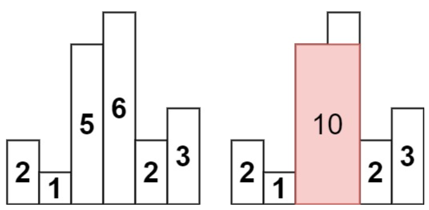

##### 1. [寻找两个正序数组的中位数](https://leetcode.cn/problems/median-of-two-sorted-arrays/)

大小分为 m、n 的正序数组 A、B，请找出两个有序数组的中位数，m+n>=1

###### 解法思路

已知两个数组长度为 m、n，那么当 m+n 为奇数时中位数位于第 (m+n)/2，为偶数时，中位数是第 (m+n)/2 和 (m+n)/2+1 的平均值。因此本算法可以转化为长度为奇数时，获取第 k 小元素的问题；为偶数时获取第 k、k+1 元素的平均值。

- 复杂度 $O(m+n)$ 的简单算法：遍历有序数组直至到第 k 个位置，或者合并两个有序数组，再返回第 k 个位置。
- 复杂度 $O(log_2(m+n))$：利用二分查找的思想。如果 A[k/2-1] <= B[k/2-1]，那么比 A[k/2-1] 小的元素个数最多有 k-2 个，因此数组 $[0,k/2-1]$ 部分肯定没有中位数，因此可以**一次排除掉 k/2 个元素**。A[k/2-1] > B[k/2-1] 时同理。之后再对剩余数组进行排除。

###### 基于二分查找的算法步骤

设置数组的两个指针 p、q 分别指向 A、B 数组，两个偏移量 sa、sb 分别表示排除过后数组 A、B 的起始位置。p、q 起始为 0，sa、sb 初始为 0。查找第 k 小元素的过程如下：

1. 定位数组的 k/2-1 元素：通过对当前剩余数组的起始位置 sa、sb 施加一个偏移量 step 来得到 k/2-1 元素，即 p=sa+step, q=sb+step。默认 `step=k/2-1`，但如果当前剩余数组的长度不足 k/2，则缩小范围至最后一个元素位置，即 `step=min(m-sa-1, n-sb-1)`。

2. 如果 A[p] <= B[q]，则排除掉数组 A 的 $[sa,p]$ 部分，并更新 k 值，即 `k-=p-sa+1, sa+=1 `。

3. 如果 A[p] > B[q]，则排除掉数组 B 的 $[sb,q]$ 部分，并更新 k 值，即 `k-=q-sb+1, sb+=1`。

4. 重复 1、2、3 步骤直至 k==1 或者有一个数组元素被全部排除。

   - 当 k==1 时，A[sa]、B[sb] 较小的就是第 k 小元素。

   - 否则，返回不为空数组的第 k 个元素。

当 m+n 为偶数时，需要寻找第 k 小元素与第 k+1 小元素，只要调用两次寻找 k/k+1 小元素算法即可。

##### 2. 最长回文子串

找到字符串 `s` 中最长的回文子串，如 "babad" => "bab"，"cbbd" => "bb"

###### 解法思路

第一种解法遍历字符串，对当前字符进行回溯判断是否为回文，要判断两种回文情况，一种是奇数长度回文、另一种是偶数长度回文。当前所得回文串长度大于记录的最大回文串长度，则更新最大回文串。时间复杂度 $O(n^2)$

第二种解法是使用 DP，设置二维数组 dp，dp\[i\][j] 表示 $[i,j]$ 部分是否为回文串，可知有如下规则

```c++
dp[i][j] = dp[i+1][j-1] && s[i] == s[j]
```

同时当 i>j 时，dp\[i\][j]=false。首先初始化 dp\[i\][i]=true，其它为 false，较长子串是否为回文串依赖于较短子串是否为回文串。因此遍历规则时长度由小到大，子串起始位置由开始到结尾。时间复杂度 $O(n^2)$

##### 3. [盛最多水的容器](https://leetcode.cn/problems/container-with-most-water/)

给定一个长度为 n 的整数数组 height 。有 n 条垂线，第 i 条线的两个端点是 (i, 0) 和 (i, height[i]) 。找出其中的两条线，使得它们与 x 轴共同构成的容器可以容纳最多的水（不能倾斜），如下图所示


###### 解法思路

第一反应是双层 for 循环，时间复杂度 $O(n^2)$。但有更好的解法，使用双指针 left、right 分别指向数组两端，计算 left 和 right 之间的面积，若大于当前记录的最大面积，则更新当前最大面积。比较 left、right 的高度大小，较小者向较大者移动，再次计算面积。按此遍历整个数组。

##### 4. [三数之和](https://leetcode.cn/problems/3sum/)

给你一个包含 n 个整数的数组 nums，判断 nums 中是否存在三个元素 a，b，c ，使得 a + b + c = 0 ？找出所有和为 0 且不重复的三元组。

###### 解法思路

先对数组进行排序，再遍历数组元素。设置双指针，mid 指向当前遍历元素的后一个，end 指向数组最后一个。根据当前遍历元素与 mid、end 之间的正负关系来决定双指针的移动。对于三者之和为 0 时，加入结果列表，分别移动双指针后，再将**双指针移动至与之前指向元素不同的位置，来避免重复的三元组**（当前遍历元素不变的情况，想要相同只能是双指针的元素相同）。

###### 算法步骤

先对数组排序，设置双指针 mid、end，三元组结果列表 tupleList，使用索引 i 逐一遍历数组元素，有如下步骤：

1. mid 指向当前遍历元素的后一个，end 指向数组最后一个元素，由 mid = i+1, end = nums.size()-1

2. 计算当前遍历元素与 mid、end 之后

   - 如果和为 0，则加入结果列表 tupleList，并移动双指针 ++mid，--end。再跳过与之前指向元素相同的位置，
     ```c++
     while(mid < end && nums[mid-1] == nums[mid]) ++mid;
     while(mid < end && nums[end] == nums[end+1]) --end;
     ```

   - 如果和大于 0，则将 end 向数值小的方向移动，--end

   - 如果和小于 0，则将 mid 向数值大的方向移动，++mid

   - 重复以上步骤直至 mid >= end

3. 重复 1、2 步骤直至数组遍历结束

##### 5. [括号生成](https://leetcode.cn/problems/generate-parentheses/)

数字 `n` 代表生成括号的对数，请你设计一个函数，用于能够生成所有可能的并且 **有效的** 括号组合。

```c#
输入：n = 3
输出：["((()))","(()())","(())()","()(())","()()()"]
```

###### 解法思路

利用递归回溯，遍历所有路径。使用一个变量来记录递归路径，同时设置两个变量分别记录递归路径中有多少个 "(" 和 ")"。每次递归有两种路径，一种放入 "("，另一种是放入 ")"。一定是 "(" 的个数先达到 n，此时只需要将剩余 ")" 全部加入递归路径即可。因此递归深度到 n 。

###### 算法步骤

使用 permu 作为当前递归路径表示的括号组合；设置变量 open、close 分别表示递归路径中 "(" 和 ")" 的数量；有如下递归过程（注意每次递归返回后都要将末尾元素去除，恢复本层递归初始环境）：

1. 如果 open 达到递归深度 n，则将剩余`(open-close)`数量的 ")" 加入递归路径中，得到一个括号组合，本次递归路径结束。
2. "(" 加入递归路径 permu，使用 open+1 进入下一层递归。（递归返回处，去除末尾元素）
3. 如果当前递归路径中 close < open，则 ")" 加入递归路径，使用 close+1 进入下一层递归

```c++
void TraceChar(int open, int colse, int n, string permu, std::vector<string>& outRetList)
{
    if(open == n){
        for(int i = 0; i < open-colse; ++i){
        	permu.push_back(')');
        }
        outRetList.emplace_back(permu);
        return;
    }
    permu.push_back('(');
    TraceChar(open+1, colse, n, permu, outRetList);
    permu.pop_back();
    if(colse < open){
        permu.push_back(')');
        TraceChar(open, colse+1, n, permu, outRetList);
    }
}
```

##### 6. [合并K个升序链表](https://leetcode.cn/problems/merge-k-sorted-lists/)

给你一个链表数组，每个链表都已经按升序排列。请你将所有链表合并到一个升序链表中，返回合并后的链表。

###### 解法思路

合并两个升序链表作为基础操作，实现较为简单 $O(n)$ 复杂度。最直接的做法是，将 k 个链表依次执行合并，第 i 次合并，目标链表长度为 i*n，因此 k 次合并的复杂度为 $O(k^2 \times n)$。

为了降低复杂度，可以采用**分治策略**，即 k 个链表第一次进行两两合并，得到 k/2 个链表，继续进行两两合并，直至合并为 1 个链表。一共进行 $\log_2k$ 次合并，第一次合并复杂度为 2n，第二次为 4n，...，第 logk 次合并为 $(\log_2k)^2 \times n=kn$，因此时间复杂度为 $O(kn \times \log_2k)$。

##### 7. [下一个排列](https://leetcode.cn/problems/next-permutation/)

整数数组的 **下一个排列** 是指其整数的下一个字典序更大的排列。如果不存在下一个更大的排列，那么这个数组必须重排为字典序最小的排列（即，其元素按升序排列）。例如 [1,2,3]=>[1,3,2]，[3,2,1]=>[1,2,3]，[1,1,5]=>[1,5,1]

###### 解法思路

只有当序列中元素降序排序，该序列才是最大的排列。因此如果序列存在一个更大的排列，那么一定能找到一个升序的子序列。想要将一个序列进行变换得到得到紧邻的更大的排列（相邻）：

- 左边的较小数与右边的较大数进行交换，可以将序列变大
- **较小数尽可能靠右**，且**较大数尽可能小**，可以使得序列变大的幅度最小

采用两次遍历的方法，第一次从最右开始遍历，定位到最先出现升序的元素 `nums[i]<nums[i+1]`，即最靠右出现升序的元素 `i`。可知 nums 中 `[i+1,n)` 部分是降序，即 `nums[i]<nums[i+1]>=nums[i+1 >= n)`。第二次从最右开始遍历，得到最小的满足 `nums[j]>nums[i]` 的元素。交换 i、j 元素，可知 `[i+1,n]` 部分依然保持降序，最后将 i+1 到 n 部分的元素逆置即可使得这部分序列最小，而 nums[i] 又增大了最小的幅度，因此可得到一个变大幅度最小的序列。

###### 算法步骤

1. 定位最先出现的升序元素，`i=nums.size()-2`
   ```c++
   while(i >= 0 && nums[i] >= nums[i+1]){
   	--i;
   }
   ```

2. 当存在升序子序列时，即 `i>=0`，定位最接近与 `nums[i]` 的较大数，`j=nums.size()-1`
   ```c++
   while(j >= 0 && nums[j] <= nums[i]){
   	--j;
   }
   swap(nums[i], nums[j]);
   ```

3. 逆置 `[i+1,n)` 部分元素得到最终序列 
   ```c++
   std::reverse(nums.begin()+i+1, nums.end());
   ```

##### 8. 最长有效括号数

给你一个只包含 `'('` 和 `')'` 的字符串，找出最长有效（格式正确且连续）括号子串的长度。

例如：")()())" => 4

###### 解法思路

**第一种解法**遍历字符串过程中，使用栈来验证括号子串是否有效，栈中持有的是遍历的指针。最直接的匹配括号思路，遇到`'('`入栈，遇到`')'`查看栈顶元素是否匹配，如果匹配则出栈，不匹配则入栈。这样下来，栈顶永远是最后一个不匹配的位置。因此当匹配时，当前位置减去栈顶位置记为当前匹配子串的长度。

因此可以只在栈中始终维持一个无效 `')'` 的位置，同时为了方便处理边界条件（全部匹配导致栈空），先入栈`-1`，当全部匹配时，栈顶为 -1，当前位置减 -1 正好也为匹配子串长度。遍历过程中有如下操作：

- 遇到`'('`入栈
- 遇到`')'`，先出栈。
  - 如果此时栈空（被出栈的是最初的-1或上一个不匹配位置，栈中没有 '('），表示匹配失败，入栈 ')'，作为当前最后一个不匹配位置。
  - 如果此时栈非空（被出栈的只能是 '('或-1，**因为不匹配位置只能是在栈底**），匹配成功，当前位置减去栈顶位置记为当前匹配子串长度。

**第二种解法**使用计数器加两趟遍历。设置 left、right 两个变量分别用来统计当前遍历位置的左右括号数量。先从左向右遍历，如果 left < right，表示括号不匹配，重置 left、right 为0；如果 left == right，表示括号匹配，当前匹配子串长度为 2*left；但 left > right 的情况无法统计。因此再从右向左来一次遍历，如果 left > right，表示括号不匹配；如果 left==right 表示括号匹配。结果为两次遍历得到的最大长度。

##### 9. 搜索旋转排序数组

整数数组 `nums` 按升序排列，数组中的值**互不相同** 。进行前 k 项部分与其后部分整体互换，如 `[0,1,2,4,5,6,7]` 在下标 `3` 处经旋转后可能变为 `[4,5,6,7,0,1,2]`。实现算法复杂度 O(logn)，找到 target 数在旋转后的数组中的位置。

###### 解法思路

要求 O(logn)，那么肯定使用二分查找。升序数组经过旋转，数组内部分有序，当使用二分法，将数组分为两部分时，至少有一部分是有序的。对于有序部分可以很快判断 target 是否在其范围内，如果在则继续在该有序部分查找。如果不在，则在另一部分查找。

##### 10. [接雨水](https://leetcode.cn/problems/trapping-rain-water/)

给定 `n` 个非负整数表示每个宽度为 `1` 的柱子的高度图，计算按此排列的柱子，下雨之后能接多少雨水。


###### 解法思路

观察可以，i 位置能接多少雨水，取决于其左右两部分的最大高度的较小者，该较小者减去 i 位置的高度即为雨水数量。

**第一种解法使用动态规划**：设置两个状态数组，leftMax、rightMax。leftMax[i] 表示从左到 i 部分的最大高度，rightMax[i] 表示从右到 i 部分的最大高度。首先从左到右遍历数组，构建 leftMax，然后从右到左构建 rightMax 数组。最后遍历数组，i 位置雨水量为 `min(leftMax[i], rightMax[i])-height[i]`

**第二种解法使用双指针**：设置双指针 left、right 分别指向高度数组两端。leftMax、rightMax 变量来记录当前左部分最大高度，右部分最大高度。遍历过程中，首先更新 leftMax=max(leftMax, height[left])、
rightMax=max(rightMax,height[right])

- 如果 leftMax < rightMax，则可以确定 left 位置的雨水量 `leftMax-height[left]`，left 右移
- 如果 leftMax > rightMax，则可以确定 right 位置的雨水量 `rightMax-height[right]`，right 左移
- 如果 leftMax == rightMax，则可以确定 left 和 right 位置的雨水量，分别为  `leftMax-height[left]`、`rightMax-height[right]`，left 右移，right 左移

**第三种解法使用单调栈**：使用一个记录数组索引的单调递减栈。从左到右遍历数组，当前元素满足单调栈时则入栈；否则，当前元素 i 、栈顶 mid 与次顶 left 之间的水量计算为 `(i-left-1) * (minH-height[mid])`，其中 minH 为 i 与 left 二者较小值，并出栈直至满足单调递减栈。

```c++
stack<int> monoStack;
int rainNum = 0;
for(int i = 0; i < height.size(); ++i){
    while(!monoStack.empty() && height[monoStack.top()] < height[i]){
        int mid = monoStack.top();
        monoStack.pop();
        if(monoStack.empty()) break;
        int left = monoStack.top();
        rainNum += (i-left-1) * (std::min(height[left], height[i]) - height[mid]);
    }
    monoStack.push(i);
}
```

##### 11. [全排列](https://leetcode.cn/problems/permutations/)

给定一个不含重复数字的数组 `nums` ，返回其 *所有可能的全排列* 。例如

```
输入：nums = [1,2,3]
输出：[[1,2,3],[1,3,2],[2,1,3],[2,3,1],[3,1,2],[3,2,1]]
```

###### 解法思路

```c++
void Permute(int depth, vector<int>& nums, vector<vector<int>>& pathList){
    for(int i = depth; i < nums.size(); ++i){
        if(depth == nums.size()-1){
            pathList.emplace_back(nums);
        }else{
            if(i != depth)
                std::swap(nums[i], nums[depth]);
            Permute(depth+1, nums, pathList);
            if(i != depth)
                std::swap(nums[i], nums[depth]);
        }
    }
}
```

##### 12. 跳跃游戏

给定一个非负整数数组 `nums` ，你最初位于数组的 **第一个下标** 。数组中的每个元素代表你在该位置可以跳跃的最大长度。判断你是否能够到达最后一个下标。例如 [3,2,1,0,4]，无论怎样都会到达 3 位置。

###### 解法思路

无法达到最后位置则表示无法避免元素 0，因此只要判断是否跳跃路径一定会经过 0。设置一个变量 `dstMax`，表示当前可以达到的最大位置。设置遍历指针 `i`：

- 如果当前元素为 0，且 `dstMax <= i`，则表示无法越过 0 元素，也就是无法达到最后位置，返回 false。
- 如果不为 0，`dstMax = max(dstMax, nums[i]+i)`。

##### 13. 字符串之间的最短距离

给你两个单词 `word1` 和 `word2`， 请返回将 `word1` 转换成 `word2` 所使用的最少操作数 。你可以对一个单词进行三种操作：插入一个字符、删除一个字符、替换一个字符。

###### 解法思路

 假设 A、B 两个字符串，如下结论：

- 对 A 执行插入一个字符等价于对 B 执行删除一个字符
- 对 B 执行插入一个字符等价于对 A 执行删除一个字符
- 对 A 执行替换一个字符等价于对 B 执行替换一个字符

因此可以只考虑三种操作：对 A 执行插入一个字符、对 B 执行插入一个字符、对 A 执行替换一个字符。

使用动态规划，设置 DP 数组，`DP[i][j]` 表示 A 前 i 个字符与 B 前 j 个字符之间的距离。初始状态有，当 i==0 时，表示 A 空子串到 B 前 j 个字符的距离，有 `DP[0][j]=j`。同理当 j==0 时，有 `DP[i][0]=i`。使用 m、n 分别指向 A、B 字符串，有如下动态转移：

- 当 A[m]==A[n] 时，`DP[m+1][n+1]=min(DP[m][n],DP[m][n+1]+1,DP[m+1][n]+1)`
- 当 A[m] != A[n] 时，`DP[m+1][n+1]=min(DP[m][n],DP[m][n+1],DP[m+1][n])+1`

最后结果为 `DP[A.length()][B.length()]`

##### 14. 最小覆盖子串

给你一个字符串 `s` 、一个字符串 `t` 。返回 `s` 中涵盖 `t` 所有字符的最小子串。如果 `s` 中不存在涵盖 `t` 所有字符的子串，则返回空字符串 `""` 。例如：

```
输入：s = "ADOBECODEBANC", t = "ABC"
输出："BANC"
```

###### 解法思路

滑动窗口思想，设置 left、right 两个指针，两个指针之间的范围即为当前检查子串。设立两个 unordered_map，`countMap`、`recordMap`。`countMap` 用来记录 `t` 字符串的字符及对应个数，`recordMap `用来统计当前遍历子串的 t 中每个字符及其个数。

每次遍历首先将 right 指针的字符进行记录，更新 `recordMap` 的字符计数：

1. 如果 `countMap` 中的字符计数都小于等于 `recordMap` 中对应的计数，表示已找到覆盖子串。
   - 如果覆盖子串长度小于当前候选覆盖子串，则更新候选覆盖子串
   - 尝试缩小滑动窗口大小，left 指针右移直至当前子串不再覆盖目标串。移动过程中更新候选子串。
2. 否则，right 指针右移

##### 15. 子集

给你一个整数数组 `nums` ，数组中的元素 **互不相同** 。返回该数组所有可能的子集（幂集）。解集**不能**包含重复的子集。你可以按 **任意顺序** 返回解集。例如

```
输入：nums = [1,2,3]
输出：[[],[1],[2],[1,2],[3],[1,3],[2,3],[1,2,3]]
```

###### 解法思路

利用深度遍历的回溯递归。数组中每个元素都有两种状态，放入或不放入。递归深度达到数组长度即得到一个子集。

```c++
void IterSubset(int start, const vector<int>& nums, vector<int>& path, vector<vector<int>>& subSetList){
    if(start == nums.size()){
        subSetList.emplace_back(path);
        return;
    }
    path.emplace_back(nums[start]);
    IterSubset(start+1, nums, path, subSetList);
    path.pop_back();
    IterSubset(start+1, nums, path, subSetList);
}
```

##### 16. [最长递增子序列](https://leetcode.cn/problems/longest-increasing-subsequence/)

给你一个整数数组 nums ，找到其中最长严格递增子序列的长度。子序列 是由数组派生而来的序列，删除（或不删除）数组中的元素而不改变其余元素的顺序。例如，[3,6,2,7] 是数组 [0,3,1,6,2,2,7] 的子序列。

###### 解法思路

**基于动态规划**：设置 dp 一维数组，dp[i] 表示前 i 个元素以 i 为结尾的最大上升子序列的长度。初始 dp 元素都为 1，状态转移有：从左到右遍历 nums 数组，遍历到 k 时有，`dp[k] = max(dp[i])+1, 0 <= i < k && nums[i]<nums[k]` 

```c++
for(int k = 1; k < nums.size(); ++k){
    for(int i = 0; i < k; ++i){
        if(nums[i] < nums[k] && dp[i] >= dp[k]){
        	dp[k] = dp[i] + 1;
        }
    }
}
```

时间复杂度为 $O(n^2)$

**基于贪心+二分查找**：要使上升子序列尽可能长，则需要让序列上升得尽可能慢。维护一个数组 seq，seq[i] 表示长度为 i 的上升子序列的末尾元素的最小值。同时使用变量 maxLen 记录当前最大上升子序列的长度。

初始时，maxLen = 1， seq[maxLen-1]=nums[0]。 1 =< i < nums.size() 遍历数组：

- 如果 nums[i] == seq[maxLen-1]，跳过

- 如果 nums[i] > seq[maxLen-1]，则表示当前遍历元素可以加入到上升子序列中，maxLen = maxLen+1
- 如果 nums[i] < seq[maxLen-1]，则表示当前遍历元素可以作为某一长度上升子序列的更小末尾元素。首先从当前最大上升子序列 seq 中定位当前遍历元素的位置。seq 为递增数组，可以使用二分查找进行定位。找到 seq[k-1] < nums[i] < seq[k]，更新 seq[k] = nums[i]

时间复杂度为 $O(n\log_2 n)$，二分查找部分代码如下，

```c++
int left = 0, right = maxLen-1;
while(left <= right){
    int mid = (left+right)/2;
    if(seq[mid] < nums[i]){
    	left = mid+1;
    }else{
    	right = mid-1;
    }
}
seq[left] = nums[i];
```

##### 17. [打家劫舍 III](https://leetcode.cn/problems/house-robber-iii/)

小偷又发现了一个新的可行窃的地区。这个地区只有一个入口，我们称之为 root 。除了 root 之外，每栋房子有且只有一个“父“房子与之相连，所有房屋组成二叉树。如果两个直接相连的房子在同一天晚上被打劫，房屋将自动报警。给定二叉树的 root 。返回在不触动警报的情况下 ，小偷能够盗取的最高金额 。如下图，


```
输入: root = [3,2,3,null,3,null,1]
输出: 7 
解释: 小偷一晚能够盗取的最高金额 3 + 3 + 1 = 7
```

###### 解法思路

由题目可知，具有父子关系的节点不能同时偷窃。因此对于一个子树，根节点 $o$，左右节点 $l$、$r$。偷窃 $o$，则 $l$、$r$ 不能被偷窃；不偷窃 $o$，则 $l$、$r$ 可以偷窃也可以不被偷窃。利用**动态规划思想**，假设 $f(x)$ 表示偷窃 $x$ 节点时的最高金额，$g(x)$ 表示不偷窃 $x$ 节点时的最高金额，则有如下关系：
$$
\begin{align}
f(o)&=g(l)+g(r) \\
g(o)&=\max\{f(l),g(l)\}+\max\{f(r), g(r)\}
\end{align}
$$
因此可以按照上述状态转移方程，对二叉树进行后序遍历。可以用 std::pair<int, int> 来表示偷窃与不偷窃的最高金额，

```c++
// <select, unselect>
std::pair<int, int> PostOrder(TreeNode* node)
{
    std::pair<int, int> maxLeft = {0, 0}, maxRight = {0, 0};
    if(node->left){
        maxLeft = PostOrder(node->left);
    }
    if(node->right){
        maxRight = PostOrder(node->right);
    }
    std::pair<int, int> result;
    result.first = maxLeft.second + maxRight.second + node->val;
    result.second = std::max(maxLeft.first, maxLeft.second) + std::max(maxRight.first, maxRight.second);
    return result;
}
```

##### 18. [和为 K 的子数组](https://leetcode.cn/problems/subarray-sum-equals-k/)

给你一个整数数组 `nums` 和一个整数 `k` ，请你统计并返回该数组中和为 `k` 的连续子数组的个数。

###### 解法思路

暴力解法：0=<start<nums.size() 遍历数组，每遍历一个元素，求以 start 为起点、和为 k 的连续子数组，由于数组元素可以为负，因此需要遍历 start<i<nums.size()。算法复杂度为 $O(n^2)$

**前缀和+哈希 map**：可以利用前缀和来推导。假设 preSum[i] 表示前 i 个元素的和，那么 $[j+1,i]$ 子数组元素和为 preSum[i]-preSum[j]。当 preSum[i]-preSum[j]==k，即 `preSum[i]-k==preSum[j]` 时，$[j+1,i]$ 子数组的元素和为 k。算法复杂度 $O(n)$

因此可以在遍历数组过程中，记录当前前 i 个元素和为 preSum，并且使用一个 hash map 记录已经遍历过的前缀和数值出现的次数。只要查询该 map，键值为 `preSum-k` 的数量，即为以当前元素结尾的、和为 k 的子数组数量。实现如下：

```c++
int seqNum = 0,  preSum = 0;
std::unordered_map<int, int> preSumCountMap;
preSumCountMap[0] = 1;
for(int i = 0; i < nums.size(); ++i){
    preSum += nums[i];
    if(preSumCountMap.find(preSum-k) != preSumCountMap.end()){
        seqNum += preSumCountMap[preSum-k];
    }
    ++preSumCountMap[preSum];
}
```

##### 19. 数列相邻数差值的绝对值之和的最大/最小值

https://www.nowcoder.com/practice/306ce234874a4cb1880e2f4310d8ce13

##### 20. 起始数经过加/减1或乘2操作到目标数的步数

https://blog.csdn.net/weixin_48419914/article/details/117485323

##### 21. [在LR字符串中交换相邻字符](https://leetcode.cn/problems/swap-adjacent-in-lr-string/)


##### 22. [柱状图中最大的矩形](https://leetcode.cn/problems/largest-rectangle-in-histogram/)

给定 *n* 个非负整数，用来表示柱状图中各个柱子的高度。每个柱子彼此相邻，且宽度为 1 。求在该柱状图中，能够勾勒出来的矩形的最大面积。



###### 解法思路

对每个柱子计算以其高度构建的矩形的面积，其中最大者即为所求最大面积。对于以某个柱子高度构建的矩形的左右边界：该柱子左侧最近的小于其高度的柱子，以及右侧最近的小于其高度的柱子，这个中间范围的宽即为矩形宽。

**使用单调递增栈来求左右边界**：设置数组 left、right 来记录每个柱子的左右边界，设置记录数组索引的单调递增栈 mono。从左到右遍历高度数组，`i` 指向当前元素：

- 如果当前元素小于栈顶元素，反复执行以下步骤，直至栈空或者满足递增约束
- - 当前栈顶的右边界 `right[mono.top()]=i`，出栈
- 经过以上处理，当前元素满足递增栈约束。
  - 如果栈空，则当前元素的左边界设置为 -1， `left[i] = -1`
  - 栈非空，有当前元素大于栈顶元素，则当前元素左边界为 `left[i] = mono.top()`
  - 当前元素入栈

已知每个柱子的左右边界，依次求其对应矩形的面积，得到最大面积

```c++
vector<int> left(heights.size()), right(heights.size(), heights.size());
stack<int> monoStack;
for(int i = 0; i < heights.size(); ++i){
    while(!monoStack.empty() && heights[monoStack.top()] > heights[i]){
        right[monoStack.top()] = i;
        monoStack.pop();
    }
    left[i] = monoStack.empty() ? -1 : monoStack.top();
    monoStack.push(i);
}
int maxArea = 0;
for(int i = 0; i < heights.size(); ++i){
    int curArea = (right[i]-left[i]-1)*heights[i];
    if(maxArea < curArea) maxArea = curArea;
}
```

##### 23. [去除重复字母](https://leetcode.cn/problems/remove-duplicate-letters/)

给你一个字符串 `s` ，请你去除字符串中重复的字母，使得每个字母只出现一次。需保证 **返回结果的字典序最小**（要求不能打乱其他字符的相对位置）

###### 解法思路

从左往右，字母的字典序的权重递减。假设有 s[i]>s[i+1]，那么无论之后的字符如何去除，去除 s[i] 得到的字符串一定要小于去除 s[i+1] 后的字符串。因此采用单调递增栈来找到这种关键字符。同时注意要求：

- 去除重复字符，因此需要首先记录字符出现次数
- 已经出现在单调栈中的字符不能再入栈

使用一个单调递增栈来记录剩下的字符，从左到右依次遍历字符串，i 指向当前元素：

- 如果栈中存在当前字符，直接跳过，并且更新当前字符的剩余次数

- 如果栈中不存在当前字符，逐一处理使得满足单调栈约束，如果栈顶元素大于当前元素：

  - 如果栈顶元素剩余次数 > 1，则出栈，同时更新剩余次数以及不在栈中标志位。
  - 否则，跳出循环。(栈中剩余字符都小于栈顶，因此去除栈中其余字符会使得栈顶靠前，字典序增大)

  当前字符入栈，并更新在栈中标志位

```c++
vector<int> chNums(26, 0);
vector<bool> exists(26, 0);
for(char c : s){
    ++chNums[c-'a'];
}
stack<char> monoStack;
for(int i = 0; i < s.length(); ++i){
    char curC = s[i];
    if(!exists[curC-'a']){	// 栈中不存在当前字符
        while(!monoStack.empty() && monoStack.top() > curC){
            char topC = monoStack.top();
            if(chNums[topC-'a'] > 1){
                monoStack.pop();
                --chNums[topC-'a'];
                exists[topC-'a'] = false;
            }else{
                break;
            }
        }
        monoStack.push(curC);
        exists[curC-'a'] = true;
    }else{	// 栈中已存在当前字符
        --chNums[curC-'a'];
    }
}
string result;	// 按次序将单调栈字符放入字符串
```

##### 24. [移掉 K 位数字](https://leetcode.cn/problems/remove-k-digits/)

给你一个以字符串表示的非负整数 `num` 和一个整数 `k` ，移除这个数中的 `k` 位数字，使得剩下的数字最小。请你以字符串形式返回这个最小的数字

###### 解法思路

要求最后数字最小，即字典序最小。使用单调递增栈，从左到右遍历字符串，去除那些不满足单调栈约束的元素，去除个数直至达到 k。如果遍历结束 k 不为 0，此时剩余数字都在单调栈中，即满足单调递增，直接从栈顶依次去除剩余 k 个。

```c++
vector<int> digits;
for(int i = 0; i < num.length(); ++i){
    while(k > 0 && digits.size() != 0 && digits.back() > num[i]){
        digits.pop_back();
        --k;
    }
    digits.push_back(num[i]);
}
string result = "";
for(int i = 0; i < digits.size() - k; ++i){
    if(!(result.length() == 0 && digits[i] == '0'))
        result.push_back(digits[i]);
}
```

##### 25. [最短无序连续子数组](https://leetcode.cn/problems/shortest-unsorted-continuous-subarray/)

给你一个整数数组 nums ，你需要找出一个 连续子数组 ，如果对这个子数组进行升序排序，那么整个数组都会变为升序排序。请你找出符合题意的 最短子数组，并输出它的长度。

###### 解法思路

假设将数组分为三部分，A、B、C，如果 B 就是所求子数组，则 A、C 都是有序部分。且有 B、C 部分的最小元素不小于 A 的元素，A、B 部分的最大元素不大于 C 的元素。通过这种关系可以找到 B 的左右边界：

- 左边界：从右往左遍历数组，记录最小元素。最后一个不满足 "B、C 部分的最小元素不小于 A 的元素" 的位置
- 右边界：从左往右遍历数组，记录最大元素。最后一个不满足 "A、B 部分的最大元素不大于 C 的元素" 的位置

```c++
int left = nums.size(), right = -1, n = nums.size()-1;
int min = 100001, max = -100001;
for(int i = 0; i < nums.size(); ++i){
    if(nums[i] >= max){
        max = nums[i];
    }else{
        right = i;
    }

    if(nums[n-i] <= min){
        min = nums[n-i];
    }else{
        left = n-i;
    }
}
int len = right < left ? 0 : (right-left+1);
```


